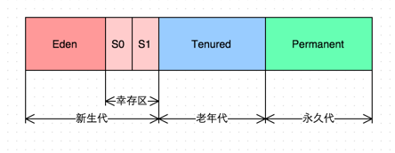

# 垃圾回收
垃圾回收的主要目的是：清除不再使用的对象，自动释放内存。  
GC是如何判断对象是否可以被回收？引入GCRoots，如果一个对象与GCRoots之间没有直接或间接的引用关系，比如某个失去任何引用的对象，或者两个互相环岛状循环引用的对象，都可以判定死缓，进行回收。  
GCRoots：  
类静态属性中引用的对象、常量引用的对象、虚拟机栈中引用的对象、虚拟机栈中引用的对象、本地方法栈中引用的对象等。  

## 垃圾回收算法

|类型|核心思路|缺点|优点|其他|
|--|--|--|--|--|
|标记-清除|从GCroots出发，依次标记引用关系的对象，最后没有被标记的对象清除。|产生大量的空间碎片，分配一个较大的连续空间会导致FGC| | |
|标记-整理|类似于磁盘整理，从GCRoots出发标记存活的对象，然后将存活的对象整理到内存空间的一端，形成连续已使用的空间，最后把已使用空间之外的部分全部清理掉，不会产生碎片| | | |
|Mark-Copy|为了并行标记和整理将空间分为两块，每次只激活其中一块，垃圾回收时，只需要把存活的对象复制到另一个未激活的空间上，同时将未激活的空间标记已激活，将已激活的空间标记为未激活，然后清除原空间中的对象。堆内分为较大的Eden和两块较小的Survivor，每次只是用Eden和Survivor区的一块。| |减少内存空间的浪费| YGC算法进行新生代回收|

## 垃圾回收器

### serial
Serial回收器主要用于YGC的垃圾回收器，<strong>采用单线程完成GC任务</strong>,其中Stop the WOrld简称STW，垃圾回收阶段会暂停整个应用程序的执行。FGC的时间相对较长，频繁FGC会严重影响应用程序的性能。

### CMS
CMS回收器（Concurrent Mask Sweep Collector)回收停顿时间比较短，目前比较常用的垃圾回收器，它通过初试标记（init mark)、并发标记(Concurrent mark)、重新标记（Remark）、并发清除（Concurrent Sweep）四个步骤，1、3初试标记和重新标记依然会引发STW，第2、4的并发标记和并发清除可以和应用程序并发执行，也是比较耗时的操作。  
CMS采用<strong>标记-清除</strong>，产生大量碎片，解决：-XX：+UseCMSCompactAtFullCollection参数，强制JVM在FGC完成后对老年代进行压缩，执行一次空间碎片整理，整理阶段会引发STW；为了减少FGC，CMS通过配置-XX:+CMSFUllGCsBeforeCompaction=n参数，在执行n次FGC后，JVM再对老年代执行空间碎片整理。

### G1(Garbage-First GarBage Collector)

传统GC内存布局，连续

* 通过-XX:+UserG1GC参数启用，<strong>G1具备压缩功能，能避免碎片，G1暂停时间更加可控。</strong>
* G1将java堆空间分割成若干相同大小的区域，即region，包括Eden、Survivor、Old、Humongous四种类型，Humongous(大小超过region一半)专门放置大型对象;一个Region的大小可以通过参数-XX:G1HeapRegionSize设定，取值范围从1M到32M，且是2的指数；这样不需要一个连续的内存空间管理对象。
* G1会有先收集垃圾最多的区域，G1整体采用“Mark-Copy”，局部（两个region)之间采用“标记-复制"算法，有非常好的空间整合能力，不会产生大量的空间碎片；G1另一个优势是可以预测停顿时间，能够尽快地在指定时间内完成垃圾回收任务；可以通过jstat查看垃圾回收情况。

SATB
STAB全程Snapshot-At-Beginning,GC开始活着的对象的一个快照，通过Root Tracing得到，作用是维持并发GC的正确性；<strong>三色标记法：白：对象没有标记到，标记阶段结束后，会被当做垃圾回收掉，灰：对象被标记了，他的field还没有被标记或标记完，黑：对象被标记，它所有的field也被标记完了。</strong>  

G1收集器四个步骤：
* 初始标记（STW）：仅仅是标记一个GC roots能直接关联到的对象，并且修改TAMS指针的值，与Young GC共用暂停，耗时很短，实际没有额外的停顿
* 并发标记：从GC root开始对堆中的对象进行可达性分析，标记要回收的对象，耗时较长，标记线程与应用线程并发执行，且收集各个region的存活对象信息。
* 最终标记请（STW）：标记那些并发阶段发生变化的对象，将被回收
* 清除垃圾：负责更新region统计数，对各个region的回收价值和成本进行排序，根据用户期望的停顿时间来制定回收计划，复制存活对象到空的region，再清理掉旧的region的空间，涉及对象的移动，STW

G1 GC主要相关参数

|参数	|含义|
|---|---|
|-XX:G1HeapRegionSize=n	|设置Region大小，并非最终值|
|-XX:MaxGCPauseMillis	|设置G1收集过程目标时间，默认值200ms，不是硬性条件|
|-XX:G1NewSizePercent|	新生代最小值，默认值5%|
|-XX:G1MaxNewSizePercent	|新生代最大值，默认值60%|
|-XX:ParallelGCThreads	|STW期间，并行GC线程数|
|-XX:ConcGCThreads=n	|并发标记阶段，并行执行的线程数|
|-XX:InitiatingHeapOccupancyPercent	|设置触发标记周期的 Java 堆占用率阈值。默认值是45%。这里的java堆占比指的是non_young_capacity_bytes，包括old+humongous|
