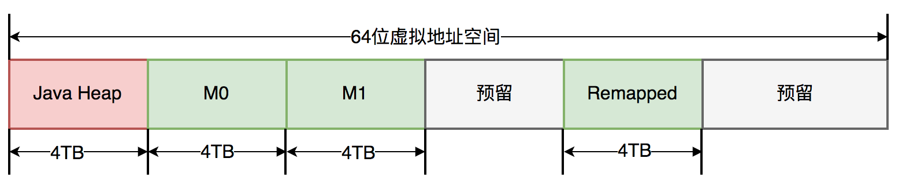

# 垃圾回收
垃圾回收的主要目的是：清除不再使用的对象，自动释放内存。  
 GC是如何判断对象是否可以被回收？一般一个对象不再被引用，就代表该对象可以被回收

* 引用计数算法：通过一个对象的引用计数器来判断该对象是否被引用了，没当被引用，引用计数器加1，没当引用失效，计数器就会减1，。当对象的引用计数器的值为0时，就说明该对象不再被引用，可以被回收了。  简单判断，但是存在循环引用的问题。
* 引入GCRoots，如果一个对象与GCRoots之间没有直接或间接的引用关系，比如某个失去任何引用的对象，或者两个互相环岛状循环引用的对象，都可以判定死缓，进行回收。  
GCRoots：所有对象的根对象，jVM加载时，会创建一些普通对象引用正常对象。  
* 类静态属性中引用的对象、常量引用的对象、虚拟机栈中引用的对象、虚拟机栈中引用的对象、本地方法栈中引用的对象等。  

## 垃圾回收算法

|类型|核心思路|缺点|优点|其他|
|--|--|--|--|--|
|标记-清除|从GCroots出发，依次标记引用关系的对象，最后没有被标记的对象清除。|产生大量的空间碎片，分配一个较大的连续空间会导致FGC| | |
|标记-整理|类似于磁盘整理，从GCRoots出发标记存活的对象，然后将存活的对象整理到内存空间的一端，形成连续已使用的空间，最后把已使用空间之外的部分全部清理掉，不会产生碎片| | | |
|Mark-Copy|为了并行标记和整理将空间分为两块，每次只激活其中一块，垃圾回收时，只需要把存活的对象复制到另一个未激活的空间上，同时将未激活的空间标记已激活，将已激活的空间标记为未激活，然后清除原空间中的对象。堆内分为较大的Eden和两块较小的Survivor，每次只是用Eden和Survivor区的一块。| |减少内存空间的浪费| YGC算法进行新生代回收|

## 垃圾回收器

### serial
Serial回收器主要用于YGC的垃圾回收器,采用复制算法，<strong>采用单线程完成GC任务</strong>,其中Stop the WOrld简称STW，垃圾回收阶段会暂停整个应用程序的执行。FGC的时间相对较长，频繁FGC会严重影响应用程序的性能。

### CMS
CMS回收器（Concurrent Mask Sweep Collector)回收停顿时间比较短，目前比较常用的垃圾回收器，它通过初试标记（init mark)、并发标记(Concurrent mark)、重新标记（Remark）、并发清除（Concurrent Sweep）四个步骤，1、3初试标记和重新标记依然会引发STW，第2、4的并发标记和并发清除可以和应用程序并发执行，也是比较耗时的操作。  
CMS采用<strong>标记-清除</strong>，产生大量碎片，解决：-XX：+UseCMSCompactAtFullCollection参数，强制JVM在FGC完成后对老年代进行压缩，执行一次空间碎片整理，整理阶段会引发STW；为了减少FGC，CMS通过配置-XX:+CMSFUllGCsBeforeCompaction=n参数，在执行n次FGC后，JVM再对老年代执行空间碎片整理。

### G1(Garbage-First GarBage Collector)

传统GC内存布局，连续

* 通过-XX:+UserG1GC参数启用，<strong>G1具备压缩功能，能避免碎片，G1暂停时间更加可控。</strong>
* G1将java堆空间分割成若干相同大小的区域，即region，包括Eden、Survivor、Old、Humongous四种类型，Humongous(大小超过region一半)专门放置大型对象;一个Region的大小可以通过参数-XX:G1HeapRegionSize设定，取值范围从1M到32M，且是2的指数；这样不需要一个连续的内存空间管理对象。
* G1会有先收集垃圾最多的区域，G1整体采用“标记-整理”，局部（两个region)之间采用“标记-复制"算法，有非常好的空间整合能力，不会产生大量的空间碎片；G1另一个优势是可以预测停顿时间，能够尽快地在指定时间内完成垃圾回收任务；可以通过jstat查看垃圾回收情况。

SATB
STAB全程Snapshot-At-Beginning,GC开始活着的对象的一个快照，通过Root Tracing得到，作用是维持并发GC的正确性；<strong>三色标记法：白：对象没有标记到，标记阶段结束后，会被当做垃圾回收掉，灰：对象被标记了，他的field还没有被标记或标记完，黑：对象被标记，它所有的field也被标记完了。</strong>  

G1收集器四个步骤：
* 初始标记（STW）：仅仅是标记一个GC roots能直接关联到的对象，并且修改TAMS指针的值，与Young GC共用暂停，耗时很短，实际没有额外的停顿
* 并发标记：从GC root开始对堆中的对象进行可达性分析，标记要回收的对象，耗时较长，标记线程与应用线程并发执行，且收集各个region的存活对象信息。
* 最终标记请（STW）：标记那些并发阶段发生变化的对象，将被回收
* 清除垃圾：负责更新region统计数，对各个region的回收价值和成本进行排序，根据用户期望的停顿时间来制定回收计划，复制存活对象到空的region，再清理掉旧的region的空间，涉及对象的移动，STW

G1 GC主要相关参数

|参数	|含义|
|---|---|
|-XX:G1HeapRegionSize=n	|设置Region大小，并非最终值|
|-XX:MaxGCPauseMillis	|设置G1收集过程目标时间，默认值200ms，不是硬性条件|
|-XX:G1NewSizePercent|	新生代最小值，默认值5%|
|-XX:G1MaxNewSizePercent	|新生代最大值，默认值60%|
|-XX:ParallelGCThreads	|STW期间，并行GC线程数|
|-XX:ConcGCThreads=n	|并发标记阶段，并行执行的线程数|
|-XX:InitiatingHeapOccupancyPercent	|设置触发标记周期的 Java 堆占用率阈值。默认值是45%。这里的java堆占比指的是non_young_capacity_bytes，包括old+humongous|

serial old采用标记整理

## ZGC
The Z Garbage Collector JDK11推出的一款低延迟垃圾回收器
* 停顿时间不超过10ms
* 停顿时间不会随着堆的大小，或者活跃对象的大小而增加
* 支持8MB~4TB级别的堆

ZGC也采用标记-复制算法，ZGC在标记、转移和重定位阶段几乎都是并发的，这ZGC实现停顿时间小于10ms目标的最关键原因。

ZGC只有三个STW阶段：初试标记，再标记，初试转移，其中初试标记和初试转移只需要扫描所有GC Roots,其处理时间和GC roots的数量相成正比，一般情况下耗时非常短；再标记阶段STW时间很短，最多1ms,超过1ms再次进入并发标记阶段，即，ZGC所有暂停依赖与GCroots集合大小，停顿时间不会随着堆的大小或活跃对象的大小而增加；与ZGC对比，G1的转移阶段完全STW，且停顿时间随存活对象的大小增加而增加。

### ZGC关键技术
ZGC通过着色指针和读屏障技术，解决了转移过程中准确访问对象的问题，实现了并发转移。大致原理：并发转移中，并发意味着GC线程再转移对象的过程中，应用线程也在不停的访问对象，假设对象发生转移，但对象的地址及时更新，那么应用线程可能访问到旧地址，从而造成错误。而在ZGC中，应用线程访问对象将触发读屏障，如果发现对象被移动了，那么“读屏障”会把读出来的指针更新到对象的地址上，这样应用线程始终访问的都是对象的新地址。
* 着色指针
着色指针是一种信息存储在指针中的技术，ZGC仅支持64位操作系统，把64位虚拟地址空间划分成多个子空间；

其中，[0 ~ 4MB]对应java堆，[4MB ~ 8TB]称为M0地址空间，[8TB ~ 12TB]称为M1地址空间，[12TB ~ 16TB]预留未使用，[16TB ~ 20TB]称为Remapped空间。 
当应用程序创建对象时，首先在堆空间申请一个虚拟地址，但该虚拟地址并不会映射到真正的物理地址。ZGC同时会为该对象在M0、M1和Remapped地址空间分别申请一个虚拟地址，且这三个虚拟地址对应同一个物理地址，但这三个空间在同一时间有且只有一个空间有效。ZGC之所以设置三个虚拟地址空间，是因为它使用“空间换时间”思想，去降低GC停顿时间。“空间换时间”中的空间是虚拟空间，而不是真正的物理空间。后续章节将详细介绍这三个空间的切换过程。
与上述地址空间划分相对应，ZGC实际仅使用64位地址空间的第0~41位，而第42~45位存储元数据，第47~63位固定为0。

ZGC将对象存活信息存储在42~45位中，这与传统的垃圾回收并将对象存活信息放在对象头中完全不同。

### 读屏障
读屏障是JVM向应用代码插入一小段代码的技术。当应用线程从堆中读取对象引用时，就会执行这段代码。需要注意的是，仅“从堆中读取对象引用”才会触发这段代码。
ZGC中读屏障的代码作用：在对象标记和转移过程中，用于确定对象的引用地址是否满足条件，并作出相应动作。

### ZGC并发处理演示
详细介绍ZGC一次垃圾回收周期中地址视图切换过程：
* 初试化： ZGC初始化之后，整个内存空间的地址视图被设置成Remapped，程序正常运行，在内存中分配对象，满足一定条件后垃圾回收启动，此时进入标记阶段。
* 并发标记阶段： 第一次进入标记阶段视图为M0，如果对象被GC标记线程或者应用线程访问时，那么就将对象的地址视图从Remapped调整为M0，所以，在标记阶段结束之后，对象地址要么是M0视图，要么是Remapped。如果对象的地址是M0视图，那么说明对象是活跃的；如果对象的地址是Remapped视图，说明对象是不活跃的。
* 并发转移阶段：标记结束后进入转移阶段，此时地址视图再次被设置为Remapped。如果GC线程或者应用线程访问过，那么就将对象地址视图从M0调整为Remapped。

其实，在标记阶段存在两个地址视图M0和M1，上面的过程显示只用了一个地址视图。之所以设计成两个，是为了区别前一次标记和当前标记。也即，第二次进入并发标记阶段后，地址视图调整为M1，而非M0。

着色指针和读屏障技术不仅应用在并发转移阶段，还应用在并发标记阶段：将对象设置为已标记，传统的垃圾回收器需要进行一次内存访问，并将对象存活信息放在对象头中；而在ZGC中，只需要设置指针地址的第42~45位即可，并且因为是寄存器访问，所以速度比访问内存更快。

ZGC 触发机制，总结如下：
* 阻塞内存分配请求触发：当垃圾来不及回收，垃圾将堆占满时，会导致部分线程阻塞，我们应当避免出现这种触发方式，日志中关键字Allocation Stall
* 基于分配速率的自适应算法：最主要的GC触发方式，其算法原理可简单描述为“ZGC根据近期的对象分配速率以及GC时间，计算当内存占用到什么阈值时触发一下”，通过ZAllocationSpikeTolerance参数控制阈值大小，该参数默认2，数值越大，越早的触发GC。我们通过调整此参数解决了一些问题。日志中关键字是“Allocation Rate”
* 基于固定时间间隔：通过ZCollectionInterval控制，适合应对增流量 场景。流量平稳变化时，自适应算法可能在堆使用率答95%以上才触发GC。流量突增时，自适应算法触发时机可能会过晚，导致线程阻塞。日志关键字Timer
* 主动触发规则：类似于固定时间间隔，但时间间隔不固定，是ZGC自行算出来的时机，日志关键字：Proactive
* 预热规则：服务刚启动时出现，日志关键字：Warmup
* 外触发：代码中显示调用System.GC触发，日志关键字： system.gc()
* 元数据分配触发:元数据区不足时导致，一般不需要关注，“Metadata GCthread"

