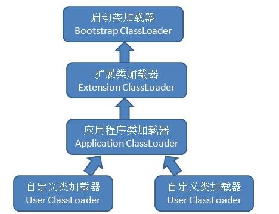

# 虚拟机类加载机制
约定：  
每个Class文件都有代表这Java语言中的一个类或接口的可能。  
Class文件并非特指存在于磁盘中的文件，应当是一串二进制字节流。 

## 类加载的时机

## 双亲委派机制

### 类加载器
* 引导类加载器(BootStrap)
  主要加载JVM自身所需要的类，该类加载器由C++实现，加载的是`<JAVA_HOME>/lib`下的class文件，负责装载核心的java类，比如Object、system、String等
* Platform CLassLoader,平台加载器，用以加载一些扩展的系统类，比如XML、加密、压缩相关的功能类，lib/ext/
* 应用类加载器，主要是加载用户定义下的CLASSPATH路径下的类
* 自定义类加载器:继承自CLassLoader，并覆盖findClass方法，它的作用是将特殊用途加载到内存中

### 双亲委派模型

某一个类加载器接到加载类的请求时，首先加载任务委托给父类加载器，依次递归，如果父类加载器可以完成类加载任务，则成功返回，无法完成加载任务，将抛出ClassNotFoundException异常，调用自己的findClass()方法进行加载

### 双亲委派模型的好处
jvm如何确认两个对象属于同一个类型：
* 都是用同名的类完成实例化的
* 两个实例各自对应的类的加载器必须是同一个。
<strong>确保类似“java.lang.Object"这种核心类，他们生成的对象会被认定同一种类型
如果用户编写了一个java.lang.Object的同名类并放在ClassPath中，多个类加载器都去加载这个类到内存中，系统中将会出现多个不同的Object类，那么类之间的比较结果及类的唯一性将无法保证，而且如果不使用这种双亲委派模型将会给虚拟机的安全带来隐患。所以，要让类对象进行比较有意义，前提是他们要被同一个类加载器加载。</strong>.

### 破坏双亲委派模型
自定义类加载器
* 隔离加载类。某些框架内进行中间件与应用的模块隔离，把类加载到不同的环境。
* 修改加载类的方式。根据实际情况在某个时间点进行按需动态加载
* 扩展加载源：比如从数据库、网络等
* 防止源码泄露：java代码容易被编译和篡改，可以进行编译加密