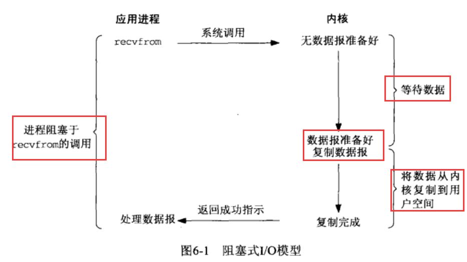
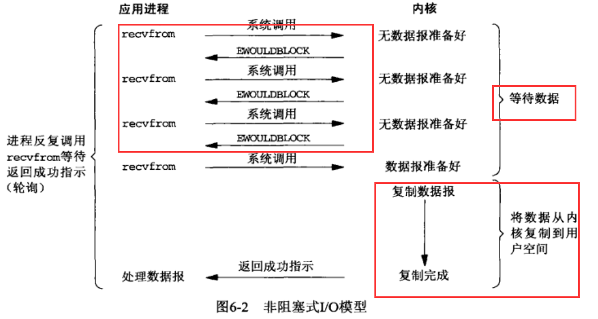
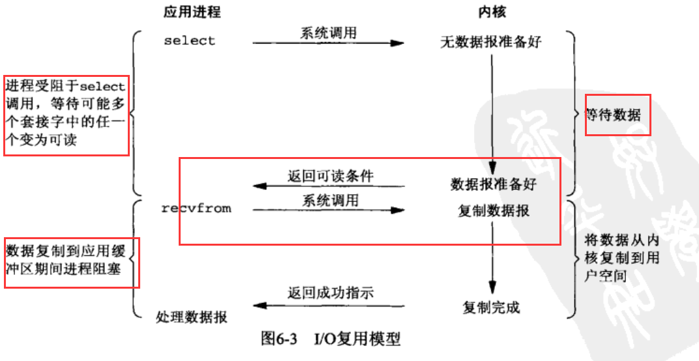
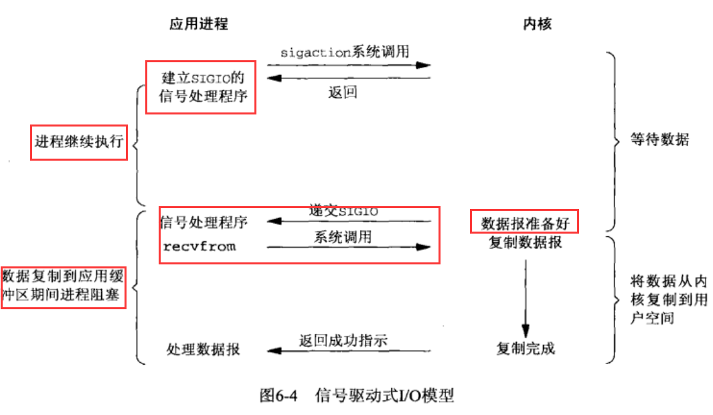
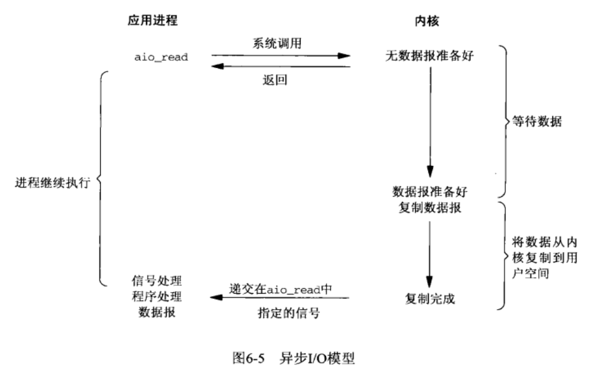
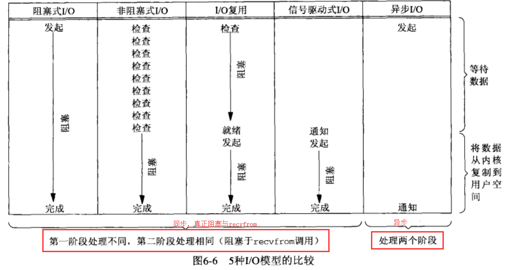

# I/O 模型
Unix系统有5种IO模型：
* 阻塞式I/O
* 非阻塞式I/O
* I/O复用(select 和poll)
* 信号驱动式I/O(SIGIO)
* 异步I/O(POSIX的aio_系列函数)

一个输入操作通常包括2个不同的阶段：  
* 等待数据准备好
* 从内核向进程复制数据

对于一个套接字来说：第一步涉及等待数据从网络中到达，当所等待分组到达时，它被复制到内核中的某个缓冲区。第二步就是把数据从内核缓冲区复制到相应进程缓冲区。  
## 阻塞式I/O模型


默认情况下所有套接字都是阻塞的，把recvfrom函数视为系统调用，区分应用进程和内核；进程调用recvfrom，其系统调用直到数据报到达且被复制到应用进程的缓冲区中或者发生错误才返回。  

## 非阻塞式I/O

进程把一个套接字设置成非阻塞是在通知内核：当所有请求的I/O操作非得把本进程投入睡眠才能完成时，不要把本进程投入睡眠，而是返回一个错误。 

前三次调用recvfrom时没有数据返回，因此内核转而立即返回一个EWOULDBLOCK错误，第四次调用recvfrom时已有一个数据报准备好，它被复制到应用进程缓冲区，于是recvfrom成功返回。当一个应用进程对非阻塞描述符循环调用recvfrom时，我们称之为轮询(polling)，应用进程程持续轮询内核，查看某个操作是否就绪。耗费大量CPU时间。 
## I/O复用模型

可以调用select或poll，阻塞在这两个系统调用中的一个之上，而不是阻塞在真正的系统调用之上。


## 信号驱动式I/O 模型
可以用信号，内核在描述符就绪时发送SIGIO信号通知我们， 

这种优势在于等待数据报到达期间进程不被阻塞，

## 异步I/O模型
工作机制是：告知内核启动某个操作，并让内核在整个操作完成后(包括将数据从内核复制到我们自己的缓冲区)完成后通知我们。与信号驱动模型的主要区别在于：信号驱动式I/O由内核通知我们何时可以启动一个I/O操作，而异步I/O模型是由内核通知我们I/O操作何时完成。


## 各种I/O模型比较

调用blocking和non-blocking的区别：  
调用blockingIO会一直block对应的进程直到操作完成，而non-blocking在kernel准备数据的情况下立刻返回。  
前四种模型都是同步I/O模型，真正操作I/O操作recvfrom将阻塞进程。

## I/O多路复用之select、poll、epoll详解
 本质上select、poll、epoll都是同步IO，他们都需要在读写事件就绪后自己负责进行读写，就是说这个读写过程是阻塞的。  
### select
```
int select (int n, fd_set *readfds, fd_set *writefds, fd_set *exceptfds, struct timeval *timeout);
```
select函数监视的文件描述符分3类，分别是writefds、readfds、exceptfds.调用后select函数会阻塞，直到有描述符就绪(有数据可读、可写、或者except)，或者超时，函数返回，。当函数返回后，可以通过遍历fdset，来找到就绪的描述符。  
select几乎所有平台都支持，良好的跨平台。缺点是：单个进程能够监视的文件描述符的数量存在最大限制，linux上一般是1024,可以通过修改宏定义甚至重新编译内核。

### poll
```
int poll (struct pollfd *fds, unsigned int nfds, int timeout);
```
与select使用三个位图表示fdset不同，poll使用一个pollfd的指针实现。  
```
struct pollfd {
    int fd; /* file descriptor */
    short events; /* requested events to watch */
    short revents; /* returned events witnessed */
};
```
pollfd结构包含了要监视的event和发生的event，不再使用select“参数-值"传递的方式，同时pollfd没有最大数量限制，但是数量过大后，性能会下降。和select函数一样，poll返回需要轮询pollfd来获取就绪的描述符。  
> select和poll都需要在返回后，通过遍历文件描述符来获取已就绪的socket。事实上，同时连接的大量客户端在一时刻可能只有很少的处于就绪状态，因此随着监视的描述符数量的增长，其效率也会线性下降


### epoll
epoll是内核2.6中提出的，是之前select、epoll增强版，epoll更加灵活，没有描述符限制。epoll使用一个文件描述符管理多个描述符，将用户关系的文件描述符的事件存放到内核的一个事件表中，这样用户控件和内核空间的copy只需一次。  
epoll操作过程需要三个接口：
```
int epoll_create(int size)；//创建一个epoll的句柄，size用来告诉内核这个监听的数目一共有多大
int epoll_ctl(int epfd, int op, int fd, struct epoll_event *event)；
int epoll_wait(int epfd, struct epoll_event * events, int maxevents, int timeout);
```
* int epoll_create(int size)  
  创建一个epoll的句柄，size用来告诉内核这个监听的数目一共有多大，这个参数不同于select()中的第一个参数，给出最大监听fd+1的值，<font color="red">参数size并不限制了epoll所能监听的描述符最大个数，只是对内核初始分配内部数据结构的一个建议</font>。创建好epoll句柄后，就会占用一个fd值，linux下查看/proc/进程id/fd/,能够看到fd值，所以在使用完epoll后，必须调用close()关闭,否则可能导致fd被耗尽。  

* int epoll_ctl(int epfd, int op, int fd, struct epoll_event *event)

函数是对指定描述符fd执行op操作。
> epfd：是epoll_create()的返回值。  
> op：表示op操作，用三个宏来表示：添加EPOLL_CTL_ADD，删除EPOLL_CTL_DEL，修改EPOLL_CTL_MOD。分别添加、删除和修改对fd的监听事件。  
> fd：是需要监听的fd（文件描述符）  
> epoll_event：是告诉内核需要监听什么事，struct epoll_event结构如下：
```
truct epoll_event {
  __uint32_t events;  /* Epoll events */
  epoll_data_t data;  /* User data variable */
};

//events可以是以下几个宏的集合：
EPOLLIN ：表示对应的文件描述符可以读（包括对端SOCKET正常关闭）；
EPOLLOUT：表示对应的文件描述符可以写；
EPOLLPRI：表示对应的文件描述符有紧急的数据可读（这里应该表示有带外数据到来）；
EPOLLERR：表示对应的文件描述符发生错误；
EPOLLHUP：表示对应的文件描述符被挂断；
EPOLLET： 将EPOLL设为边缘触发(Edge Triggered)模式，这是相对于水平触发(Level Triggered)来说的。
EPOLLONESHOT：只监听一次事件，当监听完这次事件之后，如果还需要继续监听这个socket的话，需要再次把这个socket加入到EPOLL队列里
```
* int epoll_wait(int epfd, struct epoll_event * events, int maxevents, int timeout); 等待epfd上的IO事件，最多返回maxevents个事件。  参数events用来从内核中得到事件的集合，maxevents告知内核这个events有多大，这个maxevents的值不能大于创建epoll_create的size。参数timeout是超时时间(毫秒，0立即返回-1将不确定，)；返回需要处理的事件数目，如返回0表示已经超时。  

在select/poll中，进程只有调用一定的方法后，内核才对所有监视的文件描述符进行扫描，<strong>而epoll事先通过epoll_ctl()来注册一个文件描述符，一旦基于某个文件描述符就绪时，内核采用类似callback的回调机制，迅速激活这个文件描述符，当进程调用epoll_wait()时便得到通知。</strong>  
epoll优点：  
* 监视的描述符数量不受限制，它所支持的FD上限是最大可以打开文件数目，具体数目可以cat /proc/sys/fs/file-max查看，一般来说，这个数目和系统内存关系很大。select的最大缺点就是进程打开fd是数量有限制的。
* IO的效率不会随着监视文件的数量增长而下降。epoll不同于select和poll轮询的方式，而是通过每个fd定义的回调函数来实现。

> 如果没有大量的idle-connection或者dead-connection，epoll的效率并不会比select/poll高很多，但是遇到大量idle-connection,就会发现epoll效率大大高于select/poll.


## 其他
### 文件描述符
文件描述符(File descriptor)是一个用于表述指向文件的引用的抽象化概念。   
文件描述符在形式上是一个非负整数。实际上，它是一个索引值，指向内核为每一个进程所维护的该进程打开文件的记录表。当程序打开一个现有文件或者创建一个新文件时，内核向进程返回一个文件描述符；文件描述符一概念往往适用于UNIx、Linux这样的操作系统。 

### 