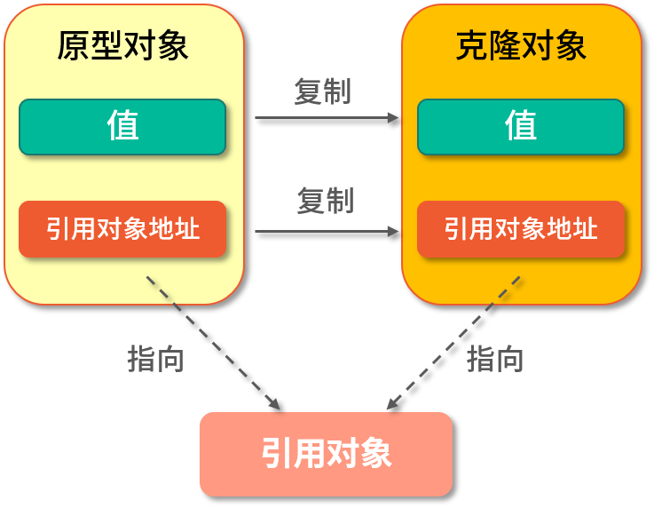
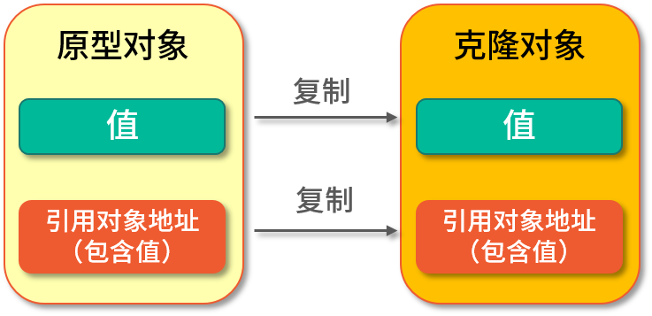

# 深拷贝与浅拷贝

## 基本概念与特性
<strong>浅拷贝</strong>是把原型对象成员变量为值类型的属性都复制给克隆对象，<font color="red">把原型对象中成员变量的引用类型的地址也复制给克隆对象</font>，也就是原型对象中如果有成员变量为引用对象则此引用对象的地址是共享给原型对象和克隆对象的。


<strong>深拷贝</strong>是将原型对象中所有类型，无论值类型还是引用类型都复制一份给克隆对象，


<font color="red" >java语言中要实现克隆必须要实现Cloneable接口，并重写Object类中的clone()方法</font>

```java
static class People implements Cloneable{
        private Integer id;
        private String name;

        public Integer getId() {
            return id;
        }

        public void setId(Integer id) {
            this.id = id;
        }

        public String getName() {
            return name;
        }

        public void setName(String name) {
            this.name = name;
        }

        @Override
        protected People clone() throws CloneNotSupportedException {
            return (People) super.clone();
        }

        @Override
        public String toString() {
            return "People{" +
                    "id=" + id +
                    ", name='" + name + '\'' +
                    '}';
        }
    }

    People p1 = new People();
        p1.setId(1);
        p1.setName("hh");
        //克隆对象,深拷贝
        People p2 = (People)p1.clone();
        p2.setName("hh2");
        System.out.println(p1.toString());//1,hh
        System.out.println(p2.toString());//1,hh2
```
## 常见考点
### clone()源码分析
```java
 /**
     * Creates and returns a copy of this object.  The precise meaning
     * of "copy" may depend on the class of the object. The general
     * intent is that, for any object {@code x}, the expression:
     * <blockquote>
     * <pre>
     * x.clone() != x</pre></blockquote>
     * will be true, and that the expression:
     * <blockquote>
     * <pre>
     * x.clone().getClass() == x.getClass()</pre></blockquote>
     * will be {@code true}, but these are not absolute requirements.
     * While it is typically the case that:
     * <blockquote>
     * <pre>
     * x.clone().equals(x)</pre></blockquote>
     * will be {@code true}, this is not an absolute requirement.
     * <p>
     * By convention, the returned object should be obtained by calling
     * {@code super.clone}.  If a class and all of its superclasses (except
     * {@code Object}) obey this convention, it will be the case that
     * {@code x.clone().getClass() == x.getClass()}.
     * <p>
     * By convention, the object returned by this method should be independent
     * of this object (which is being cloned).  To achieve this independence,
     * it may be necessary to modify one or more fields of the object returned
     * by {@code super.clone} before returning it.  Typically, this means
     * copying any mutable objects that comprise the internal "deep structure"
     * of the object being cloned and replacing the references to these
     * objects with references to the copies.  If a class contains only
     * primitive fields or references to immutable objects, then it is usually
     * the case that no fields in the object returned by {@code super.clone}
     * need to be modified.
     * <p>
     * The method {@code clone} for class {@code Object} performs a
     * specific cloning operation. First, if the class of this object does
     * not implement the interface {@code Cloneable}, then a
     * {@code CloneNotSupportedException} is thrown. Note that all arrays
     * are considered to implement the interface {@code Cloneable} and that
     * the return type of the {@code clone} method of an array type {@code T[]}
     * is {@code T[]} where T is any reference or primitive type.
     * Otherwise, this method creates a new instance of the class of this
     * object and initializes all its fields with exactly the contents of
     * the corresponding fields of this object, as if by assignment; the
     * contents of the fields are not themselves cloned. Thus, this method
     * performs a "shallow copy" of this object, not a "deep copy" operation.
     * <p>
     * The class {@code Object} does not itself implement the interface
     * {@code Cloneable}, so calling the {@code clone} method on an object
     * whose class is {@code Object} will result in throwing an
     * exception at run time.
     *
     * @return     a clone of this instance.
     * @throws  CloneNotSupportedException  if the object's class does not
     *               support the {@code Cloneable} interface. Subclasses
     *               that override the {@code clone} method can also
     *               throw this exception to indicate that an instance cannot
     *               be cloned.
     * @see java.lang.Cloneable
     */
    protected native Object clone() throws CloneNotSupportedException;
```
从注释中可以看到Object的clone()方法约定：  
* 对于所有对象来说，`x.clone()!=x` 返回true，因为克隆对象与原对象不是同一个对象。
* 对于所有对象来说，`x.clone().getClass()==x.getClass()`返回true，克隆对象与原对象类型是一样的。
* 对于所有对象，x.clone().equal(x)返回true，因为使用equal比较时，他们是相同。
* 调用clone()方法时，必须实现Cloneable接口，否则抛出`CloneNotSupportedException`.
* 拷贝时如果他们的自定义引用属性自己没有实现克隆，则还是属于浅拷贝。

### Arrays.copyOf()
```java
People[] o1 = {p1};
        People[] o2 = Arrays.copyOf(o1,o1.length);
        o1[0].setName("harr");
        System.out.println(o1[0].toString());// 1,harr
        System.out.println(o2[0].toString());// 1,harr
```
数组比较特殊，数组本身就是引用类型，使用Arrays.copyOf()其实只是把引用地址复制了一份给克隆对象，如果修改了它的引用对象，那么指向它的地址的所有对象都会发生改变，<strong>浅拷贝</strong>

### 深拷贝方式实现汇总
大致分为以下几类：<font color="red">  
* 所有对象都实现克隆方法
* 通过构造方法实现深克隆(effective java推荐)
* 使用jdk自带的字节流实现深克隆
* 使用第三方工具实现深克隆，Apache Commons Lang
* 使用JSON工具实现深克隆，Gson，FastJSON等
</font>

<strong>使用字节流拷贝</strong>  
```java
public static void main(String[] args) {
        //创建对象
        Address address = new Address(110,"bj");
        People p1 = new People(1,"Java",address);
        //通过字节流拷贝
        People p2 = (People) StreamClone.clone(p1);
        //修改原型对象
        p1.getAddress().setCity("jl");
        //输出p1,p2
        System.out.println("p1:"+p1.getAddress().getCity()+"p2:"+p2.getAddress().getCity());
        //p1:jl p2:bj
    }
    static class StreamClone {
        public static <T extends Serializable> T clone(People obj){
            T cloneObj = null;
            try {
                //写入字节流
                ByteArrayOutputStream bo = new ByteArrayOutputStream();
                ObjectOutputStream oos = new ObjectOutputStream(bo);
                oos.writeObject(obj);
                oos.close();
                //分配内存，写入原始对象，生成新对象
                ByteArrayInputStream bi = new ByteArrayInputStream(bo.toByteArray());
                ObjectInputStream oi= new ObjectInputStream(bi);
                //返回生成的新对象
                cloneObj = (T) oi.readObject();
                oi.close();
            }catch (Exception e){
                e.printStackTrace();
            }
            return cloneObj;
        }
    }
    static class People implements Serializable{
        private Integer id;
        private String name;
        private Address address;

    }
    static class Address implements Serializable{
        private Integer id;
        private String city;

    }
```
## 相关面试题
### 1.克隆有啥好处
* 使用方便：如果要复制一对象，但这个对象的部分属性已经被修改过，如果不使用克隆，需要手动赋值，相比克隆比较麻烦
* 性能高：查看clone方法可以知道，它是native方法，native方法是原生函数，使用操作系统底层语言实现，效率高。
* 隔离性：克隆可以确保对象操作时相互隔离

### 2.深克隆和浅克隆
* 浅克隆：只复制对象的值类型，而不会复制引用类型；
* 深克隆：复制整个对象，包含值类型和引用类型

### 3.如何实现浅克隆
克隆的对象实现Cloneable接口，并重写clone()方法

### 4.深克隆如何实现？
* 通过序列化实现深克隆（序列化方式：java原生序列化、JSON序列化、Hessian序列化）；序列化先将原对象序列化到内存的字节流中，再从字节流中反序列化刚存储的对象，这个新对象和原对象不存在任何地址上的共享，实现了深克隆
* 所有引用类型都实现克隆，从而实现深克隆

### 9.为什么不能直接使用 Object 的 Clone 方法，还要重写 clone() 方法之后才能实现克隆？
答：直接使用 Object 对象的 clone() 方法会抛出异常，因为 Java Api 规定使用克隆必须实现 Cloneable 接口，并重写 clone() 方法，不然就会抛出 'CloneNotSupportedException' 的异常。 为什么 Java 克隆必须要实现 Cloneable 接口？ 首先 Java 对象需要支持克隆的功能，但不是所有 Java 对象都应该被克隆，这时候需要用户自行决定哪些类可以被克隆，所以就有了这样的设计，实现 Cloneable 接口（空接口）的对象，相当于标记了此对象具备了克隆的功能。