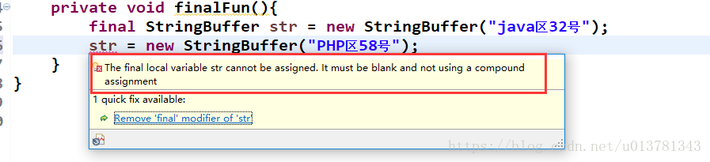
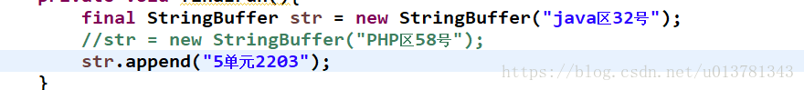

# final关键字
## final有啥用
用于修饰类、属性和方法：
* 被final修饰的类不可以被继承
* 被final修饰的方法不可以被重写
* 被final修饰的变量不可以改变，被final修饰不可变的是变量的引用，引用指向的内容是可以改变的

可以修改引用对象的内容

## final finally finalize的区别
* final可以修饰类、变量、方法，修饰类表示该类不能被继承、修饰方法表示该方法不能被重写、修饰变量表
示该变量是一个常量不能被重新赋值。
* finally一般作用在try-catch代码块中，在处理异常的时候，通常我们将一定要执行的代码方法finally代码块
中，表示不管是否出现异常，该代码块都会执行，一般用来存放一些关闭资源的代码。
* finalize是一个方法，属于Object类的一个方法，而Object类是所有类的父类，该方法一般由垃圾回收器来调
用，当我们调用System.gc() 方法的时候，由垃圾回收器调用finalize()，回收垃圾，一个对象是否可回收的
最后判断。  
>1.一旦垃圾回收器准备释放对象所占的内存空间，如果对象覆盖了Object的finalize()并且函数体内不为空，就会首先调用对象的finalize()方法，然后在下一次垃圾回收动作发生的时候真正回收垃圾所占的空间。  
>2.java垃圾回收器只能回收创建在堆中的java对象，对于不是这种方式创建的对象(JNI本地对象),只能通过finalize()保证使用之后销毁、释放内存。  
>3.充当保证使用之后释放资源的最后一道屏障，比如数据库连接之后未断开，这时只能依靠finalize()函数释放资源，但是finalize()不一定会被调用。[参考](https://blog.csdn.net/zyt425916200/article/details/78419410)  

# static修饰

* 静态域：将域定义为static，每个类只有一个这样的与。
* 静态常量：`public static final double PI=3.14145926535897`
* 静态方法：是一种不能向对象实施操作的方法；静态方法使用注意不能使用实例成员变量和实例方法，不能使用this或super。

静态方法使用场景：  
* 一个方法不需要访问对象状态，所需参数都是通过显示参数提供
* 一个方法只需要访问类的静态域