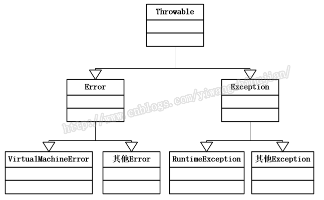
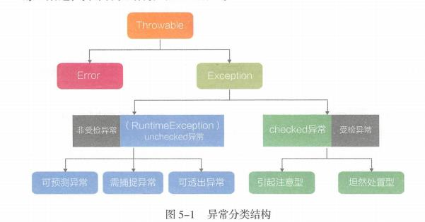

# java异常体系结构

## 概述

java把异常作为一种类，当作对象来处理。所有类的基类都是Throwable类，两大子类分别是Error和Exception。  
系统错误由java虚拟机抛出，用Error类表示，描述java虚拟机内部错误，本身无法处理，会导致虚拟机崩溃，也无法进行捕捉和抛出。  
异常（Exception)又分为RuntimeException(运行时异常、非受检异常)和CheckedException(受检异常)： 
* RuntimeException：程序运行的时候才可能发生的异常，一般为代码逻辑错误，例如：类型转换错误、空指针、数组下访问超界。
* CheckedException：编译期间出错，需要显示处理，通过使用<strong>throws</strong>声明，如果能行处理，则在当前方法中捕获异常；如果无法处理则向调用方抛出异常，例如SQLException、IOException等。
  
## 异常体系结构图
  

来源《码出高效 java开发手册》  
checked异常包括JDK中定义的SQLException、ClassNotFoundException:  
* 无能为力、引起注意型。针对此类异常，程序无法处理，例如SQLException，处理方法是保存现场等待人工介入。
* 力所能及、坦然处置。发生未授权运行时异常，程序跳转至权限申请页面。
  
unchecked异常，运行时异常，继承自RuntimeException，不需要程序进行显示的捕捉和处理，一般分为三类：  
* 可预测异常：IndexOutOfBoundException、NullPointerException等，基于代码的性能和稳定性，此类异常不应该抛出，应该提前做好检查。  
* 需捕捉异常：例如在Dubbo框架进行RPC调用时产生的远程服务异常DubboTimeoutException，此类异常客户端必须显示处理异常。
* 可透出异常：主要是指框架或系统产生的且会自行处理的异常，程序无需关心。

## 异常处理
关键字try-catch-finally,throw抛出一个异常动词，throws声明一个可能抛出的异常。
* try代码块：监视代码执行过程，出现异常则调至catch，无catch则调至finally。
* catch代码块：无异常则不执行，有异常则进行处理或向上抛出。
* finally代码块：必选执行的代码块，通常用于善后工作、清理资源、关闭管道流等，例如数据库连接关闭。
* throw 是方法内部抛出具体异常类对象的关键字。
* throws则用于方法signature上，表示调用者可以通过此方法声明向上抛出异常。

## 常见问题
```java
public class TryFinallyTest{
    static int x = 1;
    static int y = 10;
    static int z = 100;
    public static void main(String[] args){
        int value = finallyReturn();
        System.out.println(value);
        System.out.println(x);
        System.out.println(y);
        System.out.println(z);
    }

    public static int finallyReturn(){
        try{
            //
            ++x;
        }catch(Exception e){
            return ++y;
        }finally{
            return ++z;
        }
    }
}
```
分析：
```
如果无异常,则运行完try整个代码块，catch不运行：
value= 101
x = 2
y = 10
z = 101
有异常，异常处后面不再运行，跳转至catch：
value = 101
x = 1
y = 11
z = 101
finally里面写return使得返回值非常不可控
```
### throw与throws区别
* throw是语句抛出一个异常，throws是方法抛出一个异常；throw \<异常对象>；throws \<类名>由多个,分开
* throws可以单独使用;throw不行，必须和try-catch一起或和throws一起使用
* throws是说明你有这个可能、倾向抛出异常；throw则把这个可能变成了现实

### 自定义异常
项目开发中，通过自定义各种异常继承RuntimeException；Springboot通过定义全局异常处理器，使用@RestControllerAdvice注解，向控制器以json的形式抛出异常，具体异常用@ExceptionHandler(XXException.class),还需要定义统一返回的结果类、异常枚举类
## 参考
[https://www.cnblogs.com/aspirant/p/10790803.html](https://www.cnblogs.com/aspirant/p/10790803.html)  
[https://blog.csdn.net/ronawilliam/article/details/3299676](https://blog.csdn.net/ronawilliam/article/details/3299676)
《码出高效-java开发手册》