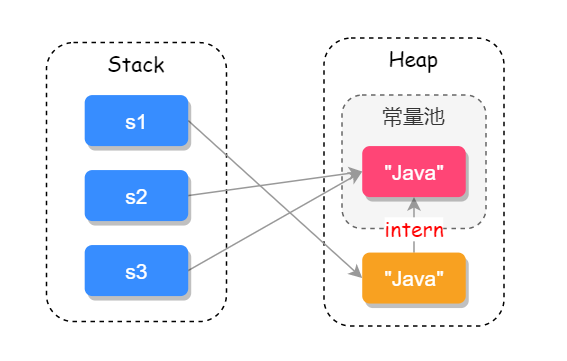

# String如何实现，有哪些重要方法

## 源码
### 基本属性
```Java
//实现了Comparable接口，
//final修饰
public final class String
    implements java.io.Serializable, Comparable<String>, CharSequence {
    /** The value is used for character storage. */
    private final char value[];//final修饰的字符数组，不变

    /** Cache the hash code for the string */
    private int hash; // Default to 0
    //其他省略
    }
```
### 多构造方法
```Java
 public String(String original) {
        this.value = original.value;
        this.hash = original.hash;
    }
 public String(char value[]) {
        this.value = Arrays.copyOf(value, value.length);
    }
//StringBuffer安全
 public String(StringBuffer buffer) {
        synchronized(buffer) {
            this.value = Arrays.copyOf(buffer.getValue(), buffer.length());
        }
    }
//
public String(StringBuilder builder) {
        this.value = Arrays.copyOf(builder.getValue(), builder.length());
    }
```
### 比较
```Java
//equal String重写Object里面的equal方法
 public boolean equals(Object anObject) {
     //对象引用相同直接返回
        if (this == anObject) {
            return true;
        }
        //判断是否为String类型，如果不是直接返回
        if (anObject instanceof String) {
            String anotherString = (String)anObject;
            int n = value.length;
            if (n == anotherString.value.length) {
                char v1[] = value;
                char v2[] = anotherString.value;
                int i = 0;
                //循环比较两个字符串的每一个字符
                while (n-- != 0) {
                    if (v1[i] != v2[i])
                        return false;
                    i++;
                }
                return true;
            }
        }
        return false;
    }
//重写 CompareTo
public int compareTo(String anotherString) {
        int len1 = value.length;
        int len2 = anotherString.value.length;
        int lim = Math.min(len1, len2);
        char v1[] = value;
        char v2[] = anotherString.value;

        int k = 0;
        while (k < lim) {
            char c1 = v1[k];
            char c2 = v2[k];
            if (c1 != c2) {
                //有字符不相等，返回差值
                return c1 - c2;
            }
            k++;
        }
        return len1 - len2;
    }
```

##考点扩展
### ==与equal
* ==对于基本类型来说，用于值比较是否相等；对于引用类型，比较引用的地址是否相同。查看源码
```Java
 public boolean equals(Object obj) {
        return (this == obj);
    }
//object中的equal实际就是==比较引用地址是否相等
//String里面重写了equal，可以通过字符串的字符一一比较
```
### final修饰类的好处
String类是被final修饰，不可继承。  
* <strong>安全</strong>，final修饰，不可变，传参时不用考虑谁会修改它的值，例如参数校验时，校验过后，如果值改变了，就会引起严重的问题。
* <strong>高效</strong>JVM用字符串常量池，只有字符串不可变市，才能实现字符串常量池，字符串常量池可以为我们缓存字符串。  
```Java
String s1 = "java";
String s2 = "java";
```

### String 、StringBuffer、StringBuilder
* String类型是不可变，用String字符串拼接，频繁创建新对象，性能低。
* StringBuffer和StringBuilder都提供了append和insert方法，拼接字符串。
* StringBuffer用synchronized来保证线程安全，性能不高。
* StringBuilder线程不安全，但是性能要优于StringBuffer，非并发环境可以考虑使用StringBuilder。

### String与JVM

String创建方式有两种：
```Java
String s1 = "Java";
String s2 = new String("Java");
```
jdk1.8中，变量s1先去字符串常量池中查找：java，如果相同字符串则返回常量句柄，没有则创建字符串，再返回常量句柄。而变量s2则是直接在堆上创建一个变量，如果调用<strong>intern</strong>方法才会把字符串保存到常量池中。
具体实例如下：  
```Java
String s1 = new String("java");
String s2 = s1.intern();
String s3 = "java";
System.out.println( s1 == s2);//false
System.out.println( s2 == s3);//true
```
JVM 示意图

JDK1.7之后把永生代换成的元空间，字符串常量池从方法区移到了java堆上。
```Java
String s1 = "ja" + "va";
String s2 = "java";
System.out.println(s1 == s2);//true
```
反编译代码后发现，"ja"+"va"直接编译成"java"；
