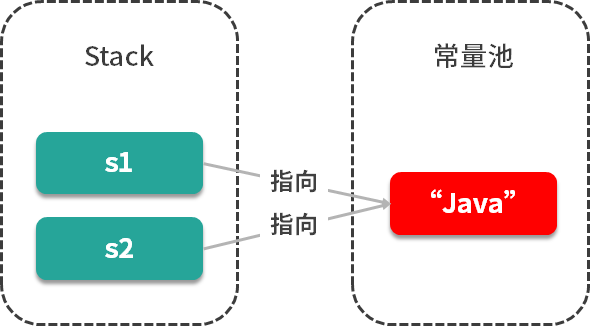

# String如何实现，有哪些重要方法

## 源码
### 基本属性
```Java
//实现了Comparable接口，
//final修饰
public final class String
    implements java.io.Serializable, Comparable<String>, CharSequence {
    /** The value is used for character storage. */
    private final char value[];//final修饰的字符数组，不变

    /** Cache the hash code for the string */
    private int hash; // Default to 0
    //其他省略
    }
```
在java中，数组也是对象，value也只是一个引用，它指向一个真正的数组对象。

String内部三个变量都是私有，final不可变。初始化后，String对象就不可变了。
### 多构造方法
```Java
 public String(String original) {
        this.value = original.value;
        this.hash = original.hash;
    }
 public String(char value[]) {
        this.value = Arrays.copyOf(value, value.length);
    }
//StringBuffer安全
 public String(StringBuffer buffer) {
        synchronized(buffer) {
            this.value = Arrays.copyOf(buffer.getValue(), buffer.length());
        }
    }
//
public String(StringBuilder builder) {
        this.value = Arrays.copyOf(builder.getValue(), builder.length());
    }
```
### 比较
```Java
//equal String重写Object里面的equal方法
 public boolean equals(Object anObject) {
     //对象引用相同直接返回
        if (this == anObject) {
            return true;
        }
        //判断是否为String类型，如果不是直接返回
        if (anObject instanceof String) {
            String anotherString = (String)anObject;
            int n = value.length;
            if (n == anotherString.value.length) {
                char v1[] = value;
                char v2[] = anotherString.value;
                int i = 0;
                //循环比较两个字符串的每一个字符
                while (n-- != 0) {
                    if (v1[i] != v2[i])
                        return false;
                    i++;
                }
                return true;
            }
        }
        return false;
    }
//重写 CompareTo
public int compareTo(String anotherString) {
        int len1 = value.length;
        int len2 = anotherString.value.length;
        int lim = Math.min(len1, len2);
        char v1[] = value;
        char v2[] = anotherString.value;

        int k = 0;
        while (k < lim) {
            char c1 = v1[k];
            char c2 = v2[k];
            if (c1 != c2) {
                //有字符不相等，返回差值
                return c1 - c2;
            }
            k++;
        }
        return len1 - len2;
    }
```

##考点扩展
### ==与equal
* ==对于基本类型来说，用于值比较是否相等；对于引用类型，比较引用的地址是否相同。查看源码
```Java
 public boolean equals(Object obj) {
        return (this == obj);
    }
//object中的equal实际就是==比较引用地址是否相等
//String里面重写了equal，可以通过字符串的字符一一比较
```
### final修饰类的好处
String类是被final修饰，不可继承。  
* <strong>安全</strong>，final修饰，不可变，传参时不用考虑谁会修改它的值，例如参数校验时，校验过后，如果值改变了，就会引起严重的问题。
* <strong>高效</strong>JVM用字符串常量池，只有字符串不可变市，才能实现字符串常量池，字符串常量池可以为我们缓存字符串。  
```Java
String s1 = "java";
String s2 = "java";
```

### String 、StringBuffer、StringBuilder
* String类型是不可变，用String字符串拼接，频繁创建新对象，性能低。
* StringBuffer和StringBuilder都提供了append和insert方法，拼接字符串。
* StringBuffer用synchronized来保证线程安全，性能不高。
* StringBuilder线程不安全，但是性能要优于StringBuffer，非并发环境可以考虑使用StringBuilder。

### String与JVM

String创建方式有两种：
```Java
String s1 = "Java";
String s2 = new String("Java");
```
jdk1.8中，变量s1先去字符串常量池中查找：java，如果相同字符串则返回常量句柄，没有则创建字符串，再返回常量句柄。而变量s2则是直接在堆上创建一个变量，如果调用<strong>intern</strong>方法才会把字符串保存到常量池中。
具体实例如下：  
```Java
String s1 = new String("java");
String s2 = s1.intern();
String s3 = "java";
System.out.println( s1 == s2);//false
System.out.println( s2 == s3);//true
```
JVM 示意图

JDK1.7之后把永生代换成的元空间，字符串常量池从方法区移到了java堆上。
```Java
String s1 = "ja" + "va";
String s2 = "java";
System.out.println(s1 == s2);//true
```
反编译代码后发现，"ja"+"va"直接编译成"java"；

## String为什么不可变

### 什么是不可变对象，
一个对象创建完之后，不能再改变它的状态，那么这个对象就是不可变的。不能改变状态的意思是，不能改变对象内的成员变量，包括基本数据类型的值不能改变，引用类型的变量不能指向其他的对象，引用类型指向的对象的状态也不能改变。

## 区分对象和对象的引用

```java
String  s = "AbDcd";
System.out.println("s="+s);//AbDcd

s = "123456";
System.out.println("s="+s);//123456
```
误区：<strong>s只是一个String对象的引用，并不是对象本身</strong>。对象在内存中是一块内存区；引用只是一个4字节的数据，里面存放了它所有的对象地址，通过这个地址可以访问对象。
s只是一个引用，它指向一个具体对象，当s="123456"，这代码执行后，又创建了一个新的对象"123456",而引用重新指向了这个新的对象，原来的对象还在”AbDcd“还在内存中，并没有改变。

## String真的不可变吗
通过反射出String对象中的value属性，进而改变通过获得Value引用改变数组的结构。
```java

public static void testReflection() throws Exception {
 		//创建字符串"Hello World"， 并赋给引用s
		String s = "Hello World"; 
		System.out.println("s = " + s);	//Hello World
		//获取String类中的value字段
		Field valueFieldOfString = String.class.getDeclaredField("value");
		//改变value属性的访问权限
		valueFieldOfString.setAccessible(true);
		//获取s对象上的value属性的值
		char[] value = (char[]) valueFieldOfString.get(s);
		//改变value所引用的数组中的第5个字符
		value[5] = '_';
		System.out.println("s = " + s);  //Hello_World
}
```
### Sring是值传递还是引用传递
值传递
<strong>java在方法传递参数时，是将变量复制一份然后传入方法体去执行</strong>
java的内存模型分为堆和栈。
1、基本类型的变量放在栈里
2、封装类型中，对象放在堆里，对象的引用放在栈里

* 这句话解释一下基本类型的传递

  * 虚拟机分配给num一个内存地址，并且存了一个值0.
虚拟机复制了一个num，我们叫他num’，num’和num的内存地址不同，但存的值都是0。
  * 虚拟机讲num’传入方法，方法将num’的值改为1.
方法结束，方法外打印num的值，由于num内存中的值没有改变，还是0，所以打印是0.
* 我们再解释封装类型的传递：

  * 虚拟机在堆中开辟了一个Product的内存空间，内存中包含proName和num。
虚拟机在栈中分配给p一个内存地址，这个地址中存的是1中的Product的内存地址。
虚拟机复制了一个p，我们叫他p’,p和p’的内存地址不同，但它们存的值是相同的，都是1中Product的内存地址。
  * 将p’传入方法，方法改变了1中的proName和num。
方法结束，方法外打印p中变量的值，由于p和p’中存的都是1中Product的地址，但是1中Product里的值发生了改变， 所以，方法外打印p的值，是方法执行以后的。我们看到的效果是封装类型的值是改变的。
* 最后我们再来解释String在传递过程中的步骤：

  * 虚拟机在堆中开辟一块内存，并存值”ab”。
  * 虚拟机在栈中分配给str一个内存，内存中存的是1中的地址。
虚拟机复制一份str，我们叫str’，str和str’内存不同，但存的值都是1的地址。
  * 将str’传入方法体
  * 方法体在堆中开辟一块内存，并存值”cd”
  * 方法体将str’的值改变，存入5的内存地址
  * 方法结束，方法外打印str，由于str存的是1的地址，所有打印结果是”ab”