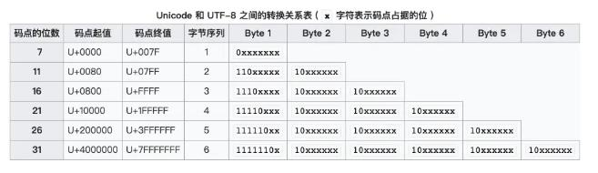

# 字符编码与字符集
## 字符编码与字符集概念

* 字符集(character set)是一个系统支持的所有抽象字符的集合。
* 编码字符集是指，这个字符集里的每一个字符，都对应唯一的一个代码值，这些代码值叫做码点(code point),字符在给定的编码方式下的二进制比特序列称为代码单元(code unit).
>常见的编码字符集：  
> 1.Unicode:统一字符集，  
> 2.ASCII：早期计算机处理英文，计算机的缺省字符集，包含英文所需要的所有字符  
> 3.GB2312：中文字符集，包含ASCII字符集，ASCII部分用单字节表示，剩余部分用双字节。  
> 4.GBK：GB2312的扩展，完整包含了GB2312的所有内容。  
> 5.GB18030：GBK字符集的超集，大汉字字符集，CJK，包含了中日韩三国语言的所有字符。  

* 字符编码(character encoding)：是编码字符集的字符和存储值对应的关系。常见的编码方式：utf-8、utf-16、utf-32(unicode字符集的编码)、ASCII(ASCII字符集编码方式)。

## UTF-8
Unicode的实现方式有UTF-8、UTF-16(2个或4个字节)、UTF-32(字符用4字节表示)。  
UTF-8是一种变长的编码方式，它可以使用1-6个字节表示一个符号，根据不同符号而变化字节长度。  

> 一个US-ASCII码只需要1字节编码  
> 中韩日、东南亚文字、中冬文字等包含了大部分常用字，使用3字节编码 
> 带有变音符号的拉丁文、希腊文等需要2字节编码
> 
>编码规则:   
>> 1.对于单字节的符号，字节的第一位设为0，后面7位为这个符号的Unicode码，因此，UTF-8编码和ASCII码是相同的。  
>>2.对于n字节的符号(n>1),第一个字节前n位都设为1，第n+1位设为0，后面字节的前两位一律设为10.剩下的二进制位全部为这个符号的Unicode码。

```
UNICODE uCA(1100 1010)编码成UTF-8
uCA(1100 1010)处于0080-07FF之间，转换表需要2字节编码，
对应UTF-8编码格式：110X XXXX 10XX XXXX；
X处都用Unicode码来填充，11位X,CA只有8位，高位补0 
补成11位-000 1100 1010，填充后得到 
1100 0011 1000 1010(C38A)
uCA-> C38A
```
## 参考阅读
[字符集与编码](https://juejin.im/post/5c847cb5f265da2dd63929c2)

### 字符编码模型
一个字符集从诞生到真正让计算机存储一般需要五个步骤： 
* 1.明确包含字符的范围。
> 这个步骤是<font color="red">确定 字符集 应该包含哪些字符</font>；比如<font color="red">ASCII</font>收录了128个字符，而GB2312收录了7445个字符，不含ASCII里的字符。

* 2.给步骤1中确定的字符进行编号。  
> 对于字符集已确定的字符，建立对应关系-<font color="red">让某个字符与某个数字建立一一对应关系</font>  
> 由于ASCII字符集包含的字符较少，只有128个，直接用0-127对应每个字符，  
> <font color="yellow">这里编号是一个纯数学编号，与计算机存储无任何关系</font>

* 3.将步骤2中的编号确定<font color="red">逻辑上的字符编码</font>.  
> 计算机只认二进制，我们需要将编号映射为二进制，有的映射是直接将编号二进制化，有的需要一些算法计算该编号对应的二进制数据。  
> 二进制表示字符：  
>> 计算机以字节为基本处理单位，不同的字符集编码不同的规定，有的一次读一个字节，有的2个，有的四个。计算机一次读的字节称为编码单元，码元。  
>> ASCII字符集，一个字节作为一个码元，一个码元可以表示一个字符。  
>逻辑字符编码的意思就是安装2中的字符编号映射为一个二进制数字，并且规定好码元大小，所以一个字符可以表示成一个或几个码元排列起来的二进制数字，我们称为码元序列。  
* 4.给步骤3中的逻辑上的字符编码生成物理上的字符编码。  
> 物理上的字符编码是跟特定的计算机平台有关的更具体的编码，主要是针对码元是多个字节的情况。<font color="red">码元为单字节时，码元序列和物理编码后的字节编码序列相同</font>。多字节码元编码主要是涉及到`大端序和小端序存储排列`.  

* 5.面向计算机底层，进行进一步的适应性编码处理。
> 1. 一种是把字节序列映射到一套更受限制的值域内，以满足传输环境需求。  
> 2. 压缩字节序列的值，进程长度编码等无损压缩技术。  

### 具体字符集编码模型
#### ASCII字符集 1字节
* 收录了128个字符。  
* 字符编号，0-127为128个字符编号。  
* 逻辑编码，采用单字节-码元，直接把编号映射为二进制数据。
* 物理编码,字节序列同码元序列。

#### ISO 8859系列字符集 1字节
* 收录了字符范围除了ASCII字符集中包含的字符外，每个字符集扩充了96个字符
* 字符编号ASCII字符集中字符编号不变，新增的字符在160-255范围编号。
* 编码(逻辑与物理编码一致)  
> 由于字符数量没有超过256，仍然采用单字节作为码元，直接映射成二进制序列。

#### GB2312字符集 2字节
* 收录了汉子以及拉丁字母、希腊字母、日文等。收录汉字6763个，其他字符682个；没有收录ASCII字符。
* 字符编号，字符太多，提出分区管理。94个区，每个区可包含94个字符。
* 编码：对GB2312字符集进行编码时，没有收录ASCII字符集，英文字母如何标识  
> GB2312编码  
> 存在ASCII字符集，按ASCII编码的方式进行编码  
> 存在GB2312字符集中，按GB2312编码的方式编码。  
> GB2312提出分区的概念，则有区位代码和位代码。但是都在1-94之间，为了区分ASCII编码，避免冲突，给区码和位码都加160(127-161均可)，拼成2个字节.  
> ```
> 我爱u 
> 我对应区位码4650，编码后十六进制CED2，二进制：11001110 11010010
> 爱对应区位码1614，十六进制B0AE，二进制：1011000010101110 
> u是ASCII字符集，编码后75，二进制01001011.
> 拼起来1100111011010010101100001010111001001011
> 十六进制 CED2B0AE4B
> ```
> 解码过程(一个十六进制位数对应4个2进制位数)  
> 读一个字节CE，大于127，一个两字节的字符，连续两个字节CED2，编码表里查到汉子-我  
> 接着读一个字节B0，大于127，两字节B0AE，编码里查到汉子-爱  
> 接着一个字节4B，发现小于127，查ASCII码表，得到u 

#### Unicode字符集
通常说的Unicode值是指字符的编号，不是编码。  
Unicode字符集编码的码元大小有1，2，4字节三种情况。分别对应UTF-8，UTF-16,uTF-32.  
##### UTF-8逻辑编码
这种编码方案的码元采用一个字节。但是一个字节最多只能表示256个字符，所以有的字符需要多个字节来表示，但这就产生了一个问题：计算机如何区分哪个字符是用一个码元(此处是1字节)表示，哪个字符使用多个码元表示的？
UTF-8编码是用首字节的开头几位来辨别是用几个字节编码的：


如果首字节以0开头，肯定是单字节编码(单个码元)；


如果首字节以110开头，肯定是双字节编码(2个码元)；


如果首字节以1110开头，肯定是三字节编码(3个码元)。

##### UTF-16逻辑编码
码元采用2字节，

##### UTF-32逻辑编码

##### 物理编码
字节序列(Byte Order)指存放多字节数据的字节的顺序。  
这里定义int 型16进制数据
```java
int i = 0xaabbccdd; //二进制数据就是 10101010 10111011 11001100 11011101
```
左边是高字节(0xaa)相对于0xbb,0xcc.  
根据i的变量在内存里的存放顺序定义大端序(Big-Endian)和小端序(Little-Endian)；  
<font color="red">大端序：高字节放在地址低的低端，低字节存放在地址高端</font>。 
```java
// 写出来的结果
0xaabbccdd
```
<font color="red">小端序：低字节放在地址低的低端，高字节存放在地址高端。</font> 
```java
// 写出来的结果
0xddccbbaa
```
```java
`大端序`就是按照人类理解的顺序进行存储的，从左至右，从高字节到低字节。

`小端序`就是按照反人类理解的顺序进行存储的，从左至右，从低字节到高字节。
```
###### 文件头加表明字节序的字符
* <font color="Red">大端序编码</font>，加一个字符`U+FEFF`，UTF-16会把这个字符编码成2个字节。UTF-32编码会编码成4个字节。  
* <font color="red">小端序编码</font>：加一个字符`U+FFFE`,同上。

## JavaWeb中的编码

* UTF-16的编码效率高，从字符到字节的相互转换简单，适合在磁盘和内存之间只用，进行字符与字节之间快速切换，java内存编码采用UTF-16。不适合网络传输，网络传输容易损坏字节流。
* UTF-8适合网络传输，对ASCII字符采用单字节存储，单个字符损坏不影响后面的其他字符，编码效率介于GBK与UTF-16之间。
* HTTP请求：URL、Cookie、Parameter、POST表单，读取数据库中的数据、本地文件都存在编码问题。涉及编码解码过程。
* URL中，涉及非ASCII字符按照某种编码格式编码成16进制，然后将每个16进制表示的字节前加上"%"。
* 服务器返回数据时，编解码字符集通过response.setCharacterEncoding()设置,并且通过Header的Content-type返回给客户端，按照返回的编码格式进行解码，没有则用浏览器默认的编码解码。