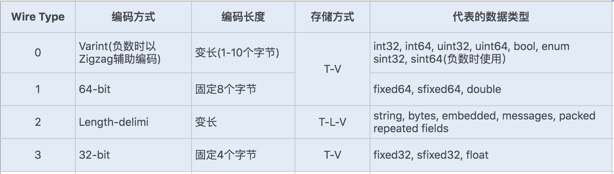

# 序列化

内存中的数据对象只有转换为二进制才可以进行数据持久化和网络传输，将数据对象转换为二进制流的过程称为对象的序列化（Serialzation），反之将二进制流恢复成数据对象的过程称为反序列化(Deserialization)；序列化需要充保留充分的信息以恢复数据对象，但是为了节约存储空间和网络带宽，序列化后的二进制流又要尽可能小。常见使用场景为RPC框架数据的传输

## 原生序列化
java类通过Serializable接口来实现该类的序列化，该接口没有任何方法，只是标识作用；java序列化保留了对象类的元数据（类、成员变量、继承类信息）以及对象数据等，兼容性最好，但不支持跨语言，性能一般。  
实现Serializable接口建议设置serialVersionUID字段值，如果不设置，运行时会根据类内部的实现，自动生成serialVersionUID，如果类的源代码有修改，就会重新编译生成新的值。因此一定要显示定义serialVersionUID属性值。修改类时根据兼容性是否修改该值：   
* 如果是兼容升级，不要修改serialVersionUID字段，避免反序列化失败
* 如果是不兼容升级，要修改该值，避免反序列化混乱

java原生序列化时不会调用类得无参构造方法，而是用native方法将成员变量赋值为对应类型的初始值。

## Hessian序列化
Hessian序列化是一种支持动态类型、跨语言、基于对象传输的网络协议。java对象序列化的二进制流可以被其他语言反序列化。  
Hessian协议有以下特性：  
* 自描述序列化类型，不依赖外部描述文件或接口定义，用一个字节表示常用基础类型，极大缩短二进制流
* 语言无关，支持脚本语言
* 协议简单，比java原生序列化高效

相比Hessian1.0，Hessian2.0中增加了压缩编码，其序列化二进制流大小是java序列化的50%，序列化耗时是java序列化的30%，反序列化时java序列化的20%。Hessian会把复杂对象的所有属性存储在一个Map中进行序列化。<strong>所以在父类和子类 存在同名成员变量的情况下，Hessian序列化时，先序列化子类，然后序列化父类，因此反序列化结果会导致子类同名成员变量被父类的值覆盖。</strong>

## JSON序列化
JSON是一种轻量级数据交换格式，JSON序列化就是将对象转换成JSON字符串。过程中抛弃了类信息，所以反序列化时，只有提供类型信息才能准确的反序列化；JSON可读性比较好，方便调试  

## Protobuf 序列化框架
Protobuf是Google的一种数据交换格式，它独立于语言、独立于平台。
Google提供了多种语言来实现，比如Java、C、Go、Python，每一种实现都包含了相应语言的编译器和库文件
Protobuf 使用比较广泛，主要是<strong>空间开销小和性能比较好</strong>，非常适合用于公司内部对性能要求高的 RPC 调用。 另外由于解析性能比较高，序列化以后数据量相对较少，所以也可以应用在对象的持久化场景中但是要<strong>使用 Protobuf 会相对来说麻烦些，因为他有自己的语法，有自己的编译器 </strong>
### Protocol Buffers
Protobuf是一种轻便的高效的结构化数据存储格式。它使用T-L-V(标识-长度-字段)的数据格式来存储数据，T代表字段的正数序列(Tag),Protocol Buffers将对象中的每个字段和正数序列对应起来，对应关系的信息是由生成的代码来保证的。序列化时用整数数值来代替字段名称，于是传输流量就可以大幅缩减；L代表Value的字节长度，一般也占一个字节；V代表字段经过编码后的值，这种格式不需要分割符，也不需要空格，减少了冗余字段名
protobuf定义了一套自己的编码方式，几乎可以映射java/Python等语言的所有基础数据类型

对于存储varint编码数据，由于数据占用的存储空间是固定的，就不需要存储字节长度的Length，实际上protobuf的存储方式是T-V，这样又减少了一个字节的存储。
Protobuf 的这种数据存储格式，不仅压缩存储数据的效果好， 在编码和解码的性能方面也很高效。Protobuf 的编码和解码过程结合.proto 文件格式，加上 Protocol Buffer 独特的编码格式，只需要简单的数据运算以及位移等操作就可以完成编码与解码。可以说 Protobuf 的整体性能非常优秀。

序列化通常会通过网络传输对象，而对象有往往有敏感数据，容易被黑客攻击，利用反序列化构造恶意代码。防范攻击可以对对象敏感的属性不需要进行序列化传输，加<strong>transient</strong>,如果一定要传递对象的敏感属性，可以用对称与非对称加密方式独立传输，再使用某方法把属性还原到对象中。