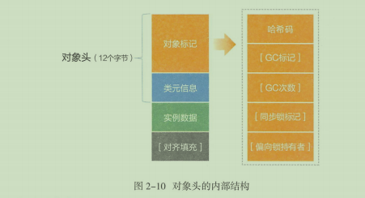

# 数据类型

## 基本数据类型
9种基本数据类型：boolean,char, byte,short,int,long, float,double和refvar(引用变量).

基本数据类型

|序号|类型|默认值|大小|最小值|最大值|包装类|缓存区间|
|--|--|--|--|--|--|--|--|
|1|boolean|false|1B|0(false)|1(true)|Boolean|无|
|2|byte|(byte)0|1B|-128|127|Byte|-128~127|
|3|char|'\u0000'|2B|'\u0000'|'\uFFFF'|Character|(char)0-127|
|4|short|(short)0|2B|-2^15|2^15-1(32767)|Short|-128~127|
|5|int|0|4B|-2^31|2^31-1|Integer|-128~127|
|6|long|0L|8B|-2^63||2^63-1|Long|-128~127|
|7|float|0.0f|4B|1.4e-45|3.4e+38|Float|~|
|8|double|0.0d|8B|4.9e-324|1.798e+308|Double|~|

引用分成两种数据类型：引用变量本身(refvar)和引用指向的对象(refobj)。refvar是基本数据类型，默认值是null，存储refobj的首地址，可以直接使用==等值判断。作为引用变量，不管它指向什么，refvar占4B空间(类似C中指针变量).无论refobj是多么小的对象，最小占用12B(存储基本信息，对象头)，但是由于存储空间必须8B的倍数，初始分配空间最少16B。   
对象头内部结构：  

* 对象头(Object Header)
> 对象头占用12字节，包括对象标记(存储对象本身运行时的数据，哈希码、GC标志、GC次数、锁标记、线程关联信息)，这部分"Mark Word",64位JVM上占8B；还包括类元信息(存储对象指向它的类元数据的首地址)占用4字节。
* 实例数据(Instance Data)
> 存储对象的实例成员变量和所有可见的父类成员变量。

* 对齐填充(Padding)
> 对象的存储分配单位是8Byte,如果一个占用16字节的对象增加一个成员变量byte类型，此时需要17字节，会分配24个字节进行对齐操作。

## 包装类型
包装类型解决了基本类型无法做的事情：泛型类型参数、序列化、类型转换、高频区间数据缓存；  

<strong>选择使用包装类型还是基本类型，推荐方式</strong>:  
* 所有POJO类属性必须使用包装数据类型
* RPC方法返回值和参数必须使用包装数据类型
* 所有局部变量推荐使用基本数据类型