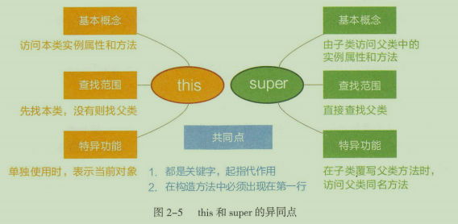
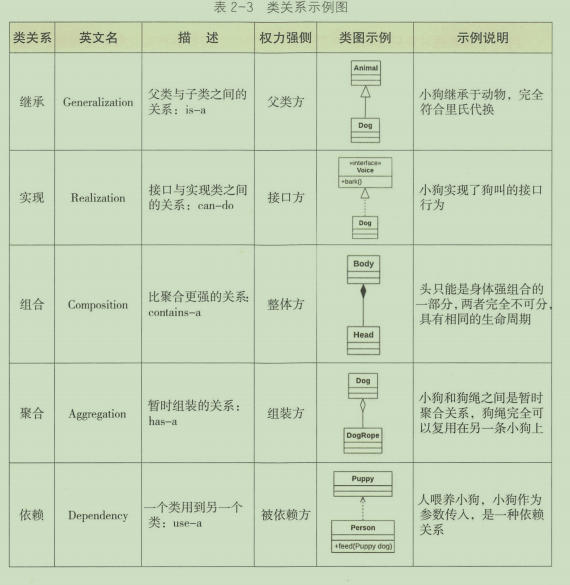

### 获取一个类对象的方式有哪些？
<strong>类对象概念</strong>： 所有的类，都存在一个类对象，这个类对象用于提供类本身的信息，比如有几种构造方法， 有多少属性，有哪些普通方法。  
<strong>类的对象概念</strong>：类的实例化。  
* 通过类对象的getClass()方法获取，getClass是Object里面的方法
```java
User user = new User();
//clazz就是一个类对象
Class<?> clazz = user.getClass();
```
* 通过类的静态成员表示，每个类都有隐含的静态成员class
```java
//clazz是一个类对象
Class<?> clazz = User.class;
```
* 通过Class类的静态方法forName()获取
```java
Class<?> clazz = Class.forName("com.hs.User");
```

### 抽象与接口
相同点：
* 都不能被实例化，(即使用new）

不同点：
* 概念不一样，抽象是对类本质的抽象；接口是对动作行为的抽象。
* 使用不同；接口(implements)可以多继承，抽象只能单一继承
* 接口中的基本数据类型为static，而抽象类不是
* 接口中只定义方法，不能实现(1.8后，用default修饰)，抽象类可以定义实现部分非抽象方法。
* 接口被用于常用的功能，便于日后维护和添加删除，而抽象类更倾向于充当公共类的角色，不适用于日后重新对立面的代码修改。功能需要累积时用抽象类，不需要累积时用接口。
* 抽象类在被继承时体现的是is-a关系，接口体现的是can-do关系
* 抽象类是模板式设计，接口是契约式设计

### 内部类
定义在类内部，本身就是类的一个属性，类型：
静态内部类- static class XXXInserClass{};
成员内部类- private class XXXInserClass{};
局部内部类，定义在表达式或方法内部；
匿名内部类，(new Thread(){}).start().

无论什么类型的内部类，<font color="red">都会编译成独立的.class</font>.

内部类好处：  
* 作用域不会扩散到包外。
* 可以通过"外部类.内部类"的方式直接访问。
* 内部类可以访问外部类中的所有静态属性和方法。

### 访问权限
|访问权限控制符|任何地方|包外子类|包内|类内|
|--|--|--|--|--|
|public| OK |OK|OK|OK|
|protected|NO|OK|OK|OK|
|无|NO|NO|OK|OK|
|private|NO|NO|NO|OK|

推荐访问权限级别：<font color="red">  
* 如果不允许外部直接通过new创建对象，构造方法必须是private。
* 工具类不允许有public或default构造方法
* 类非static成员变量并且与子类共享，必须是protected。
* 类非static成员变量并且仅在本类使用，必须是private。
* 类static成员变量如果仅在本类使用，必须是private
* 若是static成员变量，必须考虑是否为final，
* 类成员方法只供类内部调用，必须是private，
* 类成员方法只对继承公开，那么必须限制为protected。
</font>
### this与super



### 类关系
* 【继承】 extends(is -a)
* 【实现】 implements(can -do)
* 【组合】类是成员变量(contains-a),非常强的整体与部分的关系，同生共死
* 【聚合】 类是成员变量(has-a)，非常松散的暂时组合，部分可以拆出来
* 【依赖】 import类(use-a)


