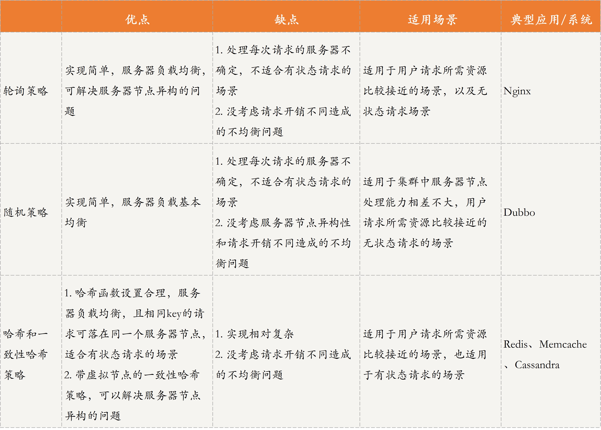
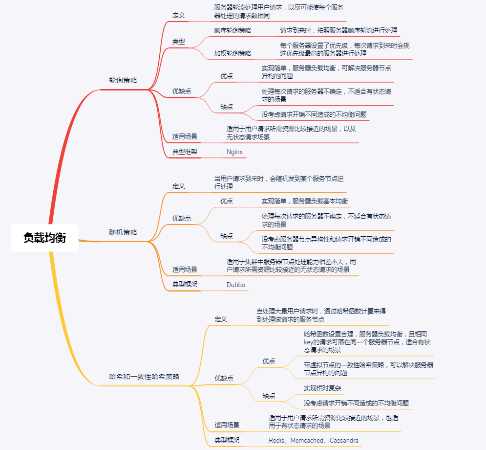
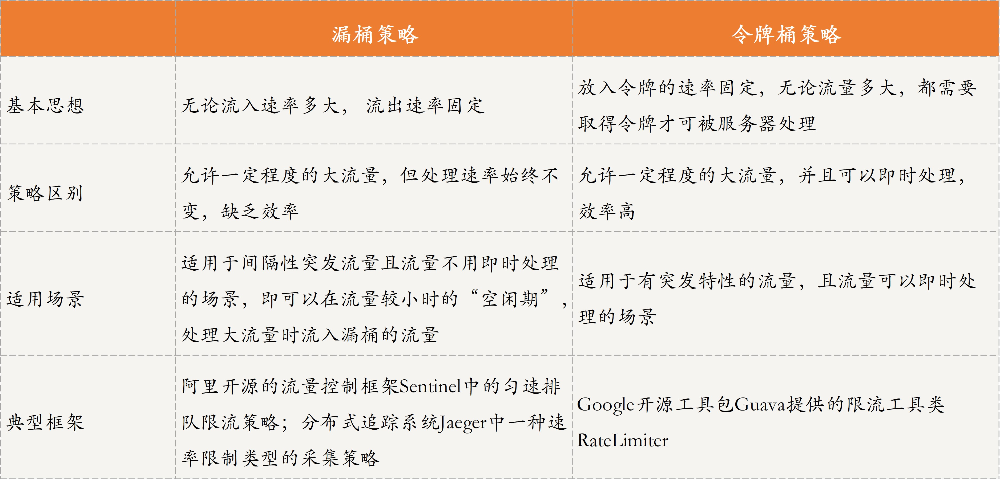
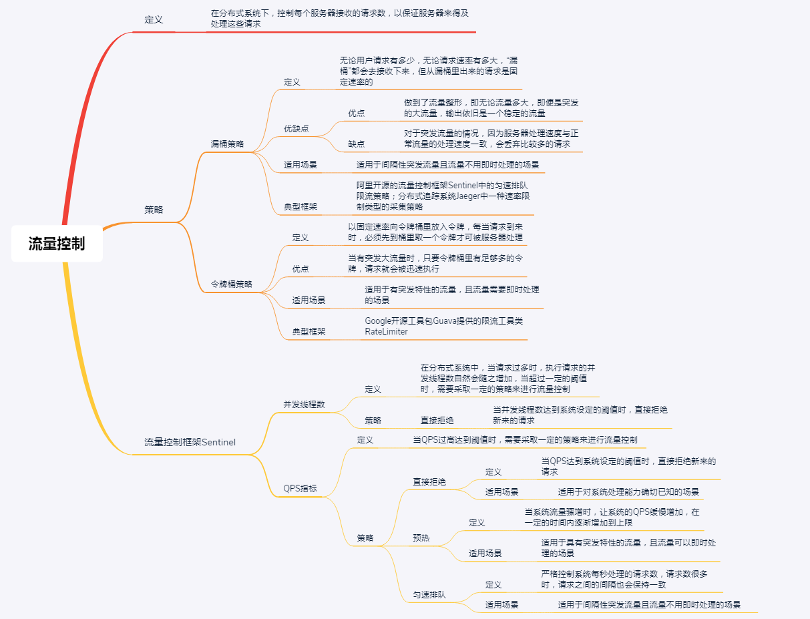
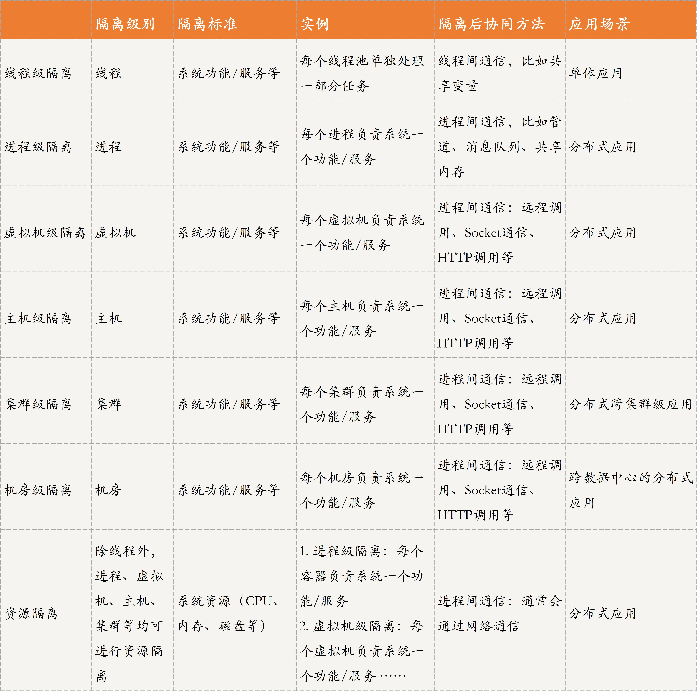
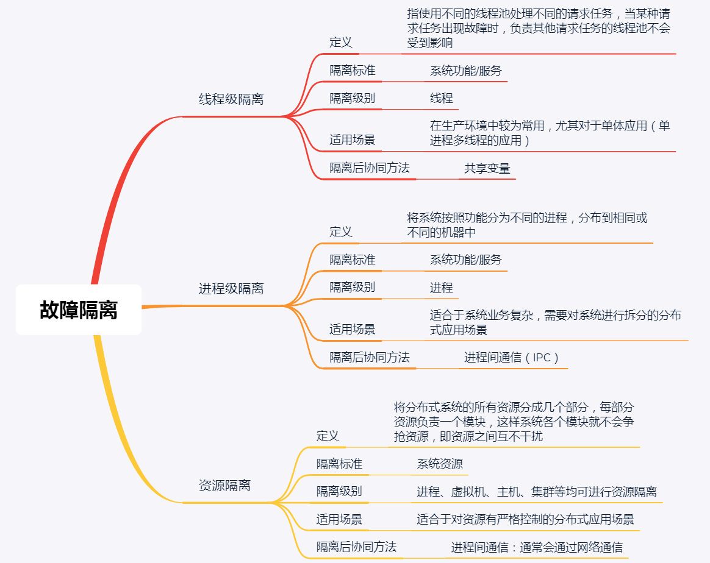
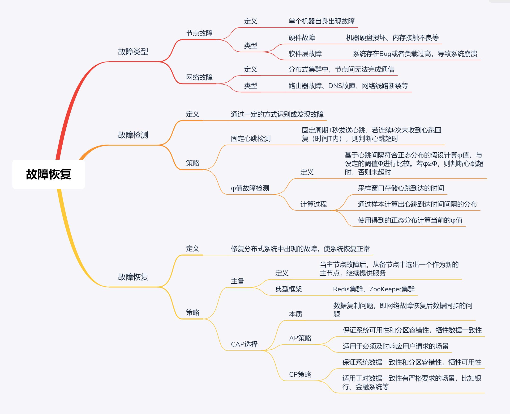

# 负载均衡

## 定义
负载均衡两种：
* 一种是请求负载均衡，即将用户的请求均衡地分发到不同的服务器进行处理。
* 数据负载均衡，用户更新的数据分发到不同的存储服务器。  

# 流量控制

# 故障隔离
## 定义
分布式系统中的故障隔离技术是，在进行分布式系统设计时，考虑故障隔离的设计，也就是提前预防或避免出现故障后对整个系统造成影响。   

## 服务方隔离
故障常见的隔离策略：
* 线程级隔离
* 进程级隔离
* 资源隔离

线程或进程隔离是指功能/服务模块进行隔离的纬度进行划分，借助了系统本身对线程或进程的隔离机制实现故障隔离；资源隔离是对资源的纬度进行隔离，主要通过容器、服务器、集群、机房等物理资源纬度进行隔离。  

>> 微服务就是一个典型的资源隔离例子。微服务理念中，尽可能将服务最小化，服务与服务之间进行解耦，包括运行环境隔离的相互隔离。一个服务对应一个容器，一个容器实际上就是操作系统的一个进程。不同进程负责不同模块功能。  
容器可以实现资源限制，让每个容器占用的资源都有一个上限，比如CPU、内存等都可以设置上限。  
容器是一种虚拟化技术，可以为应用提供一整套运行环境。容器通过限制自身使用的资源来实现资源隔离。  
<strong>比较常用的是docker技术</strong>，主要使用Linux内核中的Linux Cgroup模块来设置容器的资源上限，包括CPU、磁盘、内存、网络带宽等。通过Cgroup模块，容器间就形成了资源隔离，从而避免了容器间的资源争夺，提升了系统性能。  
容器间通信通过配置网络通信。  

## 用户级别隔离
无论是按照功能或服务划分模块，还是按照资源进行故障隔离，他们都是一种对服务方式的故障隔离手段。  
用户隔离级别是指，将不同用户分开，当系统出故障时只影响部分用户，而不是全体用户。  
具体策略：
* 数据分片，将不同用户的数据存储到不同的数据库，当某个数据库出故障时，仅影响该数据库存储的用户，而不会影响全部用户。  
* 负载均衡，当处理请求的某个服务器出现故障时，只影响故障服务器负责的用户请求，而不会影响其他服务器的请求。  

## 小结
  

# 分布式故障恢复
