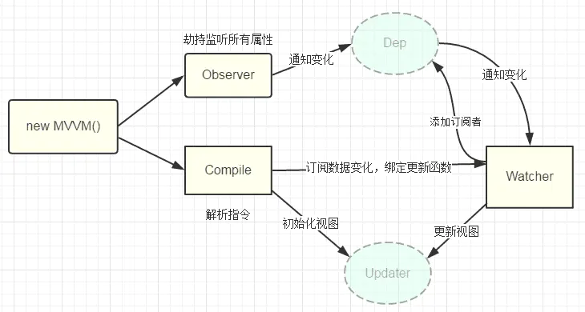

# vue

## vue生命周期

* new Vue()创建一个实例空壳
* create
* mount
* update
* destroy

### new Vue()创建实例

每当渲染一个组件前都会为该组件创建一个vue实例来管理组件中的数据和事件方法。通过new Vue()创建实例时，实际创建了一个vue实例的空壳，初始化生命周期和事件。  

### create 
导入依赖项，将方法、data，计算属性等注入到实例当中。

### mount
在created后，beforeMount前，会检查el选项，没有就会调用vm.$mount(),然后继续检查template，没有的话就绑定el选项的HTML，进入beforeMount后，编译模板为虚拟的DOM，开始render，将虚拟DOM渲染到页面上。

### update
当数据更新时，vue的虚拟dom机制会重新构建虚拟dom与上一次的虚拟dom树利用diff算法进行对比之后重新渲染。

### destroy
解除绑定，销毁实例

## 生命周期钩子函数

### beforecreate
完成实例初始化，初始化非响应式变量this指向创建的实例；可以加这个loading事件；data、computed、watch methods上的方法和数据均不能访问。

### created
实例创建完成后，完成数据（data props computed)初试化导入依赖项。可访问data computed watch methods上的方法和数据，未挂载dom,不能访问el,ref为空数组，可在这结束loading，还做一些初始化，实现函数自执行，可以对data数据进行操作，可以进行一些请求，请求不宜过多，避免白屏时间过长。若此阶段进行的DOM操作一定要放在Vue.nextTick()的回调函数中。

### beforeMount
有了el,编译了template/ outerHTML能找到对应的template，并编译成render函数

### mounted
完成创建vm.el和双向绑定，完成挂载DOM和渲染，可以在mounted钩子对挂载的dom进行操作即有了DOM且完成双向绑定访问DOM节点，ref可以在这发起后端请求，拿回数据

### beforeUpdate
数据更新之前，可以在更新访问前现有的DOM，如手动移除添加的事件监听器

### updated
完成虚拟DOM的重新渲染和打补丁；组件DOM已完成更新。执行依赖的dom操作。

### beforeDestroy
在执行app.$destroy()之前，可以做一些删除提示

### destroyed
前组件已被删除，销毁监听事件、组件，子实例也被销毁。

## MVVM
MVVM是Model-View-ViewModel的缩写，它是一种前端开发的架构模式，其核心是提供对view和viewmodel的双向数据绑定，这使得viewmodel的状态改变可以自动传递View。

* Model代表数据模型，可以定义数据修改和操作的业务逻辑；
* View代表UI组件，它负责将数据模型转化成UI展现出来；
* ViewModel是一个同步View和Model的对象。
  
viewModel通过数据双向绑定把View和Model层连接起来，View和Model之间的同步工作是完全自动的。

## vue数据双向绑定原理
vue.js是采用数据劫持结合发布者-订阅者模式的方式，通过Object.defineProperty()来劫持各个属性的setter，getter，在数据变动时发布消息给订阅者，触发响应的监听回调。

> Observer数据监听器，能够对数据对象的所有属性进行监听，如有变动可能拿到新值并通知订阅者，内部采用Object.defineProperty的getter和setter来实现
> Compile指令解析器，它的作用对每个元素节点的指令进行扫描和解析，根据指令模板替换数据，以及绑定相应的更新函数
> Watcher订阅者，作为连接Observer和Compile的桥梁，能够订阅并收到每个属性变动的通知，执行指令绑定相应的回调函数。
> Deq消息订阅器，内部维护了一个数组，用来收集订阅者(Watcher)，数据变动出发notify函数，再调用订阅者的update方法。

