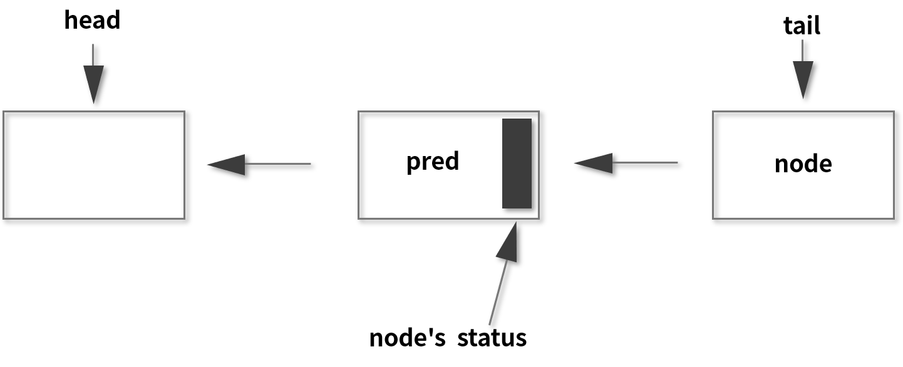

# AQS

AQS (AbstractQueuedSynchronizer)；队列同步器；AQS在ReentrantLock、ReentrantReadWriteLock、Semaphore、CountDownLatch、ThreadPoolExecutor的Worker都有运用，AQS是这些类的底层原理。  

## 锁和协作类的共同点：阀门功能

ReentrantLock和Semaphore都可以当做阀门来用，Semaphore的许可证数量设置为1，只让一个线程通过，通过后归还许可证。ReentrantLock，只有一个线程能获取锁，这个线程释放锁之后，允许其他线程获得锁；如果当前线程发现没有额外的许可证或得不到锁，就会被阻塞，并且等待后续有许可证或锁释放了，被唤醒。

## 为什么需要AQS

把类似的功能提取出来，变成一个新的底层工具类，AQS；其他协作工具类不需要关心线程调度细节。

## 如果没有AQS

每个线程协作工类需要实现以下：
* 状态的原子性管理
* 线程的阻塞与解除阻塞
* 队列的管理

这里的状态对于不同的工具类而言，代表不同的含义，比如对于 ReentrantLock 而言，它需要维护锁被重入的次数，但是保存重入次数的变量是会被多线程同时操作的，就需要进行处理，以便保证线程安全。不仅如此，对于那些未抢到锁的线程，还应该让它们陷入阻塞，并进行排队，并在合适的时机唤醒。所以说这些内容其实是比较繁琐的，而且也是比较重复的，而这些工作目前都由 AQS 来承担了。

如果没有 AQS，就需要 ReentrantLock 等类来自己实现相关的逻辑，但是让每个线程协作工具类自己去正确并且高效地实现这些内容，是相当有难度的。AQS 可以帮我们把 “脏活累活” 都搞定，所以对于 ReentrantLock 和 Semaphore 等类而言，它们只需要关注自己特有的业务逻辑即可。正所谓是“哪有什么岁月静好，不过是有人替你负重前行”。

## AQS作用
一个用于构建锁、同步器等线程协作工具类的框架，

## 内部原理
AQS三大部分：<strong>状态、队里和期望协作工具类去实现的获取或释放等重要方法</strong>

### state状态
```java
/**
 * The synchronization state.
 */
private volatile int state;

```
state含义，根据具体实现类的作用不同而表示不同的含义；
* Semaphore信号量里。state表示剩余许可证的数量；假设开始设为10，这就表示许可证开始一共有10个，当某个许可证取走一共就会变成9，内部计数器
* CountdownLatch里面，state表示需要“倒数”的数量，一开始假设设置5，countdown方法，state就会减一
* ReentrantLock中，state表示锁占有情况，开始是0，没有任何线程占有锁；state变为1，表示有这个锁已经被某个线程占有
* ReentrantLock锁是可以重入的，这个锁被同一个线程多次获取，那么state会逐渐增加，state表示重入的次数。

>state修改问题。state被多线程共享，会被并发的修改，必须保证state是线程安全的，仅仅被volatile修饰，不足以保证线程安全，
两个相关的方法compareAndSetSate()和setState()；
```java
protected final boolean compareAndSetState(int expect, int update) {
    return unsafe.compareAndSwapInt(this, stateOffset, expect, update);
}

```
>方法里面只有一行代码，即 return unsafe.compareAndSwapInt(this, stateOffset, expect, update)，这个方法我们已经非常熟悉了，它利用了 Unsafe 里面的 CAS 操作，利用 CPU 指令的原子性保证了这个操作的原子性，与之前介绍过的原子类去保证线程安全的原理是一致的。

```java
protected final void setState(int newState) {
    state = newState;
}
```
> stat=newstate,直接赋值，没有加锁和CAS， 
> volatile使用场景：<strong>对基本类型变量直接进行赋值，加了volatile保证线程安全</strong>;这里state是int类型，直接赋值，没有读取之前的值，也不涉及原来值的基础上修改，所以这里使用volatile就阔以保证线程安全。 

### FIFO队列
FIFO队列主要作用是存储等待的线程。假设很多线程都想要同时抢锁，那么大部分线程是抢不到的，处理这些抢不到锁的线程就需要一个队列来存放。排队管理器。  
队列内部采用双向链表的形式，

队列中，分布用head和tail来表示头节点和尾结点，两者初始化指向一个空节点，头节点可以理解<strong>当前持有锁的线程</strong>，头节点之后的线程被阻塞了，它们会等待被唤醒。

### 获取/释放方法

* 获取方法
我们首先来看一下获取方法。获取操作通常会依赖 state 变量的值，根据 state 值不同，协作工具类也会有不同的逻辑，并且在获取的时候也经常会阻塞，下面就让我们来看几个具体的例子。

比如 ReentrantLock 中的 lock 方法就是其中一个“获取方法”，执行时，如果发现 state 不等于 0 且当前线程不是持有锁的线程，那么就代表这个锁已经被其他线程所持有了。这个时候，当然就获取不到锁，于是就让该线程进入阻塞状态。

再比如，Semaphore 中的 acquire 方法就是其中一个“获取方法”，作用是获取许可证，此时能不能获取到这个许可证也取决于 state 的值。如果 state 值是正数，那么代表还有剩余的许可证，数量足够的话，就可以成功获取；但如果 state 是 0，则代表已经没有更多的空余许可证了，此时这个线程就获取不到许可证，会进入阻塞状态，所以这里同样也是和 state 的值相关的。

再举个例子，CountDownLatch 获取方法就是 await 方法（包含重载方法），作用是“等待，直到倒数结束”。执行 await 的时候会判断 state 的值，如果 state 不等于 0，线程就陷入阻塞状态，直到其他线程执行倒数方法把 state 减为 0，此时就代表现在这个门闩放开了，所以之前阻塞的线程就会被唤醒。

我们总结一下，“获取方法”在不同的类中代表不同的含义，但往往和 state 值相关，也经常会让线程进入阻塞状态，这也同样证明了 state 状态在 AQS 类中的重要地位。

* 释放方法
释放方法是站在获取方法的对立面的，通常和刚才的获取方法配合使用。我们刚才讲的获取方法可能会让线程阻塞，比如说获取不到锁就会让线程进入阻塞状态，但是释放方法通常是不会阻塞线程的。

比如在 Semaphore 信号量里面，释放就是 release 方法（包含重载方法），release() 方法的作用是去释放一个许可证，会让 state 加 1；而在 CountDownLatch 里面，释放就是 countDown 方法，作用是倒数一个数，让 state 减 1。所以也可以看出，在不同的实现类里面，他们对于 state 的操作是截然不同的，需要由每一个协作类根据自己的逻辑去具体实现。

## AQS具体在CountdownLatch应用

### AQS用法
使用AQS实现自己的一个线程协作类工具主要步骤
* 新建一个线程协作工具类，内部写一个Sync类，该Sync类继承AbstractQueuedSynchorizer
* 想好设计的线程工具类的协作逻辑，在Sync类里，根据是否独占来重写方法，独占则重写tryAcquire和tryRelease等方法，非独占则重写tryAcquireShared和tryReleaseShared等方法；
* 自己的线程协作类工具类中，实现获取/释放的相关方法，并在里面调用AQS对应额方法，独占则调用acquire或release等方法，非独占则调用acquireShared或releaseShared或acquireSharedInterruptibly等方法。  

继承类后必须重写，因为AQS默认的实现时抛出异常
```java
protected boolean tryAcquire(int arg) {
    throw new UnsupportedOperationException();
}

protected boolean tryRelease(int arg) {
    throw new UnsupportedOperationException();
}

protected int tryAcquireShared(int arg) {
  throw new UnsupportedOperationException();
}

protected boolean tryReleaseShared(int arg) {
    throw new UnsupportedOperationException();
}

```
### AQS具体在CountdownLatch中应用
```java
public class CountDownLatch {
    /**
     * Synchronization control For CountDownLatch.
     * Uses AQS state to represent count.
     */

    private static final class Sync extends AbstractQueuedSynchronizer {
        private static final long serialVersionUID = 4982264981922014374L;
        Sync(int count) {
            setState(count);
        }
        int getCount() {
            return getState();
        }
        protected int tryAcquireShared(int acquires) {
            return (getState() == 0) ? 1 : -1;
        }
        protected boolean tryReleaseShared(int releases) {
            // Decrement count; signal when transition to zero
            for (;;) {
                int c = getState();
                if (c == 0)
                    return false;
                int nextc = c-1;
                if (compareAndSetState(c, nextc))
                    return nextc == 0;
            }
        }
    }
    private final Sync sync;
   //省略其他代码...
}

```
可以看到Sync是CountdownLatch的一个子类，继承了AQS，重写了tryAcquireShared、tryReleaseShared方法；CountdownLatch属于非独占的类型，所以实现共享的方法。
#### 构造函数

```java
public CountDownLatch(int count) {
    if (count < 0) throw new IllegalArgumentException("count < 0");
    this.sync = new Sync(count);
}
Sync(int count) {
     setState(count);
}

```
> 构造函数调用AQS的setState方法并且把count传进去，而setState正是AQS中的state变量赋值的
```java
protected final void setState(int newState) {
    state = newState;
}

```
>所以我们通过 CountDownLatch 构造函数将传入的 count 最终传递到 AQS 内部的 state 变量，给 state 赋值，state 就代表还需要倒数的次数。

#### getCount
获取当前剩余的还需要”倒数“的数量
```java
public long getCount() {
     return sync.getCount();
}
//Sync
int getCount() {
     return getState();
}
//AQS 
protected final int getState() {
    return state;
}

```

>如代码所示，protected final int getState 方法直接 return 的就是 state 的值，所以最终它获取到的就在 AQS 中 state 变量的值。

#### countDown

countDown方法就是释放
```java
public void countDown() {
    sync.releaseShared(1);
}

//sync
public final boolean releaseShared(int arg) {
    if (tryReleaseShared(arg)) {
        doReleaseShared();
        return true;
    }
    return false;
}

protected boolean tryReleaseShared(int releases) {
    // Decrement count; signal when transition to zero
    for (;;) {
        int c = getState();
        if (c == 0)
            return false;
        int nextc = c-1;
        if (compareAndSetState(c, nextc))
            return nextc == 0;
    }
}
```
>方法内是一个 for 的死循环，在循环体中，最开始是通过 getState 拿到当前 state 的值并赋值给变量 c，这个 c 可以理解为是 count 的缩写，如果此时 c = 0，则意味着已经倒数为零了，会直接会执行下面的 return false 语句，一旦 tryReleaseShared 方法返回 false，再往上看上一层的 releaseShared 方法，就会直接跳过整个 if (tryReleaseShared(arg)) 代码块，直接返回 false，相当于 releaseShared 方法不产生效果，也就意味着 countDown 方法不产生效果。  

>再回到 tryReleaseShared 方法中往下看 return false 下面的语句，如果 c 不等于 0，在这里会先把 c-1 的值赋给 nextc，然后再利用 CAS 尝试把 nextc 赋值到 state 上。如果赋值成功就代表本次 countDown 方法操作成功，也就意味着把 AQS 内部的 state 值减了 1。最后，是 return nextc == 0，如果 nextc 为 0，意味着本次倒数后恰好达到了规定的倒数次数，门闩应当在此时打开，所以 tryReleaseShared 方法会返回 true，那么再回到之前的 releaseShared 方法中，可以看到，接下来会调用 doReleaseShared 方法，效果是对之前阻塞的线程进行唤醒，让它们继续执行。

#### await
await相当于CountDownLatch获取方法，调用await方法把线程阻塞，直到倒数为0才能继续执行。
```java
public void await() throws InterruptedException {
    sync.acquireSharedInterruptibly(1);
}
//Sync
 public final void acquireSharedInterruptibly(int arg)
        throws InterruptedException {
    if (Thread.interrupted())
        throw new InterruptedException();
    if (tryAcquireShared(arg) < 0)
        doAcquireSharedInterruptibly(arg);
}
protected int tryAcquireShared(int acquires) {
    return (getState() == 0) ? 1 : -1;
}

```
> getState方法获取到的值是剩余需要倒数的次数，此时剩倒数的次数大于0，则getState返回值不等于0，则tryAcquireShared方法返回-1，执行doAcquireSharedInterruptibly方法，让线程进入阻塞状态。

#### AQS在CountdownLatch小结
最后对 AQS 在 CountDownLatch 的应用进行总结。当线程调用 CountDownLatch 的 await 方法时，便会尝试获取“共享锁”，不过一开始通常获取不到锁，于是线程被阻塞。“共享锁”可获取到的条件是“锁计数器”的值为 0，而“锁计数器”的初始值为 count，当每次调用 CountDownLatch 对象的 countDown 方法时，也可以把“锁计数器” -1。通过这种方式，调用 count 次 countDown 方法之后，“锁计数器”就为 0 了，于是之前等待的线程就会继续运行了，并且此时如果再有线程想调用 await 方法时也会被立刻放行，不会再去做任何阻塞操作了。
