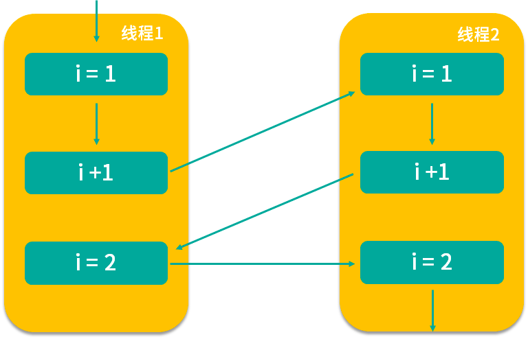

# java内存模型

## JVM内存模型
* 堆区：堆是存储实例和数组的，通常内存中最大的一块
* 虚拟机栈：保存局部变量和部分结果，并在方法调用和返回中起作用
* 方法区：存储每个类的结构，运行时的常量池、字段、方法数据，以及方法和构造函数的代码
* 本地方法栈：


## JMM
JMM是和多线程相关的一组规范，需要各个JVM来实现遵守的JMM规范，更方便的开发多线程程序。  
JMM与处理器、缓存、并发、编译器有关，解决了CPU多级缓存、处理器优化、指令重排序等导致的不可预期的问题。  

## 指令重排序

指令重排序，提高处理速度。


重排序三种：
* 编译器优化
编译器（包括 JVM、JIT 编译器等）出于优化的目的，例如当前有了数据 a，把对 a 的操作放到一起效率会更高，避免读取 b 后又返回来重新读取 a 的时间开销，此时在编译的过程中会进行一定程度的重排。不过重排序并不意味着可以任意排序，它需要需要保证重排序后，不改变单线程内的语义，否则如果能任意排序的话，程序早就逻辑混乱了。
* CPU优化
CPU 同样会有优化行为，这里的优化和编译器优化类似，都是通过乱序执行的技术来提高整体的执行效率。所以即使之前编译器不发生重排，CPU 也可能进行重排，我们在开发中，一定要考虑到重排序带来的后果。
* 内存"重排序"
由于内存有缓存的存在，主存和本地内存，内容可能不一致，出现乱序行为。

## 原子性和原子操作
具备原子性的操作称为原子操作，要么全部发生要么全不发生。  
i++一行代码涉及三个指令：
* 读取
* 增加
* 写回保存


Java 中的原子操作有哪些

在了解了原子操作的特性之后，让我们来看一下 Java 中有哪些操作是具备原子性的。Java 中的以下几种操作是具备原子性的，属于原子操作：
* 除了 long 和 double 之外的基本类型（int、byte、boolean、short、char、float）的读/写操作，都天然的具备原子性；
* 所有引用 reference 的读/写操作；
* 加了 volatile 后，所有变量的读/写操作（包含 long 和 double）。这也就意味着 long 和 double 加了 volatile 关键字之后，对它们的读写操作同样具备原子性；
* 在 java.concurrent.Atomic 包中的一部分类的一部分方法是具备原子性的，比如 AtomicInteger 的 incrementAndGet 方法。

目前主流虚拟机，机会都把64位数据的读写当做原子操作来对待，无需要volatile修饰。

## 内存可见性

```java
/**
 * 描述：     演示可见性带来的问题
 */
public class VisibilityProblem {

    int a = 10;
    int b = 20;

    private void change() {
        a = 30;
        b = a;
    }


    private void print() {
        System.out.println("b=" + b + ";a=" + a);
    }

    public static void main(String[] args) {
        while (true) {
            VisibilityProblem problem = new VisibilityProblem();
            new Thread(new Runnable() {
                @Override
                public void run() {
                    try {
                        Thread.sleep(1);
                    } catch (InterruptedException e) {
                        e.printStackTrace();
                    }
                    problem.change();
                }
            }).start();

            new Thread(new Runnable() {
                @Override
                public void run() {
                    try {
                        Thread.sleep(1);
                    } catch (InterruptedException e) {
                        e.printStackTrace();
                    }
                    problem.print();
                }
            }).start();
        }
    }
}

```
结果可能会有
b=30; a=10 
a的值被改了，但是其他线程看不到，即产生了可见性问题。  

### 能够保证可见性措施

* synchronized保证原子性，可见性，临界区，只有一个线程操作数据，该线程操作完释放锁后，所有的修改，都会被下一个获得锁的线程所看到
* volatile可以保证可见性

## JMM的抽象：主内存和工作内存

JMM 有以下规定：

（1）所有的变量都存储在主内存中，同时每个线程拥有自己独立的工作内存，而工作内存中的变量的内容是主内存中该变量的拷贝；

（2）线程不能直接读 / 写主内存中的变量，但可以操作自己工作内存中的变量，然后再同步到主内存中，这样，其他线程就可以看到本次修改；

（3） 主内存是由多个线程所共享的，但线程间不共享各自的工作内存，如果线程间需要通信，则必须借助主内存中转来完成。

## happens-before规则

### 单线程规则

在一个单独的线程中，按照程序代码的顺序，先执行的操作 happen-before 后执行的操作。
重排序后只要结果依然符合happens-before关系，保证可见性即可。并不需要语句一定要在另一个语句之前执行。

### 锁操作规则（synchronize和Lock)

从上图中可以看到，有线程 A 和线程 B 这两个线程。线程 A 在解锁之前的所有操作，对于线程 B 的对同一个锁的加锁之后的所有操作而言，都是可见的。这就是锁操作的 happens-before 关系的规则。

### volatile
对一个volatile变量的写操作happen-before后面对该变量的读操作
这就代表了如果变量被 volatile 修饰，那么每次修改之后，其他线程在读取这个变量的时候一定能读取到该变量最新的值

### 线程启动
Thread对象的start方法happen-before此线程run方法中的每一个操作，

在图中的例子中，左侧区域是线程 A 启动了一个子线程 B，而右侧区域是子线程 B，那么子线程 B 在执行 run 方法里面的语句的时候，它一定能看到父线程在执行 threadB.start() 前的所有操作的结果。

### 线程join规则

我们知道 join 可以让线程之间等待，假设线程 A 通过调用 threadB.start() 启动了一个新线程 B，然后调用 threadB.join() ，那么线程 A 将一直等待到线程 B 的 run 方法结束（不考虑中断等特殊情况），然后 join 方法才返回。在 join 方法返回后，线程 A 中的所有后续操作都可以看到线程 B 的 run 方法中执行的所有操作的结果，也就是线程 B 的 run 方法里面的操作 happens-before 线程 A 的 join 之后的语句。

### 线程中断

对线程 interrupt 方法的调用 happens-before 检测该线程的中断事件。

也就是说，如果一个线程被其他线程 interrupt，那么在检测中断时（比如调用 Thread.interrupted 或者 Thread.isInterrupted 方法）一定能看到此次中断的发生，不会发生检测结果不准的情况。

### 并发工具类的规则
* 线程安全的并发容器（如 ConcurrentHashMap）在 get 某个值时一定能看到在此之前发生的 put 等存入操作的结果。也就是说，线程安全的并发容器的存入操作 happens-before 读取操作。
* 信号量（Semaphore）它会释放许可证，也会获取许可证。这里的释放许可证的操作 happens-before 获取许可证的操作，也就是说，如果在获取许可证之前有释放许可证的操作，那么在获取时一定可以看到。
* Future：Future 有一个 get 方法，可以用来获取任务的结果。那么，当 Future 的 get 方法得到结果的时候，一定可以看到之前任务中所有操作的结果，也就是说 Future 任务中的所有操作 happens-before Future 的 get 操作。
* 线程池：要想利用线程池，就需要往里面提交任务（Runnable 或者 Callable），这里面也有一个 happens-before 关系的规则，那就是提交任务的操作 happens-before 任务的执行。