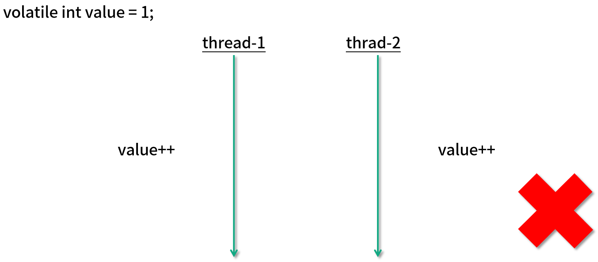

# java中原子操作类
13类，4种类型的原子更新方式<strong>:原子更新基本类型、原子更新数组、原子更新引用、原子更新属性</strong>;Atomic包里的类基本都是使用Unsafe实现的包装类。  

## 原子更新基本类型
* AtomicBoolean: 原子更新布尔类型
* AtomicInteger：原子更新整型
* AtomicLong： 原子更新长整型

```java
public class AtomicIntegerTest {
    static AtomicInteger ai = new AtomicInteger(1);
    public static void main(String[] args) {
        System.out.println(ai.getAndIncrement());//1
        System.out.println(ai.get());//2
    }
}
```
getAndIncrement()如何实现原子操作；  
```java
public final int getAndIncrement(){
    for(;;){
        int current = get();
        int next = current + 1;
        if(compareAndSet(current, next)){
            return current;
        }
    }
}
public final boolean compareAndSet(int expect, int update){
    return unsafe.compareAndSwapInt(this, valueOffset, expect, update);
}
```
源码中for循环，第一个先获取AtomicInteger里存储的数值，第二步对当前数值加1，关键第三步调用compareAndSet方法来进行原子更新操作，该方法先检查当前数值是否等于current，等于意味着AtomicInteger的值没有被其他线程改变，则进行更新成next值；否则再次进入for循环进行compareAndSet操作。  
Atomic提供3中基本类型：compareAndSwapObject、compareAndSwapInt、compareAndSwapLong;其他类型char、float、double通过类型转换。

## 原子更新数组

* AtomicIntegerArray: 原子更新整型数组里的元素
* AtomicLongArray：更新长整型
* AtomicReferenceArray： 原子更新引用类型数组
* Atomic

```java
public class AtomicIntegerArrayTest {
    static int[] value = new int[]{1,2};
    static AtomicIntegerArray ai = new AtomicIntegerArray(value);
    public static void main(String[] args) {
        ai.getAndSet(0, 3);
        System.out.println(ai.get(0));//3
        System.out.println(value[0]);//1
    }
}

```
## 原子更新引用类型
* AtomicReference： 更新引用类型
* AtomicReferenceFileUpdater: 原子更新引用类型里的字段
* AtomicMarkableReference: 原子更新带有标记位的引用类型

## 原子更新字段类
* AtomicIntgerFiledUpdater：原子更新整型的字段的更新器
* AtomicLongFileUpdater: 原子更新长整型字段的更新器
* AtomicStampedReference: 原子更新带有版本号的引用类型

## 原子类与volatile有什么异同


使用volatile只能保证可见性，value++不是原子操作，使用关键字synchronized

synchronized保证了原子性，同时保证了可见性，

利用原子变量，使用它的incrementAndGet方法，底层由CPU指令保证原子性。

### volatile 和原子类使用场景

有一个可见性问题，可以使用volatile关键字；如果涉及一个组合操作，需要用同步来解决原子性问题的话，可以使用原子变量。不能使用volatile  

通常情况下，volatile 可以用来修饰 boolean 类型的标记位，因为对于标记位来讲，直接的赋值操作本身就是具备原子性的，再加上 volatile 保证了可见性，那么就是线程安全的了。


而对于会被多个线程同时操作的计数器 Counter 的场景，这种场景的一个典型特点就是，它不仅仅是一个简单的赋值操作，而是需要先读取当前的值，然后在此基础上进行一定的修改，再把它给赋值回去。这样一来，我们的 volatile 就不足以保证这种情况的线程安全了。我们需要使用原子类来保证线程安全。

## AtomicInteger和Synchronized异同
* 原理不同
> synchronized背后使用monitor锁；原子类利用CAS操作

* 使用范围不同
原子类使用范围比较局限，不够灵活；synchronized使用范围广泛，修饰方法、一段代码等，灵活控制

* 粒度不同
原子变量粒度比较小，把竞争范围缩小到变量级别。synchronized锁的粒度大于原子变量的粒度。
* 性能区别(乐观锁、悲观锁)
synchronized典型悲观锁，比较重量级，竞争激烈的情况下，会让拿不到锁的线程阻塞，开销固定，随着时间增长不会线性增长(竞争激烈)。而原子类竞争激烈情况下，永不阻塞线程，随着时间的增加，开销逐步上涨（竞争不激烈时使用)。