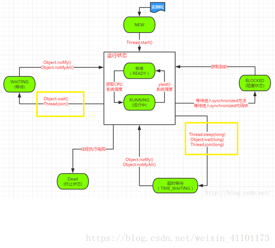
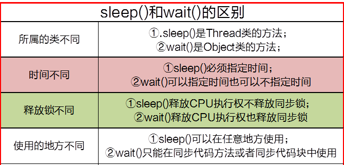

# sleep and wait

##  为什么wait、notify被定义在Object类中，sleep定义在thread类中
* 因为java中每个对象都有一把称之为monitor监视器的锁，每个对象都可以上锁，这就要求在对象头有一个用来保存锁信息的位置，锁是对象级别的，非线程级别的，wait、notify都是锁级别的操作，他们的锁属于对象，定义在Objec类中最合适，Object类是所有对象的父类。
* 如果wait、notify定义在Thread类中，会带来很大的局限性，比如一个线程可能持有多把锁，以便相互配合的复杂逻辑，wait定义在Thread类中，无法实现一个线程持有多把锁，我们是让线程去等待某个对象的锁，自然通过操作对象来实现

## wait/notify与sleep异同，
不同：
* wait方法必须在Synchronized保护的代码中使用，而sleep没有这个要求
* 同步代码块中执行sleep方法，并不会释放monitor锁，但执行wait方法时会主动释放锁
## sleep()和wait()方法的阻塞线程场景

* sleep()实现线程阻塞的方法，称为线程睡眠，方式是超时等待，时间一到从睡眠中醒来。
* wait()方法实现线程阻塞的方法，线程等待：
  * 和sleep()一样可以传入时间，时间到就解除阻塞
  * 不传入时间，无限期等待，只通过notify()方法来唤醒

## 两者区别
很大区别是：<strong>是否释放同步锁</strong>
CPU执行权和同步锁：
* sleep释放CPU执行权，但不释放同步锁
* wait释放CPU执行，同时释放同步锁

## 总结
