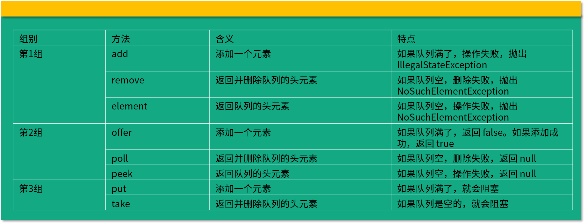

# 阻塞队列

## 阻塞队列的作用

```java
public interface BlockingQueue<E> extends Queue<E>{...}
```
BlockingQueue继承了Queue接口，是线程安全的，多线程场景下利用线程安全的队列解决线程安全问题，例如生产者/消费者业模式；

队列可以安全的从一个线程向另一个线程传递数据； 
还能起到隔离的作用；例如转账业务，生产者不需要关心具体的转账逻辑，只要把转账任务，如账号和金额等信息放到队列中即可。
实现任务之间的解耦。 


## 并发队列
并发队列主要分为阻塞队列和非阻塞队列两大类
阻塞队列BlockingQueue接口的实现类，分别是：ArrayBlockingQueue\LinkedBlockingQueue\SynchronousQueue\DelayQueue\PriorityBlockingQueue\LinkedTransferQueue
非阻塞队列：ConcurrentLinkedQueue，这个不会让线程阻塞，利用CAS保证了线程安全。  

## 阻塞队列的特点
### take方法
take是获取并移除队列的头节点，通常队列里面有数据的时候可以正常移除，无数据则要阻塞，直到有数据

### put方法
put方法插入元素时，队列没有满，则和普通的插入一样，队列已满，则无法继续插入，则阻塞，直到队列里有了空闲空间。

### 是否有界
LinkedBlockingQueue的上限是Integer.MAX_VALUE,近似无界队列
有的阻塞队列是有界的，ArrayBlockingQueue

## 阻塞队列的常用方法


## 常见的阻塞队列

### ArrayBlockingQueue
ArrayBlockingQueue是典型的有界队列，内部用数组存储元素，利用ReentrantLock实现线程安全。  
```java
ArrayBlockingQueue(int capacity, boolean fair)
```
参数是容量，是否公平

### LinkedBlockingQueue
正如名字所示，这是一个内部用链表实现的 BlockingQueue。如果我们不指定它的初始容量，那么它容量默认就为整型的最大值 Integer.MAX_VALUE，由于这个数非常大，我们通常不可能放入这么多的数据，所以 LinkedBlockingQueue 也被称作无界队列，代表它几乎没有界限。

### SynchronousQueue

SynchronousQueue最大不同之处在于，它的容量是0，每次取数据必须先阻塞，直到有数据放入；同理放入数据时也会阻塞，直到有消费者来取。 


### priorityBlockingQueue
PriorityBlockingQueue 是一个支持优先级的无界阻塞队列，可以通过自定义类实现 compareTo() 方法来指定元素排序规则，或者初始化时通过构造器参数 Comparator 来指定排序规则。同时，插入队列的对象必须是可比较大小的，也就是 Comparable 的，否则会抛出 ClassCastException 异常。
它的 take 方法在队列为空的时候会阻塞，但是正因为它是无界队列，而且会自动扩容，所以它的队列永远不会满，所以它的 put 方法永远不会阻塞，添加操作始终都会成功，也正因为如此，它的成员变量里只有一个 Condition：
```java
private final Condition notEmpty;
```
这和之前的 ArrayBlockingQueue 拥有两个 Condition（分别是 notEmpty 和 notFull）形成了鲜明的对比，我们的 PriorityBlockingQueue 不需要 notFull，因为它永远都不会满，真是“有空间就可以任性”。

### DelayQueue
具有延迟功能，设定让队列中的任务延迟多久之后执行，它是无界队列，放入的元素必须实现Delayed接口，该接口又继承了Comparable接口，自然拥有比较和排序的能力
```java
public interface Delayed extends Comparable<Delayed> {
    long getDelay(TimeUnit unit);
}
```
元素会根据延迟时间的长短被放到队列的不同位置，越靠近队列头代表越早过期。

DelayeQueue内部实用PriorityQueue的能力来进行排序。

## 阻塞队列和非阻塞队列的并发安全原因

### ArrayBlockingQueue
```java
// 用于存放元素的数组
final Object[] items;
// 下一次读取操作的位置
int takeIndex;
// 下一次写入操作的位置
int putIndex;
// 队列中的元素数量
int count;
```
三个用于并发控制的工具
```java
// 以下3个是控制并发用的工具
final ReentrantLock lock;
private final Condition notEmpty;
private final Condition notFull;
```
ReentrantLock,两个Condition别是由ReentrantLock产生
读操作和操作先得获取到ReentrantLock独占锁才能进行下一步操作，进行时如果队列为空线程就会进入到专属的notEmpty的condition队列中去排队，等待线程写入新的元素；同理，队列已满，这个时候写操作的线程进入到写线程专属的notFull队列中排队，等待读线程将队列元素移除并腾出空间。 

```java
public void put(E e) throws InterruptedException {
    checkNotNull(e);
    final ReentrantLock lock = this.lock;
    lock.lockInterruptibly();
    try {
        while (count == items.length)
        notFull.await();
        enqueue(e);
    } finally {
        lock.unlock();
    }
}

//Condition实现消费者
public void put(Object o) throws InterruptedException {
    lock.lock();
    try {
        while (queue.size() == max) {
        notFull.await();
    }
    queue.add(o);
    notEmpty.signalAll();
    } finally {
        lock.unlock();
    }
}

```

### 非阻塞队列

```java
public boolean offer(E e) {
    checkNotNull(e);
    final Node<E> newNode = new Node<E>(e);

    for (Node<E> t = tail, p = t;;) {
        Node<E> q = p.next;
        if (q == null) {
            // p is last node
            if (p.casNext(null, newNode)) {
                // Successful CAS is the linearization point
                // for e to become an element of this queue,
                // and for newNode to become "live".
                if (p != t) // hop two nodes at a time
                    casTail(t, newNode);  // Failure is OK.
                return true;
            }
            // Lost CAS race to another thread; re-read next
        }
        else if (p == q)
            // We have fallen off list.  If tail is unchanged, it
            // will also be off-list, in which case we need to
            // jump to head, from which all live nodes are always
            // reachable.  Else the new tail is a better bet.
            p = (t != (t = tail)) ? t : head;
        else
            // Check for tail updates after two hops.
            p = (p != t && t != (t = tail)) ? t : q;
    }
}

```
，非阻塞队列 ConcurrentLinkedQueue 使用 CAS 非阻塞算法 + 不停重试，来实现线程安全，适合用在不需要阻塞功能，且并发不是特别剧烈的场景。

## 如何选择自己的阻塞队列


* FixedThreadPool(SingleThreadExecutor)选取LinkedBlockingQueue
由于FixedThreadPool的线程数是固定的，在任务激增时，它无法增加更多的线程来帮忙处理Task，所以需要LinkedBlockingQueue这样没有容量上限的Queue来存储那些还没处理的Task。

* CachedThreadPool选择SynchronousQueue
为了避免新提交的任务被拒绝，选择了无限制的maxPoolSize，线程最大数量不受限制，则不需要额外空间来存储Task，每个任务都可以通过新建线程来处理。

* ScheduleThreadPool选择延迟队里
我们选择使用延迟队列的原因是，ScheduledThreadPool 处理的是基于时间而执行的 Task，而延迟队列有能力把 Task 按照执行时间的先后进行排序，这正是我们所需要的功能。