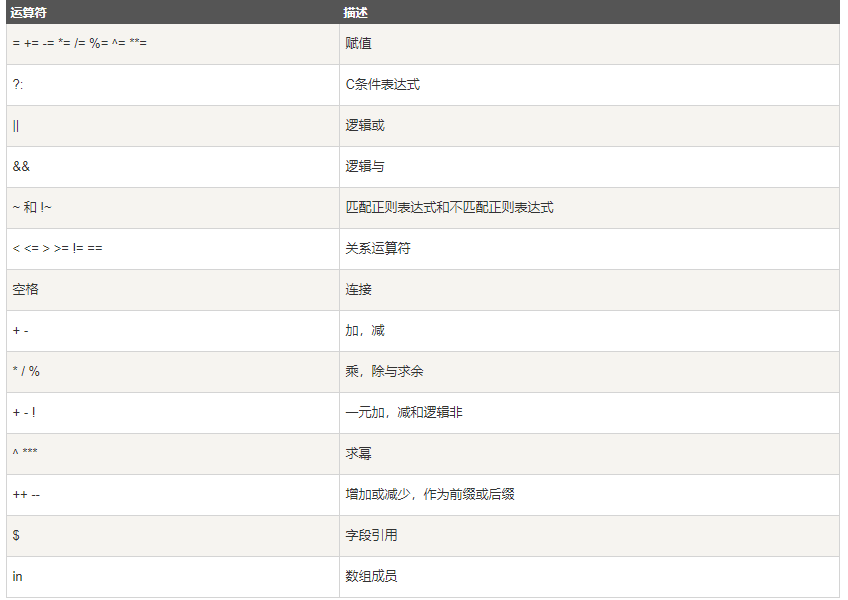
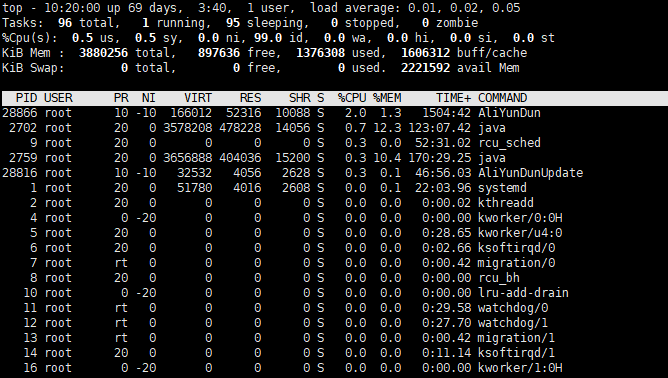

# Linux命令
## 查看文件内容
```shell
cat -n access.log #显示行号，带上参数-n
more access.log #分页显示，enter翻页

less access.log # 除了翻页，输入/Get,搜索get

tail -n 2 access.log #显示文件末尾倒数几行
head -n 2 access.log #显示文件开头几行

sort -k 2 -t '  ' -n access.log #sort的-k参数来指定排序的列。此处传的是2，表示第二列；-t参数指定列分隔符，这里列分隔符时空格；-n指定按照数字来进行排序，
[root@izwz9853xzzbsd0y95igboz ~]# sort -k 1 sort.txt 
0 b
1 a 
2 c
3 b
4 d
5 a

[root@izwz9853xzzbsd0y95igboz ~]# sort -k 2 sort.txt 
5 a
1 a 
0 b
3 b
2 c
4 d
# -k第二列排序，uniq -c去重显示次数
[root@izwz9853xzzbsd0y95igboz ~]# sort -k 2 sort.txt | uniq -c
      1 
      1 1 a
      1 5 a
      1 1 a 
      1 0 b
      3 3 b
      2 2 c
      1 4 d
# cut -f指定显示哪个区域，-d自定义分隔符，默认制表符
[root@izwz9853xzzbsd0y95igboz logs]# cat access.log | cut -f1 -d " " | sort | uniq -c | sort -k 1 -n -r | head -10
   5821 202.114.121.200
   4377 196.207.85.20
   3689 202.114.121.197
   2710 202.114.121.192
   1779 221.13.12.222
   1499 163.177.13.2
   1400 202.114.121.194
   1363 202.114.121.195
   1316 80.82.70.187
   1225 202.114.121.193

```


## 查看CPU信息
 * `cat /proc/cpuinfo | grep name| cut -f2 -d:|uniq -c`
 * `cat /proc/cpuinfo | grep "physical id" | sort | uniq| wc -l`
## 查看内存信息
`cat /proc/meminfo/`

## 查看磁盘信息
`iostat -x 10`
## Linux之grep "XXX" * | wc -l 命令

* 查看某文件下所有文件中的某个字符的个数
```shell
grep 'xx' * | wc -l

[root@izwz9853xzzbsd0y95igboz ~]# grep 'a' log.txt | wc -l
4
```
* 查看某文件夹下的个数，包括子文件夹里的

```shell
ls -l |grep "^-"|wc -l"
```
* wc

  * 命令格式 `wc -l`
  * 命令功能：统计指定文件中的字节数、字数、行数，并将结果输出
  * 命令参数：
    * -c:统计字节数
    * -l:统计行数
    * -m:统计字符数
    * 
```
wc -l
[root@izwz9853xzzbsd0y95igboz logs]# wc -l access.log 
491080 access.log

```
统计输出的信息的行数

## awk

```shell
awk [选项参数] 'script' var= value file(s)
awk [option] 'pattern {action}' file
# option为命令选项，pattern行为匹配规则，
# action为执行的具体操作，如果没有pattern，则对所有行执行action
awk [选项参数] -f scriptfile var=value file(s)
```

* -F fs：输入文件拆分隔符
* -v var=value:赋值用户定义一个变量
* -f scriptfile：从脚本文件中读取AWK命令

```shell
# 每行按空格或tab分割，输出文本的1、4项
[root@izwz9853xzzbsd0y95igboz ~]# awk '{print $1, $4}' log.txt
2 a
3 like
This's 
10 orange,apple,mongo
```
`awk -F # -F相当于内置FS，指定分割符`

```shell
# 使用分隔符“，”分割
[root@izwz9853xzzbsd0y95igboz ~]# awk -F, '{print $1, $4}' log.txt
2 this is a test 
3 Are you like awk 
This's a test 
10 There are orange 
```

### 运算符
[参考](https://www.runoob.com/linux/linux-comm-awk.html)


```shell
# 输出第二列包含 "th"，并打印第二列与第四列
[root@izwz9853xzzbsd0y95igboz ~]# awk '$2 ~ /th/ {print $2,$4}' log.txt
this a

# 过滤第一列大于2的行
[root@izwz9853xzzbsd0y95igboz ~]# awk '$1>2' log.txt
3 Are you like awk
This's a test
10 There are orange,apple,mongo
# 过滤第一列大于2并且第二列等于'Are'的行
[root@izwz9853xzzbsd0y95igboz ~]# awk '$1>2 && $2=="Are"' log.txt
3 Are you like awk
[root@izwz9853xzzbsd0y95igboz ~]# awk '!/th/' log.txt
3 Are you like awk
This's a test
10 There are orange,apple,mongo
[root@izwz9853xzzbsd0y95igboz ~]# 
```

## 开机服务

```
chkconfig [--add][--del][--list][系统服务]
```
--add:添加服务
--del:删除系统服务
--list:显示所有运行级系统服务的运行状态


## top-全面了解系统资源情况
能够实时显示系统中各个进程的资源占用状况。

* 第一行
  * 当前时间和系统运行时间
  * 当前登录用户数
  * 系统负载：1分钟、5分钟、15分钟平均值
* 第二行是任务的信息
  * 进程总数
  * 正在运行的进程数
  * 睡眠的进程数
  * 停止的进程数
  * 僵尸进程数

* CPU利用信息
  * us: userTimeCPU执行用户进程百分比，包括nicetime
  * sy: System Time，CPU在内核运行百分比，包括IRQ、SoftIRQ百分比
  * ni: Nicetime，调整进程优先级百分比
  * id：Idle Time ,系统空闲百分比
  * wa: Waitingtime，CPU等待I/O完成所用白分比
  * hi:Hard IRQtime，硬中断占用的CPU时间百分比
  * si: 软中断占用的CPU时间百分比
  * st: stealTIme，虚拟服务占用CPU时间百分比

* 内存使用信息
  * total：总物理内存
  * used: 已使用内存
  * free：空闲的物理内存
  * buffers: 缓冲的总量

* 交换区的使用信息
  * total：交换区大小
  * used: 使用大小
  * free: 未使用大小
  * cached： 缓存的总量

cached和buffers区别
>cached和buffers都是内存中存放的数据，cached是存放从磁盘中读出的数据，buffer是存放准备写入磁盘的数据。
cached是Linux把文件从硬盘中读取后再内存保存的数据，下次读取这些数据时若命中直接获取，否则读硬盘数据。cached按照读取的频率组织起来，最频繁读取的数据放在最快读取到的地方。
buffers是为磁盘写设计的，把分散的磁盘操作集中起来，减少磁盘寻道的时间和磁盘碎片，从而提高系统性能。

## ps 显示进程状态
-a:按用户名和启动时间的顺序来显示进程
-u:显示所有用户的所有进程
-x:显示无控制终端的进程

```shell
ps aux | grep java
```

## netstat-查看网络相关信息
* -l:listen,监听端口
* -a:显示所有的socket，包括正在监听的
* -n:显示数字格式的地址
* -t:监听TCP端口
* -u:监听UDP的端口
* -p:显示建立相关链的程序名

```shell
netstat -nat | grep 80
```
## losf 查看某个进程打开的所有文件

```shell
lsof -p 7389
```
## 磁盘空间查看

```shell
df -hl # 查看磁盘剩余空间
df -h # 查看每个根路径的区分大小
du -sh[目录名] #返回该目录的大小
du -hl #查看具体目录
```
