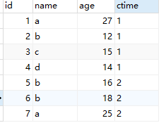

# SQL 语句操作

## 分数排名


```sql
select a.Score as Score,
(select count(distinct b.Score) from Scores b where b.Score >= a.Score) as `Rank`
from Scores a
order by a.Score DESC
```
## 查询平均成绩大于60分的同学的学号和平均成绩
* AVG 函数返回数值列的平均值
* GROUP BY 聚合函数语句用于结合聚合函数，根据一个或多个列对结果集进行分组。
* WHERE 关键字无法与聚合函数一起使用。HAVING 子句可以让我们筛选分组后的各组数据。

```sql
SELECT S#,AVG(Score)
FROM SC
GROUP BY S#
HAVING AVG(SCORE)>60
```


## SQL函数的使用

### group by
group by用于结合合计函数，根据一个或多个列对结果集进行分组。

```sql
select column_name, aggregate_function(column_name) 
from table_name
where column_name operator value
group by column_name
```
测试数据


* name重复，统计name出现的次数
```sql
mysql> select name,count(name) from t_user group by name;
+------+-------------+
| name | count(name) |
+------+-------------+
| a    |           2 |
| b    |           3 |
| c    |           1 |
| d    |           1 |
+------+-------------+
```
* name重复，计算每个name的age和

```sql
mysql> select name, sum(age) from t_user group by name;
+------+----------+
| name | sum(age) |
+------+----------+
| a    | 52       |
| b    | 46       |
| c    | 15       |
| d    | 14       |
+------+----------+
```
* 多列合计，

```sql
mysql> select name, avg(age),ctime from t_user group by name, ctime;
+------+----------+-------+
| name | avg(age) | ctime |
+------+----------+-------+
| a    | 27.0000  | 1     |
| a    | 25.0000  | 2     |
| b    | 12.0000  | 1     |
| b    | 17.0000  | 2     |
| c    | 15.0000  | 1     |
| d    | 14.0000  | 1     |
+------+----------+-------+
```
### having
where关键字无法与合计函数一起使用

```sql

mysql> select name, sum(age) as sum_age from t_user group by name having sum_age > 15;
+------+---------+
| name | sum_age |
+------+---------+
| a    | 52      |
| b    | 46      |
+------+---------+

mysql> select * from t_user group by name having count(*) > 1;
+----+------+-----+
| id | name | age |
+----+------+-----+
|  7 | a    |  25 |
|  2 | b    |  12 |
+----+------+-----+
2 rows in set (0.02 sec)
```
