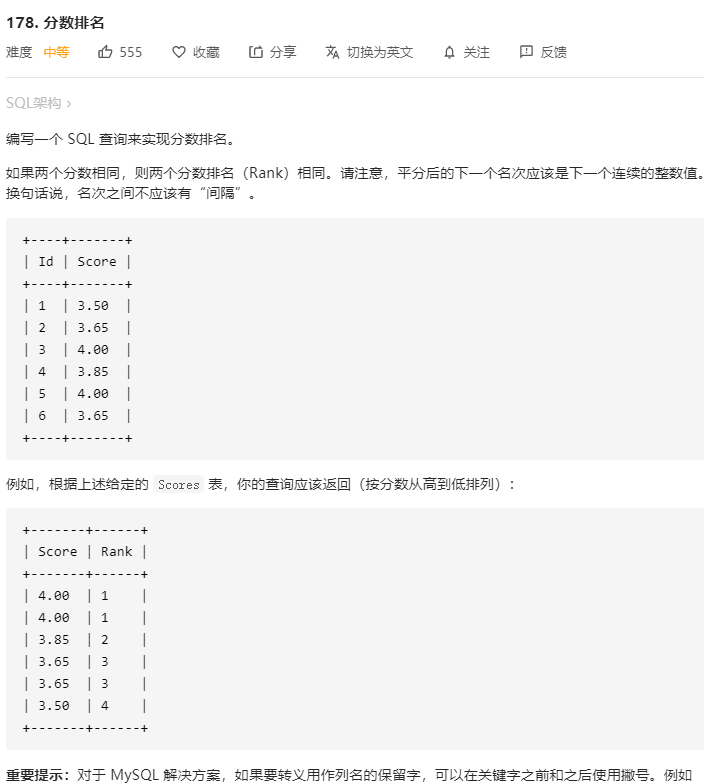

# SQL 语句操作

## 分数排名


```sql
select a.Score as Score,
(select count(distinct b.Score) from Scores b where b.Score >= a.Score) as `Rank`
from Scores a
order by a.Score DESC
```
## 查询平均成绩大于60分的同学的学号和平均成绩
* AVG 函数返回数值列的平均值
* GROUP BY 聚合函数语句用于结合聚合函数，根据一个或多个列对结果集进行分组。
* WHERE 关键字无法与聚合函数一起使用。HAVING 子句可以让我们筛选分组后的各组数据。

```sql
SELECT S#,AVG(Score)
FROM SC
GROUP BY S#
HAVING AVG(SCORE)>60
```


