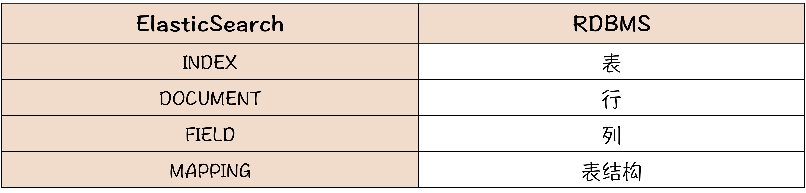

# Elasticsearch

## 理解倒排索引机制

<strong>倒排索引的表，它是以单词为索引的key,然后每个单词的倒排索引的值是一个列表，</strong>

## ES中如何构建商品的索引

## 小结
ES本质上一个支持全文索引的分布式内存数据库，特别适合构建搜索系统，采用了倒排索引。倒排索引是一种特别为搜索而设计的索引结构，先对索引的字段进行分词，然后以分词为索引组成一个查找树，这样就把一个全文匹配的查找转换成了对树的查找。
倒排索引相比一般数据库采用的B树索引，它的写入和更新性能都比较差，因此倒排索引只适合全文搜索，不适合更新频繁的交易数据。

