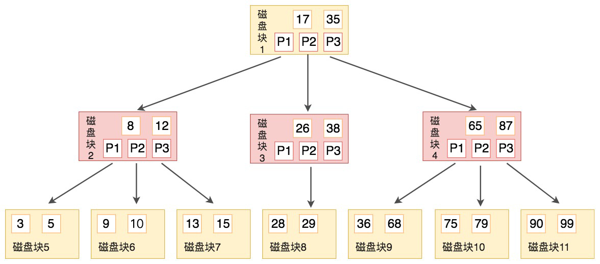
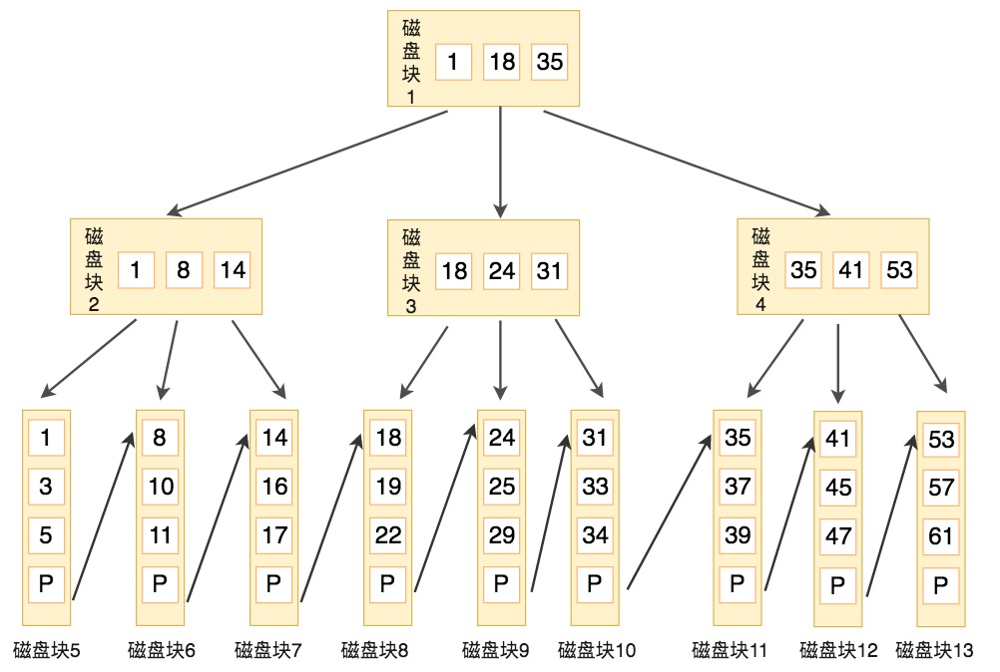
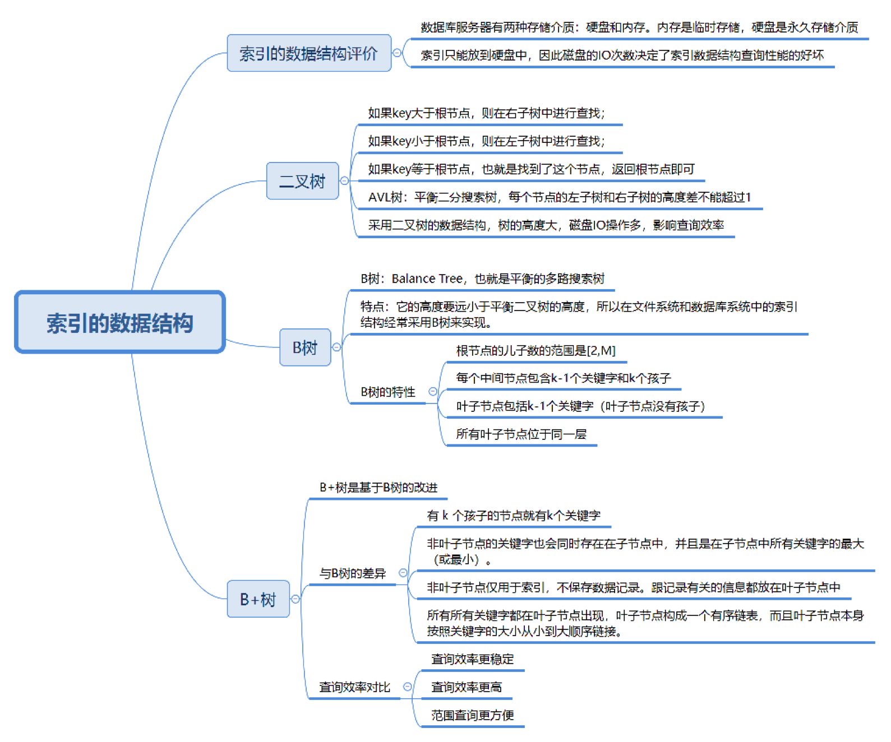

# B树、B+树

## 如何评价索引数据结构设计好坏

我们需要将索引存放到硬盘上，在硬盘上进行查询时，也就产生了硬盘的I/O操作，相比于内存的存取来说，硬盘IO操存取消耗时间要高很多。我们可以通过索引来查找某行数据的时候，需要计算产生的磁盘IO次数，磁盘IO次数越多，所消耗时间也越大。如果我们能让索引的数据结构尽量减少硬盘的I/O操作，所消耗时间也就越小。

## 二叉搜索树
平衡二叉树，树的深度也是O(log2n)，n比较大时，深度也是很高的。意味着磁盘IO操作次数多，会影响整体数据的查询效率。

## B树
B树-平衡的多路搜索树，高度远小于平衡二叉树的高度，
一个M 阶的B树的特性：
* 根节点的儿子数范围[2,M]
* 每个中间节点包含k-1个关键字和k个孩子，孩子的数量 = 关键字数+1，k取值范围[ceil(M/2),M]
* 叶子节点包括k-1个关键字，
* 中间节点关键字为；Key[1],Key[2]、、、Key[k-1]，按照升序排序，k-1个关键字相当于划分了k个范围，对应k个指针，P[1]\P[2]、、P[k]
* 所有叶子节点位于同一层。

## B+树
B+树与B树差异：
* 有k个孩子的节点就有k个关键字，B树中，孩子数量=关键字+1
* 非叶子节点的关键字也会同时存在子节点中，并且是在子节点中所有的关键字的最大
* 非叶子节点仅用于索引，不保存数据记录，跟记录有关的信息都放在叶子节点中，而B树中，非叶子节点既保持索引也保存数据记录
* 所有关键字在叶子节点出现，叶子节点之间构成有序链表，而且叶子节点本身按照关键字的大小从小到大顺序链接。

首先，B+ 树查询效率更稳定。因为 B+ 树每次只有访问到叶子节点才能找到对应的数据，而在 B 树中，非叶子节点也会存储数据，这样就会造成查询效率不稳定的情况，有时候访问到了非叶子节点就可以找到关键字，而有时需要访问到叶子节点才能找到关键字。

其次，B+ 树的查询效率更高，这是因为通常 B+ 树比 B 树更矮胖（阶数更大，深度更低），查询所需要的磁盘 I/O 也会更少。同样的磁盘页大小，B+ 树可以存储更多的节点关键字。

不仅是对单个关键字的查询上，在查询范围上，B+ 树的效率也比 B 树高。这是因为所有关键字都出现在 B+ 树的叶子节点中，并通过有序链表进行了链接。而在 B 树中则需要通过中序遍历才能完成查询范围的查找，效率要低很多。

## 小结

<strong>SQL必知必会45讲</strong>[SQL必知必会-极客时间](http://125.220.153.16:85/study/01-%E8%AE%A1%E7%AE%97%E6%9C%BA%E4%B8%93%E4%B8%9A%E8%AF%BE/06-SQL%E5%BF%85%E7%9F%A5%E5%BF%85%E4%BC%9A45/)
