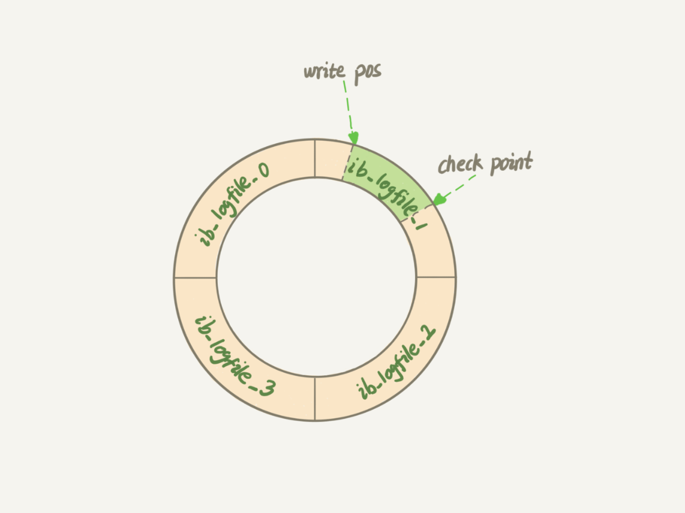
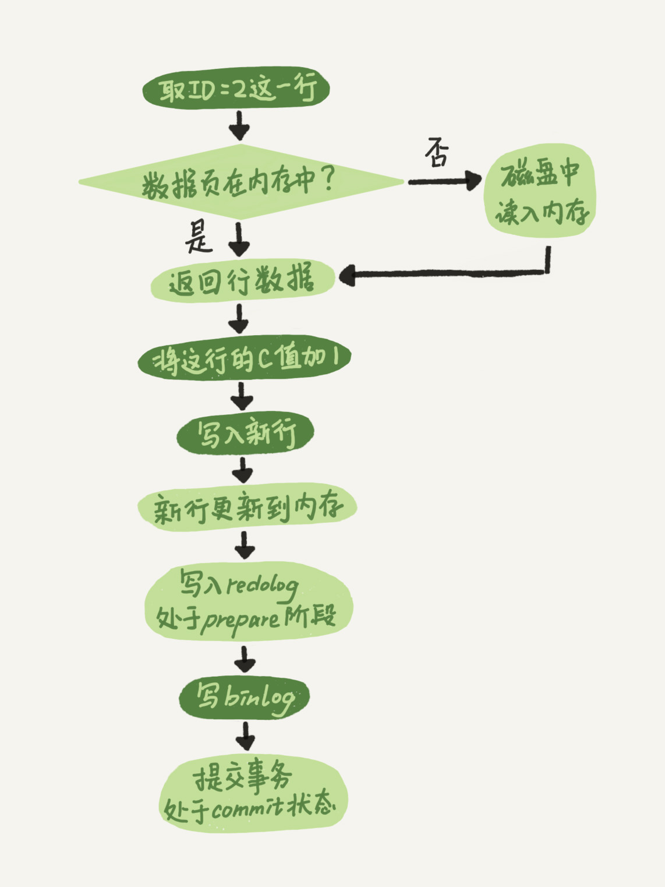

# MySQL数据库

## 基本架构

## 日志系统
### redo(重做日志)

每一次更新操作如果都写进磁盘，磁盘要找到那条相应记录，然后再更新，整个IO成本、查找成本很高，mysql采用了WAL(Write-Ahead Logging),关键点：先写日志，再写磁盘。  
具体操作：当有一条记录要更新时，Innodb引擎就会先把记录写到redo log里面，并更新内存，这个时候就算更新完成了；Innodb会在适当的时候将这个操作记录更新到磁盘，在系统比较空闲的时候。  
redo log是固定大小的，可以循环写。

有了redo log，Innodb就可以保证即使数据库发生异常重启，之前提交的记录就不会丢失，这个能力称为<strong>crash-safe</strong>。
### bin log(归档日志)

server层，做mysql功能层的事情，binlog(归档日志)；redolog是存储层的相关日志。  
两种日志不同：
* redo log 是Innodb引擎特有的；binlog是mysql的server层实现，所有引擎都可以使用。
* redo log是物理日志，记录的是"在某个数据页上做了什么修改"；binlog是逻辑日志，记录的是这个语句的原始逻辑，比如:"给ID=2这一行的c字段加1".
* redo log是循环写的，固定空间会用完；binlog是可以追加写的。"追加写"是指binlog文件写到一定大小后切换到下一个，并不会覆盖以前的日志。

执行器和Innodb引擎执行这个update语句时的内部流程。
* 1.执行器先找引擎取id=2这一行。id是主键，引擎直接用树搜索找到这一行。如果id=2，这一行所在的数据页本就在内存中，直接返回给执行器，否则从磁盘读入内存再返回。
* 执行器拿到引擎给的行数据，把这个值加上1，比如原来是N，先找就是N+1，得到新一行数据，再调用引擎接口写入这行新数据。
* 引擎将这行新数据更新到内存中，同时这个更新操作记录到redo log里面，此时redo log处于prepare状态。然后告知执行器完成了，随时可以提交事务。
* 执行器生成这个操作的binlog,并把binlog写入磁盘。
* 执行器调用引擎的提交事务接口，引擎把刚写入的redolog改成commit状态，更新完成。

操作流程：
深色是在执行器中完成的

### 为什么要两阶段提交
这里用反证法解释。不用两阶段即要么先写redo log,再写binlog，或反过来。  
假设当前的id=2的行，字段c的值是0，再假设update语句过程中写完第一个日志后，第二个日志还没有写完期间就发生了crash，会出现啥情况？
* <strong>先写redo log,后写binlog</strong>，假设在redo log写完，binlog还没有写完的时候，mysql进程异常重启。redlog把数据恢复回来，c的值是1；但是由于binlog没写完，binlog里面没有记录这个语句，之后做备份日志的时候，存起来的binlog就没有这条语句。如果用binlog来恢复临时库，binlog丢失语句，临时库减少了一次更新，恢复出来的c值为0.与原库值不同。
* <strong>先写binlog后写redo log</strong>,如果binlog写完之后crash，由于redlog还没写，崩溃后恢复以后这个事务无效，所以这一行c的值是0；但是binlog已经记录了把c改为1这个日志。所以之后用binlog来恢复的时候就多了一个事务出来，恢复出来c值为1，与原库不同。

简单说，redo log 和 binlog 都可以用于表示事务的提交状态，而两阶段提交就是让这两个状态保持逻辑上的一致。

> 1 prepare；2 写binlog；3 commit  
>>当在2之前崩溃时  
重启恢复时，发现没有commit，回滚；备份恢复：没有binlog。保持一致。  
>>当在3之前崩溃时  
重启恢复时：虽没有commit，但满足prepare和binlog完整，所以重启后会自动commit；备份binlog。一致。

详细执行过程：  
1.首先客户端通过tcp/ip发送一条sql语句到server层的SQL interface  
2.SQL interface接到该请求后，先对该条语句进行解析，验证权限是否匹配  
3.验证通过以后，分析器会对该语句分析,是否语法有错误等  
4.接下来是优化器器生成相应的执行计划，选择最优的执行计划  
5.之后会是执行器根据执行计划执行这条语句。在这一步会去open table,如果该table上有MDL，则等待。  
如果没有，则加在该表上加短暂的MDL(S)
(如果opend_table太大,表明open_table_cache太小。需要不停的去打开frm文件)  
6.进入到引擎层，首先会去innodb_buffer_pool里的data dictionary(元数据信息)得到表信息  
7.通过元数据信息,去lock info里查出是否会有相关的锁信息，并把这条update语句需要的
锁信息写入到lock info里(锁这里还有待补充)  
8.然后涉及到的老数据通过快照的方式存储到innodb_buffer_pool里的undo page里,并且记录undo log修改的redo  
(如果data page里有就直接载入到undo page里，如果没有，则需要去磁盘里取出相应page的数据，载入到undo page里)  
9.在innodb_buffer_pool的data page做update操作。并把操作的物理数据页修改记录到redo log buffer里
由于update这个事务会涉及到多个页面的修改，所以redo log buffer里会记录多条页面的修改信息。
因为group commit的原因，这次事务所产生的redo log buffer可能会跟随其它事务一同flush并且sync到磁盘上  
10.同时修改的信息，会按照event的格式,记录到binlog_cache中。(这里注意binlog_cache_size是transaction级别的,不是session级别的参数,
一旦commit之后，dump线程会从binlog_cache里把event主动发送给slave的I/O线程)  
11.之后把这条sql,需要在二级索引上做的修改，写入到change buffer page，等到下次有其他sql需要读取该二级索引时，再去与二级索引做merge
(随机I/O变为顺序I/O,但是由于现在的磁盘都是SSD,所以对于寻址来说,随机I/O和顺序I/O差距不大)
12.此时update语句已经完成，需要commit或者rollback。这里讨论commit的情况，并且双1  
13.commit操作，由于存储引擎层与server层之间采用的是内部XA(保证两个事务的一致性,这里主要保证redo log和binlog的原子性),
所以提交分为prepare阶段与commit阶段  
14.prepare阶段,将事务的xid写入，将binlog_cache里的进行flush以及sync操作(大事务的话这步非常耗时)  
15.commit阶段，由于之前该事务产生的redo log已经sync到磁盘了。所以这步只是在redo log里标记commit  
16.当binlog和redo log都已经落盘以后，如果触发了刷新脏页的操作，先把该脏页复制到doublewrite buffer里，把doublewrite buffer里的刷新到共享表空间，然后才是通过page cleaner线程把脏页写入到磁盘中  