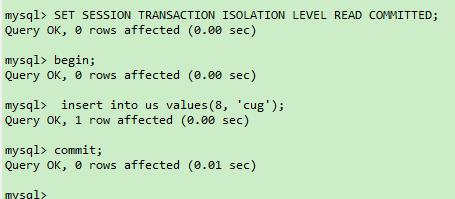

# 事务
## 什么事务
事务保证了一次处理的完整性，也保证了数据库中的数据一致性。
### 事务的特性ACID
* A，也就是原子性（Atomicity）。原子的概念就是不可分割，你可以把它理解为组成物质的基本单位，也是我们进行数据处理操作的基本单位。
* C，就是一致性（Consistency）。一致性指的就是数据库在进行事务操作后，会由原来的一致状态，变成另一种一致的状态。也就是说当事务提交后，或者当事务发生回滚后，数据库的完整性约束不能被破坏。
* I，就是隔离性（Isolation）。它指的是每个事务都是彼此独立的，不会受到其他事务的执行影响。也就是说一个事务在提交之前，对其他事务都是不可见的。
* 最后一个 D，指的是持久性（Durability）。事务提交之后对数据的修改是持久性的，即使在系统出故障的情况下，比如系统崩溃或者存储介质发生故障，数据的修改依然是有效的。因为当事务完成，数据库的日志就会被更新，这时可以通过日志，让系统恢复到最后一次成功的更新状态。
>ACID 可以说是事务的四大特性，在这四个特性中，原子性是基础，隔离性是手段，一致性是约束条件，而持久性是我们的目的。
### 事务的控制

* START TRANSACTION 或者 BEGIN，作用是显式开启一个事务。
* COMMIT：提交事务。当提交事务后，对数据库的修改是永久性的。
* ROLLBACK 或者 ROLLBACK TO [SAVEPOINT]，意为回滚事务。意思是撤销正在进行的所有没有提交的修改，或者将事务回滚到某个保存点。
* SAVEPOINT：在事务中创建保存点，方便后续针对保存点进行回滚。一个事务中可以存在多个保存点。
* RELEASE SAVEPOINT：删除某个保存点。
* SET TRANSACTION，设置事务的隔离级别。


## 事务隔离性
### 事务并发处理可能存在哪些异常？
有三种异常：
* <strong>脏读</strong>读到了其他事务还没有提交的数据。
* <strong>不可重复读</strong>:对某数据进行读取，发现两次读到的结果不同，也就是说明没有读到相同的内容。这是因为有其他事务对这个数据同时进行了修改或删除。
* <strong>幻读</strong>：事务 A 根据条件查询得到了 N 条数据，但此时事务 B 更改或者增加了 M 条符合事务 A 查询条件的数据，这样当事务 A 再次进行查询的时候发现会有 N+M 条数据，产生了幻读。

### 事务的隔离级别
四种隔离级别，这四种隔离级别从低到高分别是：读未提交（READ UNCOMMITTED ）、读已提交（READ COMMITTED）、可重复读（REPEATABLE READ）和可串行化（SERIALIZABLE）。
|类型|脏读|不可重复读|幻读|
|--|--|--|--|
|读未提交(READ UNCOMMITTED)|可能|可能|可能|
|读已提交(READ COMMITTED)|不可能|可能|可能|
|可重复读(REPEATABLE READ)|不可能|不可能|可能|
|可串行化(SERIALIZABLE)|不可能|不可能|不可能|

> 读未提交：也就是允许读到未提交的数据，这种情况下查询是不会使用锁，可能产生脏读、不可重复读、幻读等情况。  
> 读已提交：只能读到已经提交的内容，可以避免脏读的产生,RDMBS中默认(ORacle和SQL server);但要想避免不可重复读或幻读则需要加锁。  
> 可重复读：保证一个事务在相同条件下两次查询得到的数据结果是一样；可避免不可重复读和脏读；<strong>MySQL默认隔离级别可重复读</strong>。 
> 可串行化：将事务进行串行化，在一个队列中按顺序执行。可串行最高隔离级别，可以解决所有异常，但是牺牲了并发性。

<strong>数据库会创建一个视图，访问的时候以视图的逻辑结果为准；在可重复读隔离级别下，这个视图是在事务启动时创建的，整个事务存在期间都用这个视图；在读提交的隔离级别下，这个视图是在每个SQL语句执行的时候创建的；读未提交隔离级别下直接返回记录上的最新值，没有视图概念；串行化隔离级别下只用用加锁的方式来避免并行访问。</strong>   
mysql默认隔离级别：可重复读；oracle：读提交   

## 事务的隔离实现
在mysql中，实际上每条记录在更新的时候都会同时记录一条回滚操作。记录上的最新值，通过回滚操作，都可以得到前一个状态的值。  
在视图ABC里面，这个记录是1、2、4，同一条记录在系统中存在多个版本，就是数据库多版本并发控制MVCC。  
长事务的危害：长事务意味着系统里会存在很老的事务视图；由于这些事务随时可能访问数据库里面的任何数据，所以这个事务提交之前，数据库里面的它能用到的回滚记录都必须保留，必回导致大量占用存储空间。  

## 事务启动的方式
* 显示启动语句：begin或start transaction，配套的提交语句是commit，回滚语句rolleback，
* set autocommit = 0,这个命令将这个线程的自动提交关掉。只要执行了select语句，这个事务就启动了，不会自动提交，一直持续到你主动执行commit或rollback语句。
建议通过显示的方式来启动事务。  

### 三种异常模拟
实验环境：mysql5.7；关键语句：
```sql
# 查看级别
SHOW VARIABLES LIKE 'transaction_isolation';
# 设置本次会话隔离级别
SET SESSION TRANSACTION ISOLATION LEVEL READ UNCOMMITTED;
# 关闭事务默认提交
 SET autocommit = 0;
# 查看autocommit值
 show variables like 'autocommit';
```

实验设计：  
|事务A|事务B|
|--|--|
|开启事务|  |
|第一次查询V1|开启事务|
|   |插入X|
|   |提交|
|第二次查询V2|  |
|插入X| |
|提交|  |
#### 读未提交(READ UNCOMMITTED)
命令
```sql
SET SESSION TRANSACTION ISOLATION LEVEL READ UNCOMMITTED;
```
* 脏读 
   
事务B插入X(7,'whu')，未提交。
  

事务A两次查询结果不一样,读到未提交的X


* 不可重复读：两次同样的查询，结果不一样，既是允许不可重复读。
* 幻读：第一次查询时候没有X，第二次查到了X，即幻读
  
#### 读提交(READ COMMITTED)
命令：
```sql
SET SESSION TRANSACTION ISOLATION LEVEL READ COMMITTED;
```
B事务插入X(8,'CUG'),提交;

B事务修改X(8,)未提交；

A事务第二次同条件查询,结果不一样  
第三次查询结果相同(修改未提交)  


* 不可重复读；一二次查询结果不一样
* 幻读：第一次查询后，A不知道X(8插入)，第二次就是幻读。

#### 可重复读级别(REPEATABLE READ) 
准备命令：
```sql
SET SESSION TRANSACTION ISOLATION LEVEL REPEATABLE READ;
SET autocommit = 0;
```

* 可重复读：V1和V2结果相同；  
事务B插入记录(6,rs)  
  
事务A两次查询结果相同  
  

* 幻读：事务A以为X不存在，插入X，错误


## 事务隔离级别的实现

* 读数据前，对其加锁，阻止其他事务对数据进行修改——Lock Based Concurrency Control(LBCC)
* 生成一个数据请求时间点的一致性数据快照(Snapshot)，并用这个快照来提供一定级别的一致性读取——Multi Version Concurrency Control(MVCC)