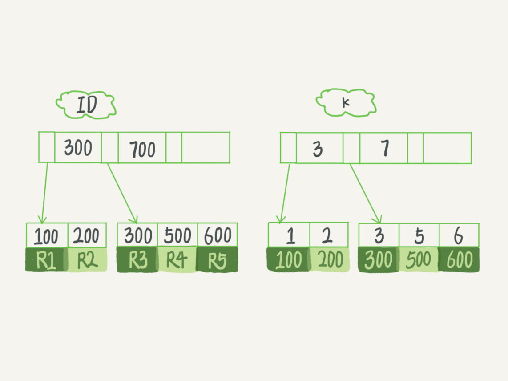
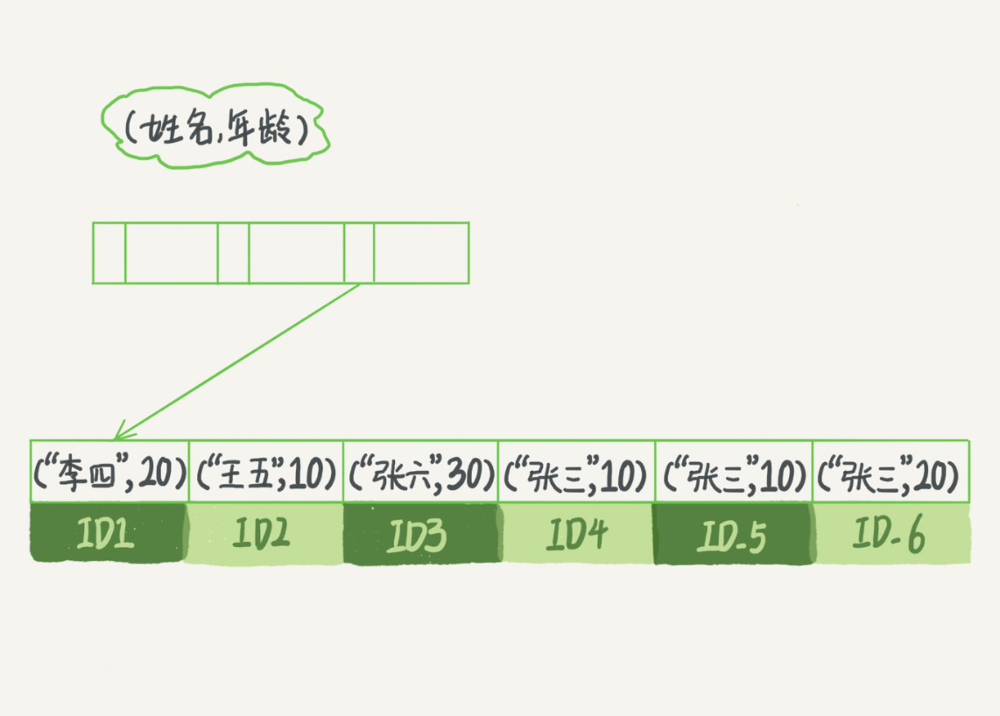
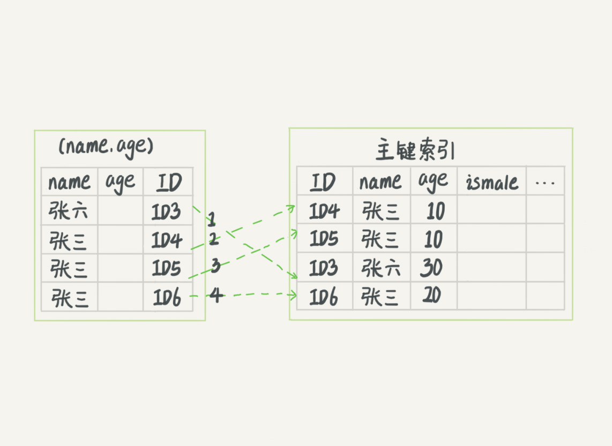
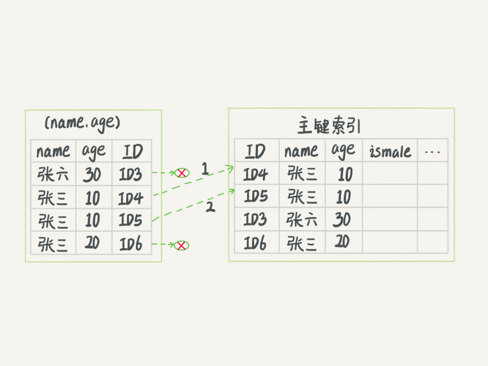

# 索引

## 索引常见的模型
### 哈希表
哈希表是一种以键-值存储的数据结构，我们只要输入待查找的键即key,就可以找到对应的的值即value。哈希就是通过把值放在数组里，哈希函数把key换算成一个确定的位置，然后把value放在这个位置。  
由于多个key经过哈希函数的换算后，会出现同一个值，一般采用拉链法来解决冲突，key对应哈希值相同的放在一个链表上。  
哈希表这种结果适用于只有等值查询的场景，比如memcached及其他一些NoSQL引擎。  

### 有序数组
有序数组在等值查询和范围查询场景中性能就非常优秀。我们可以采用二分法查找，优化搜索次数，有序数组索引只适用于静态存储引擎，保存数据后不再修改。

### 二叉树
二叉搜索树特点：左儿子结点小于父节点，右儿子结点大于父节点，时间复杂度是O(logN).  同时我们必须维持树平衡才能保证，O(logN).    
为了让一个查询尽量少地读磁盘，就必须让查询过程访问尽量少的数据库。那么我们就需要使用N叉树，N叉中的N取决数据块大小，N叉树读写性能、适配磁盘访问模式，广泛用于数据库引擎中。
## InnoDB的索引模型

InnoDB使用B+树索引模型。  
主键列为id，字段k有索引。
```sql
 create table T(
     id int primary key, 
    k int not null, 
    name varchar(16),
    index (k))engine=InnoDB;
```

根据叶子节点内容：主键索引和非主键索引。  
* 主键索引的叶子节点存的是整行数据。也被称为聚集索引(clustered index).
* 非主键索引的叶子节点存的是主键的值。也称为二级索引(Secondary index).

<strong>基于主键索引和普通索引的查询有什么区别?</strong>  
* 如果是`select * from T where id = 500`主键查询方式，则只需要搜索id这个B+树。
* 如果`select * from T where k = 5`,普通索引方式，需要先搜索K索引树，得到id值500，再到id索引树搜索一次，这过程称为<strong>回表</strong>。

我们尽量使用主键查询。

### 索引维护

B+树为了维护索引有序性，插入新值时，做必要的维护，可能会数据所在页已满，需申请新的数据页，同时挪动数据，过程叫做页分裂。删除数据则可能伴随着页合并过程。  
当我们设置自增主键索引时，数据都是追加，不会涉及到其他数据的挪动，不会触发叶子节点的分裂。  
如果有业务逻辑字段做主键，则往往不容易保证有序插入，写数据成本比较高。   
主键的选择？身份证还是自增字段   
如果身份证号作主键，则二级索引的叶子节点占用约20个字节，而用自增型主键，只要4个字节。显然，主键长度越小，普通索引的叶子节点就越小，普通索引占用的空间也就越小。    
查询时尽量用主键查询，避免查询搜索两颗树(先搜索普通索引再搜索聚集索引)，

### 覆盖索引
如果执行的语句是 select ID from T where k between 3 and 5，这时只需要查 ID 的值，而 ID 的值已经在 k 索引树上了，因此可以直接提供查询结果，不需要回表。也就是说，在这个查询里面，索引 k 已经"覆盖了"我们的查询需求，我们称为覆盖索引。  
<strong>由于覆盖索引可以减少树的搜索次数，显著提升查询性能，所以使用覆盖索引是一个常用的性能优化手段。</strong>

### 最左前缀原则
B+ 树这种索引结构，可以利用索引的"最左前缀"，来定位记录。(name,age)联合索引  

索引项是按照索引定义里面出现的字段顺序排序的。
<strong>建立联合索引的时候，如何安排索引内的字段顺序，索引复用能力，因为支持最左原则，(a,b)联合索引，不需要再单独在a上建立索引，第一原则是通过调整顺序，减少维护一个索引；如果单独要做b的查询，则同时需要维护(a,b),(b)两个索引；这时考虑空间问题，name字段比age字段大，则创建(name,age)联合索引，(age)单字段索引。</strong>

### 索引下推
如果满足最左前缀原则，可以在索引中定位记录，那么不符合左前缀的部分呢？  
```sql
select * from tuser where name like '张 %' and age=10 and ismale=1;
```
这个语句搜索时，只能用"张",找到第一个满足条件的ID3，在<strong>Mysql5.6</strong>之前，只能从ID3开始一个个回表，找到主键索引上的数据行，比较字段值。在<strong>Mysql5.6</strong>开始，引入了<strong>索引下推</strong>(index condition pushdown)，<font color="red">在索引遍历过程中，对索引中包含的字段先做判断，直接过滤掉不满足条件的记录，减少回表次数。</font>  
无索引下推

索引下推


## 面试题精选
### 索引有几种类型？分别如何创建?
索引两种分类方式：逻辑分类和物理分类，逻辑分类：  
* 主键索引：一张表只能有一个主键索引，不允许重复、不允许NULL；  
* 唯一索引：数据列不允许重复，允许NULL值，一张表可有多个唯一索引，但是唯一一个索引只能包含一列，比如身份证号码、卡号等可以作为唯一索引；
* 普通索引：一张表可以创建多个普通索引，一个普通索引可以包含多个字段，允许数据重复，允许NULL值插入；
* 全文索引：让搜索关键词更高效的一种索引。

按照物理分类：  
* 聚集索引：一般是表中的主键索引，如果表中没有显示指定主键，则会选择表中的第一个不允许NULL的唯一索引，如果没有的话，就采用Innodb存储引擎为每行数据内置<strong>6字节ROWID</strong>作为聚集us噢因。每一张表只有一个聚集索引，因为聚集索引的键值的逻辑顺序决定了表中相应行的物理顺序。聚集索引在精确查找和范围查找方面有良好的性能表现，聚集索引选择需要慎重，(一般不会让没有语义的自增id充当聚集索引)。
* 非聚集索引：该索引的逻辑顺序与磁盘上行的物理存储顺序不同，一个表可以拥有多个非聚集索引。

索引创建脚本：  
```sql
-- 创建主键索引
alter table t add primary key add (`id`);
-- 创建唯一索引
alter table t add unique (`username`);
-- 创建普通索引
alter table t add index index_name (`username`);
-- 创建全文索引
alter table t add fulltext (`username`);
```

### 什么是最左匹配原则？它的生效原则有哪些？
最左原则也叫最左前缀原则，说的是索引以最左边的为起点任何连续的索引都能匹配上，当遇到范围查询(>,<,betweeb,like)就会停止匹配。生效原则示例，表中有一个联合索引字段index(a,b,c)： 
* where a = 1 只使用索引a；
* where a =1 and b = 2 只使用了索引a,b
* where a = 1 and b = 2 and c = 3,使用了abc
*  where b = 1 or c =1 不适用索引
*  where a = 1 and c = 3 只用索引a
*  where a = 1 and b like 'XX%' and c = 3 只使用了索引a,b

<strong>在联合索引中 范围以后的索引会导致索引失效</strong>
#### 失效情况
1.有or必全有索引;
2.复合索引未用左列字段;
3.like以%开头;
4.需要类型转换;
5.where中索引列有运算;
6.where中索引列使用了函数;
7.如果mysql觉得全表扫描更快时（数据少）;

### 什么是前缀索引？为什么要使用？什么情况使用
* 前缀索引也叫局部索引，比如给身份证前10位添加索引，类似于某列部分信息添加索引的方式
* 前缀索引能有效减小索引文件的大小，让每个索引也可以保存更多的索引值，从而提高了索引查询的速度。但是前缀索引也有它的缺点，不能再order by或group by触发前缀索引，也不能用于覆盖索引。
* 当字符串本身可能比较长，而且前几个字符开始不相同，适合使用前缀索引；

给手机号前6位创建索引:
```sql
alter table t add index index_phone(phone(6));
create index index_phone on t(phone(6));
```
[其他参加gitchat-mysql专栏](https://gitbook.cn/gitchat/column/5d80aea449b2b1063b52990f/topic/5d80b1f649b2b1063b529956)