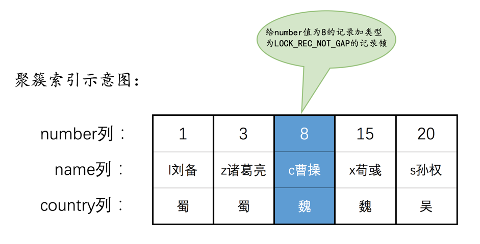
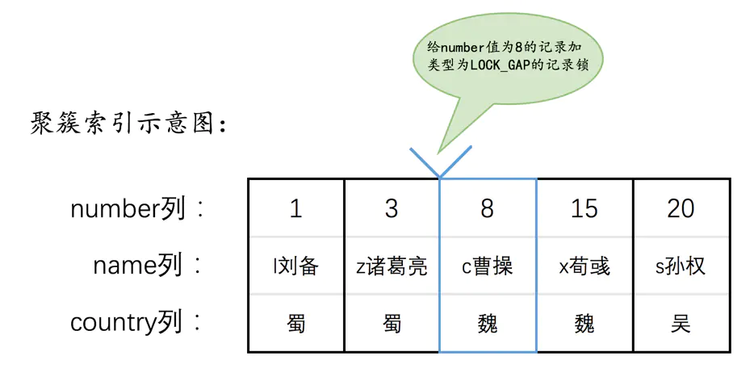
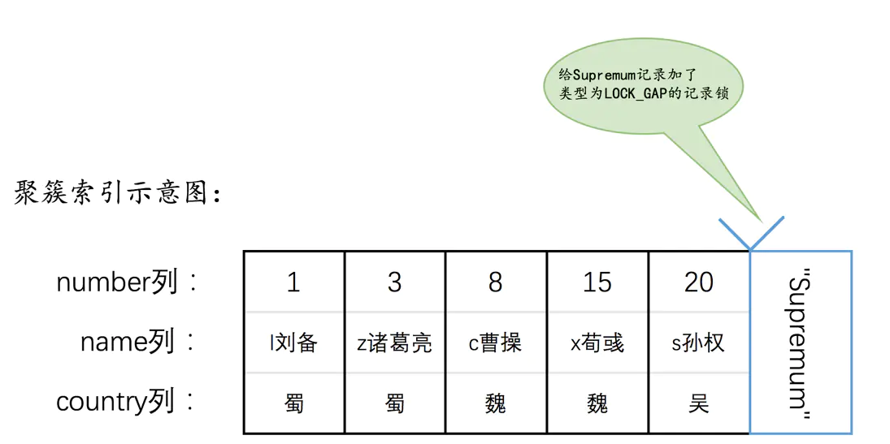

## 锁的粒度
表锁与行锁的区别:
* 锁定粒度-表锁 > 行锁
* 加锁效率-表锁 > 行锁
* 冲突概率-表锁 > 行锁
* 并发性能-表锁 < 行锁

### 共享锁(Share S锁) 行锁
又称读锁，共享锁就是多个事务对同一数据可以共享一把锁，都能访问到数据，但是只能读不能修改；
```sql
# 加锁方式
select * from student where id = 1 LOCK IN SHARE MODE;
# 释放锁
commit/rollback;
```

### 排他锁(X 锁) 行锁
又称为写锁，排他锁不能与其他锁并存，如果一个事务获取了一个数据行的排他锁，其他事务就不能再获取该行的锁(共享锁、排他锁)，只有获取了排他锁的事务是可以对数据进行读取和修改。
```sql
# 加锁方式
# 自动
delete / update /insert 默认加上X锁;
# 手动
select * from student where id=1 FOR UPDATE;
```

### 意向共享锁(IS)/意向排他锁(IX) 表锁，一个标志
* 意向锁是由数据引擎自己维护的，用户无法手动操作意向锁，意向共享锁(Intention Shared Lock，简称IS锁)。  
> 表示事务准备给数据行加入共享锁，也就是一个数据行加共享锁必须先取得该表的IS锁。

* 意向排他锁(Intention Exclusion Lock，简称IX锁)；
> 表示事务准备给数据行加入排他锁，说明事务在一个数据行加排他锁前必须先取得该表的IX锁。

>> 给一张表加表锁的前提：  
>>>没有任何事务已经锁定表的任意一行数据，需要进行全表扫描。有了意向锁，就相当flag。

# 全局锁
根据加锁范围，可以分成全局锁、表级锁、行锁三大类。  
全局锁顾名思义就是对整个数据库实例加锁。提供一个全局加读锁的方法-Flush tables with read lock(FTWRL),当你只让整个数据库处于只读状态的时候，可以使用这个命令，以下命令会被阻塞：数据更新语句(数据的增删改)、数据定义语句(包括建表、修改表结构等)和更新类事务的提交语句。  
<strong>全局锁的使用场景，做全库逻辑备份</strong>   
mysql自带的mysqldump逻辑备份工具，使用参数-single-transaction，导数据前，启动一个事务，来确保拿到一致性视图。  
一致性读是好，但前提是引擎要支持这个隔离级别。比如myIsam不支持事务的。single-transaction方法只适用于所有表使用事务引擎的库。如果有表使用不支持事务的引擎，则备份只能通过FTWRL方法。   
为什么不使用set global readonly=true的方式，主要原因：  
* 有些系统中，readonly的值用来做其他逻辑，判断一个库是否为主库还是备库。修改global变量的方式影响面更大，不建议使用。
* 异常处理机制有区别。如果执行FTWRL命令之后，由于客户端异常断开，mysql会自动释放全局锁，整个库可以回到正常更新的状态。而将整个库设置成readonly后，如果发生异常，数据库一直会保持readonly状态，导致整个库长时间处于不可写状态，风险较高。  

# 表级锁
表级别锁有两种：一种是表锁，一种是元数据锁(meta data lock,MDL).   
表锁的语法是lock tables ...read/write。可以用unlock tables主动释放锁，也可以在客户端断开时自动释放。lock tables除了会限制别的线程读写外，也会限定本线程的其他行为。  
<strong>另一类表级锁：MDL(meta data lock)。</strong>MDL不需要显示使用，在访问一个表时会自动加上，  
mysql5.6引入MDL，当对一个表做增删查改操作的时候，加MDL读锁；当要对表结构做变更操作时，加MDL写锁。  
读锁之间不互斥，因此可以多个线程同时一张表增删查改。  
读写锁之间、写锁之间是互斥的。用来保证表变更结构操作的安全性。如果有两个线程要给一个表加字段，其中一个要等另一个执行完才能执行。  

事务中的MDL锁，语句执行开始时申请，但是语句结束后并不会马上释放，而会等到整个事务提交后再释放。  
如何安全地给小表加字段？  
首先解决长事务，事务不提交一直会占着MDL锁。可以在information_schema库中的Innodb_trx表中，查看当前执行的事务，如果有长事务，考虑先暂停DDL或者kill这个长事务。  
如果是一个热点表，kill未必管用。理想的机制是在alter table语句里面设定等待时间，这个等待的时间里能够拿到MDL写锁最好，拿不到也不要阻塞后面的业务语句，先放弃。之后由开发人员或者DBA再通过重试命令重复这个过程。

# 行锁
mysql的行锁在引擎层由各个引擎自己实现。并不是所有引擎都支持行锁，例如myISAM。  
顾名思义，行锁是对数据表中的记录的锁。比如事务A更新了一行，这时候B也要更新同一行，必须等待事务A的操作完才能进行。  
在Innodb事务中，行锁是在需要的时候才加上的，但并不是不需要了就立刻释放，而是要等到事务结束才释放。-两阶段锁协议。   
<font color="red">如果事务中需要锁多个行， 把最可能造成锁冲突、最可能影响并发度锁尽量往后放</font>  
## 死锁和死锁检测
当并发系统中不同线程出现资源循环依赖，涉及的线程都在等待别的线程释放资源是，就会导致这个几个线程进入无线等待的状态，称为死锁。  
  
死锁解决策略：  
* 直接进入等待，直到超时，这个超时通过参数Innodb_lock_wait_timeout来设置。  
* 发起死锁检测，主动回滚死锁链条中的某一个事务，让其他事务得以继续执行。将参数Innodb_deadlocak_detect设置为on，表示开启这个逻辑。  

开启死锁检测会导致，每个新来堵住的线程都要判断会不会由于自己的加入导致了死锁，时间复杂度为O(n);例如1000个线程要同时更新同一行，死锁检测级别就是100万量级，会耗费大量CPU资源，却执行不了几个事务。  
热点行更新导致的性能问题如何解决？  
症结在于死锁检测要耗费大量的CPU资源。  
* 一种头痛医头的办法，假如你能保证业务一定不会出现死锁，可以临时把死锁检测关闭。
* 控制并发度，同一行控制同时修改的线程数，死锁检测成本会很低。但是如果连接大量的客户端，峰值并发数也不小。 并发控制要坐在数据库服务端，对于相同行的更新，在进入引擎之前排队，
* 可以考虑将一行改成逻辑上的多行来减少冲突，并发的时候任意选择其中一条记录加锁，可以减少锁等待个数，减少了死锁检测的CPU消耗。需要根据业务逻辑做详细设计。  

## 怎么解决脏读、幻读、不可重复读

* 所谓的MVCC我们在前一章有过详细的描述，就是通过生成一个ReadView，然后通过ReadView找到符合条件的记录版本（历史版本是由undo日志构建的），其实就像是在生成ReadView的那个时刻做了一次时间静止（就像用相机拍了一个快照），查询语句只能读到在生成ReadView之前已提交事务所做的更改，在生成ReadView之前未提交的事务或者之后才开启的事务所做的更改是看不到的。而写操作肯定针对的是最新版本的记录，读记录的历史版本和改动记录的最新版本本身并不冲突，也就是采用MVCC时，读-写操作并不冲突。

>小贴士： 我们说过普通的SELECT语句在READ COMMITTED和REPEATABLE READ隔离级别下会使用到MVCC读取记录。在READ COMMITTED隔离级别下，一个事务在执行过程中每次执行SELECT操作时都会生成一个ReadView，ReadView的存在本身就保证了事务不可以读取到未提交的事务所做的更改，也就是避免了脏读现象；REPEATABLE READ隔离级别下，一个事务在执行过程中只有第一次执行SELECT操作才会生成一个ReadView，之后的SELECT操作都复用这个ReadView，这样也就避免了不可重复读和幻读的问题。

* 方案二：读、写操作都采用加锁的方式。

如果我们的一些业务场景不允许读取记录的旧版本，而是每次都必须去读取记录的最新版本，比方在银行存款的事务中，你需要先把账户的余额读出来，然后将其加上本次存款的数额，最后再写到数据库中。在将账户余额读取出来后，就不想让别的事务再访问该余额，直到本次存款事务执行完成，其他事务才可以访问账户的余额。这样在读取记录的时候也就需要对其进行加锁操作，这样也就意味着读操作和写操作也像写-写操作那样排队执行。

>小贴士： 我们说脏读的产生是因为当前事务读取了另一个未提交事务写的一条记录，如果另一个事务在写记录的时候就给这条记录加锁，那么当前事务就无法继续读取该记录了，所以也就不会有脏读问题的产生了。不可重复读的产生是因为当前事务先读取一条记录，另外一个事务对该记录做了改动之后并提交之后，当前事务再次读取时会获得不同的值，如果在当前事务读取记录时就给该记录加锁，那么另一个事务就无法修改该记录，自然也不会发生不可重复读了。我们说幻读问题的产生是因为当前事务读取了一个范围的记录，然后另外的事务向该范围内插入了新记录，当前事务再次读取该范围的记录时发现了新插入的新记录，我们把新插入的那些记录称之为幻影记录。采用加锁的方式解决幻读问题就有那么一丢丢麻烦了，因为当前事务在第一次读取记录时那些幻影记录并不存在，所以读取的时候加锁就有点尴尬 —— 因为你并不知道给谁加锁，没关系，这难不倒设计InnoDB的大叔的，我们稍后揭晓答案，稍安勿躁。

## 行锁

### Record Locks

分为 S锁和X锁，某条记录获取了S锁，其他事务可以获取该记录的S锁，但是不能获取该记录的X锁。  
当一个事务获取了X锁后，其他事务即不可以获取S锁也不可以获取X锁。

### Gap Locks
解决幻读，Lock_GAP ,间隙锁，

即(3,8)之间不让插入新记录，例如插入记录4，定位该条新记录下一条记录8，该记录上有一个Gap锁，所以阻塞插入。待提交后方可插入。 
<strong>gap锁是为了防止幻影记录提出的</strong>

不知道大家发现了一个问题没，给一条记录加了gap锁只是不允许其他事务往这条记录前边的间隙插入新记录，那对于最后一条记录之后的间隙，也就是hero表中number值为20的记录之后的间隙该咋办呢？也就是说给哪条记录加gap锁才能阻止其他事务插入number值在(20, +∞)这个区间的新记录呢？这时候应该想起我们在前边唠叨数据页时介绍的两条伪记录了：

 * Infimum记录，表示该页面中最小的记录。

 * Supremum记录，表示该页面中最大的记录。

为了实现阻止其他事务插入number值在(20, +∞)这个区间的新记录，我们可以给索引中的最后一条记录，也就是number值为20的那条记录所在页面的Supremum记录加上一个gap锁，画个图就是这样：


### Next-key Locks
有时候又想锁住某条记录，又想阻止其他事务在该记录前边的间隙插入新记录，设计了Next-key Locks，是前两种锁的合体，

