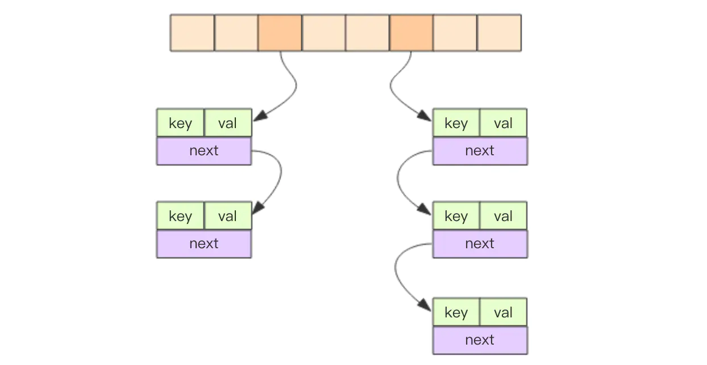

# redis 10万+ QPS
### 为什么redis能这么快？
* 完全基于内存，绝大部分请求是纯粹的内存操作，执行效率高
* 数据结构简单，对数据操作也简单
* 采用单线程，单线程也能处理高并发请求，
* 使用多路I/O复用模型，非阻塞IO
  
### redis多路I/O复用
redis采用的I/O多路复用函数：epoll/kqueue/evport/select?  
* 因地制宜
* 优先选择时间复杂度O(1)的I/O多路复用函数作为底层实现  
* 以时间复杂度为O(n)的select作为保底
* 基于react设计模式监听I/O事件

## redis的数据类型
### 用户使用的数据类型
* String:最基本的数据类型，二进制安全(SDS简单动态字符串)
* Hash:String元素组成的字典，适合用于存储对象(ziplist和hashtable)
* List:列表,按照String元素插入顺序排序(ziplist和linkedlist)
* Set:String元素组成的无序集合，通过hash表实现，不允许重复(intset整数集合，hashtable哈希表)
* Sorted Set:通过分数来为集合中的成员进行从小到大的排序(skiplist跳跃表和ziplist压缩列表)
* String:最基本的数据类型，二进制安全
* Hash:String元素组成的字典，适合用于存储对象
* List:列表,按照String元素插入顺序排序
* Set:String元素组成的无序集合，通过hash表实现，不允许重复
* Sorted Set:通过分数来为集合中的成员进行从小到大的排序（hash，skiplist）
* 用于计数的HyperLog，用于支持存储地理位置信息的Geo

### 底层数据类型基础
* 简单动态字符串
* 链表
* 字典
* 跳跃表
* 整数集合
* 压缩列表
* 对象
#### 链表
* 双端：链表节点带有prev和next指针，
* 无环：表头节点和表尾节点都指向NULL
* 带链表长度计数器：程序使用list结构的len属性对list持有的链表节点进行计数
* 多态：链表节点使用void * 指针来保存节点值。


#### 字典

* 字典实现：类似于java hashmap
* 插入键冲突采用链地址法，头插入
* 哈希表的扩容与收缩
  * 服务器没有执行bgsave时，装载因子大于1(总数大于数组长度)时扩容
  * 执行bgsave时，装载因子大于5，强制执行扩容 
  * 哈希表负载因子小于0.1时，程序自动开始缩容。
* 渐进式rehash：
  * 扩容需要重新申请新的数组，将旧数组的键值对分多次、渐进式慢慢的rehash到新数组。
  * rehash操作时分摊到对字典的每个添加、删除、操作、查找和更新操作上。rehash完成时，rehashidx+1,完成时为-1；

#### 整数集合
当一个集合只包含整数值元素，并且元素数量不多是，redis就会使用整数集合作为集合键的底层实现。
* 当向一个底层为int16_t数组集合中添加一个int64_t类型的整数数值是，整数集合已有的所有元素都会被转换成int64_t类型。
* 只升级不降级。

#### 跳跃表


* 跳跃表节点

  * 层：leve数组包含多个元素，每个元素都包含一个指向其他节点的指针，每次创建的时候，随机生成一个层数
  * 前进指针：每个层都有指向表尾的前进指针，用于从表头向表尾访问节点。
  * 跨度：用于记录两个节点之间的距离，两个节点之间跨度越大，他们相距越远，<strong>计算排名rank</strong>
  * 后退指针：用于从表尾向表头方向访问节点，每个节点只有一个后退指针。
  * 分值和成员：节点分值从小到大来排序。节点成员对象obj指向一个字符串对象。
  * 支持平均O(logN)、最坏O(N)

#### 压缩列表

> * 列表 
> 对应两种：压缩列表（ziplist),另一种是双向循环链表
> 列表数据量比较小的时候，列表就可以采用压缩列表的方式实现。两个条件：列表中保存的单个数据小于64字节；列表中数据个数少于512个。
> 压缩列表类似于数组，通过一片连续的内存空间来存储数据，它跟数组不同的一点是，它允许存储的数据大小不同；这里说的压缩节省内存相较于数组的存储思路而言，数组每个元素大小相同，我们要存储不同长度的字符串。
> 当数据量比较大的时候，列表通过双向循环链表来实现。
> * 字典
> 对应底层两种实现方式：压缩列表和散列表
> 压缩列表： 字典中保存的键和值的大小都要小于64字节；字典中键值对的个数小于512个
> 当数据动态增加之后，散列表的装载因子会不停地变大，为了避免散列表性能的下降，当装载因子大于1的时候，redis会触发扩容，将散列表扩为原来大小的2倍左右。
> 动态减少之后，为了节省内存，当装载因子小于0.1的时候，触发缩容。
> * 集合（set)
> 两种实现方法：基于有序数组，基于散列表
> 有序数组：存储的数据类型都是整数
> 存储的数据元素个数不超过512个。
> * 有序集合
> 两种实现：所有数据大小都要小于64字节；元素个数要小于128字节
> 

## 过期策略
* 过期的key集合
redis将每个设置了过期时间的key放入到一个独立的字典中，以后定期遍历这个字典来删除到期的key。同时还会使用惰性策略来删除过期的key,惰性策略就是在客户端访问这个key会检查key的过期时间，过期则立即删除。定时删除时集中处理，惰性删除时零散处理。
  * 惰性策略实现：由db.c/expireIfNeeded函数实现，所有读写数据库的Redis命令在执行之前都会调用expireIfNeed函数对输入键进行检查
  * 定期删除策略：redis.c/activeExpireCycle函数实现，每当redis的服务器周期性操作redis.c/serverCron函数执行时，activeExpireCycle函数就会被调用。


* 定时扫描策略
redis默认会每秒进行十次过期扫描，过期扫描不会遍历过期字典中所有的key，采用一种贪心策略，
1、过期字典中随机选20个key,
2、删除这个20key中已过期的key
3、如果过期的key比率超过1/4,那就重复步骤1；

* 从库过期的策略
从库不会过期扫描，从库对过期的key是被动的，主库在key到期时，会在AOF中增加一条del指令。同步到从库后，通过执行这条del指令来删除过期的key。

## 淘汰策略
* noeviction不会继续服务写请求，读请求可以继续进行，可以保证不会丢失数据，但是会让线上的业务不能持续进行。默认淘汰策略
* volatile-lru:尝试淘汰设置了过期时间的key,最少使用的key优先被淘汰。没有设置过期时间的key不会被淘汰，这样可以保证需要持久化的数据不会突然被丢失。
* volatile-ttl:淘汰key的剩余时间ttl的值，ttl越小越优先被淘汰
* volatile-random：跟上面一样，不过淘汰的key是过期key集合中随机的key
* allkeys-lru：淘汰的key对象是全体的key集合，而不只是过期的key集合。这意味着没有设置过期时间的key也会被淘汰。
* allkeys-random:淘汰随机的key
* volatile-lfu：带过期时间的key进行最近使用少的进行淘汰（redis4.0)
* allkeys-lfu:对所有key执行lfu淘汰算法。


## Redis持久化
### RDB和AOF的优缺点

|方式|优点|缺点|
|--|--|--|
|RDB|全量数据快照，文件小、恢复快|无法保存最近一次快照之后的数据|
|AOF|可读性高，适合保存增量数据，数据不易丢失|文件体积较大，恢复时间较长|
### RDB
<strong>RDB持久化通过保存数据库中的键值对来记录数据库的状态。</strong>
* RDB文件的创建
  * 生成RDB文件两个命令： SAVE，BGSAVE
  * SAVE命令会阻塞Redis服务进程，直到RDB文件创建完毕为止，客户端所有命令请求都会被阻塞。
  * BGSAVE：会派生出一个子进程，然后由子进程的方式调用这个函数。会拒绝SAVE，BGSAVE，BGREWRITEAOF命令。
* RDB文件载入
  * 如果服务器开启了AOF持久化功能，优先使用AOF来还原数据库状态
  * 只有在AOF持久化功能关闭时，才会使用RDB文件来还原
  * RDB载入文件时，会一直处于阻塞状态。

* RDB文件结构

|REDIS|db_version|database|EOF|check_sum|

```shell
od -c dump.rdb
```
> RDB会以快照“RDB”的形式将数据持久化到磁盘的一个二进制文件dump.rdb,
> 工作原理：当redis需要做持久化时，redis会fork一个子进程，子进程将数据写到磁盘上一个临时RDB文件中，当子进程写完临时文件后，将原来RDB替换掉，这样的好处是可以copy-on-write.
> RDB 非常适合备份；缺点是：尽量避免在服务器故障时丢失数据，RDB不适合。


### AOF持久化
<strong>AOF持久化是通过保存Redis服务器所执行的写命令来记录数据库状态的。</strong>

* AOF持久化实现
  * 会以协议格式将被执行的命令追加到服务器状态的aof_buf缓冲区末尾。

* AOF载入与数据还原
* AOF重写：为了解决AOF持久化文件体积膨胀，重写AOF文件，创建新的AOF文件代替现有的AOF文件，新旧AOF文件保存相同的数据库状态，但是不会包含任何浪费空间的冗余命令。
  * AOF重写实现： 首先从数据库中读取键现在的值，然后用一条命令去记录键值对，代替之前记录这个键值对的多条命令。
  * AOF后台重写：AOF重写aof_rewrite函数，

> 使用AOF做持久化，每一个写命令都通过write函数追加到appendonly.aof中，配置如下：
```
appendfsync yes
appendfsync always     #每次有数据修改发生时都会写入AOF文件。
appendfsync everysec   #每秒钟同步一次，该策略为AOF的缺省策略。
```
>AOF 将 Redis 执行的每一条命令追加到磁盘中，处理巨大的写入会降低 Redis 的性能，不知道你是否可以接受。数据库备份和灾难恢复：定时生成 RDB 快照非常便于进行数据库备份，并且 RDB 恢复数据集的速度也要比 AOF 恢复的速度快。当然了，redis 支持同时开启 RDB 和 AOF，系统重启后，redis 会优先使用 AOF 来恢复数据，这样丢失的数据会最少。

## RDB-AOF混合持久方式 4.0后


## Redis的同步机制
### 全量同步过程
* Slave 发送Sync命令到master
* Master启动一个后台进程，将redis中的数据快照保存到文件中
* Master将保存数据快照期间接收到的写命令缓存起来
* Master完成写文件操作后，将该文件发送给slave
* 使用新的AOF文件替换掉旧的AOF文件
* Master将这期间收集的增量写命令发送给salve端。

### 增量同步过程
* Master接收到用户的操作指令，判断是否需要传播到Slave
* 将操作记录追加到AOF文件
* 将操作传播到其他Slave：1.对齐主从库；2.往响应缓存写入指令
* 将缓存中的数据发送给slave

## Redis Sentinel(哨兵)
### 解决主从同步Master宕机后的主从切换问题
* 监控：检查主从服务器是否运行正常
* 提醒：通过API向管理员或者其他应用程序发送故障通知
* 自动故障迁移：主从切换

机制类似于Zookeeper

### 流言协议Gossip
在杂乱无章中需求一致：  
* 每个结点都随机地与对方通信，最终所有结点的状态达成一致。
* 种子结点定期随机向其他节点发送节点列表以及需要传播的消息
* 不保证信息一定会传递给所有结点，但是最终会趋于一致
  
## Redis的集群原理
### 如何从海量数据里快速找到所需
* 分片：按照某种规则去划分数据，分散存储在多个节点上
* 常规的按照hash划分无法实现节点的动态增减
* > 一致性哈希算法：对2^32取模，将哈希值空间组成虚拟的圆环，  
* > 将数据key使用相同的hash函数计算出哈希值  
* > 某个节点宕机，会发生数据倾斜
* > 引入虚拟节点解决数据倾斜的问题
无中心协议，获取key的hash
redis-cluster采用去中心化思想，没有中心节点的说法，客户端与redis节点直连，不需要中间代理层，连接任何一个可用节点。
## 如何实现分布式锁

## 如何实现异步队列、消息订阅

## Redis使用
linux下启动客户端:
```shell
./redis-cli -p port # 启动客户端
auth 密码 #密码登录
```
## 参考阅读
[大厂面试！我和面试官之间关于Redis的一场对弈](https://mp.weixin.qq.com/s/DHTPSfmWTZpdTmlytzLz1g)  


## 资料扩展

Redis 基础手册：https://www.runoob.com/redis/redis-tutorial.html
Redis 基础系列（推荐）：https://www.cnblogs.com/itzhouq/p/redis1.html
Redis常用参数：https://www.cnblogs.com/liufukui/p/10448827.html
Spring Cache整合ehcache和Redis：https://www.cnblogs.com/xiang--liu/p/9720344.html
Spring Data Redis：https://blog.csdn.net/lydms/article/details/105224210
Redis命中率：https://www.cnblogs.com/junlinqunxia/p/11244230.html
Redis知识与场景集合（推荐）：http://c.biancheng.net/view/4560.html
Redis内存优化：https://redis.io/topics/memory-optimization
Redis数据类型原理与优化（推荐）：https://www.cnblogs.com/williamjie/p/11288062.html
Redis优化的几个tips：
\- https://zhuanlan.zhihu.com/p/55068567
\- http://www.jwsblog.com/archives/50.html

Lettuce详解：
\- https://www.cnblogs.com/throwable/p/11601538.html
\- https://blog.csdn.net/moonpure/article/details/82658788

Redis设计与实现：http://redisbook.com/