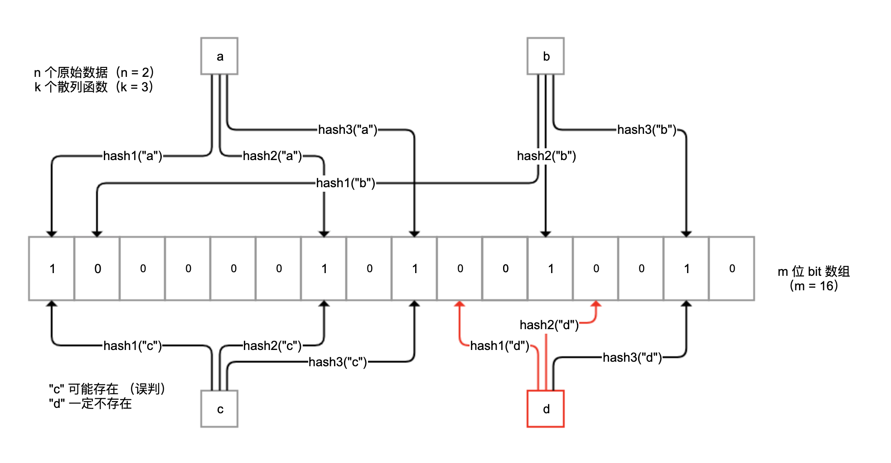

# 缓存设计
缓存是用空间换时间，来解决性能问题的一种架构模式。redis这种缓存系统的整体吞吐量能达到关系数据库的几倍甚至几十倍，特别适用于互联网应用的高并发场景。  

## 不要把redis当作数据库
redis虽然具有数据持久化功能，可以实现服务重启后数据不丢失；redis是一个内存数据库，所有数据保存在内存中，并且直接从内存中读写数据响应操作。redis处理请求快，但是无法保存超过内存大小的数据。  
```
VM模式虽然可以保存超过内存大小的的数据，但是因为性能原因从2.6开始废弃。企业版redis提供Redis on Flash可以实现key + 字典+热数据保存在内存中，冷数据保存在SSD中。
```
redis做缓存注意：  
* 缓存数据的特点一定要有原始数据来源，且允许丢失；数据丢失后我们需要重新加载数据，不能认为缓存系统是绝对可靠的，更不能认为缓存系统不会删除没有过期的数据
* 缓存系统可以保存的数据量一定是小于原始数据的。我们应该限制redis对内存的使用量，也就是设置maxmemory参数；其次我们应该根据数据特点设置，淘汰数据的方式。 

淘汰数据策略有：  
* allkeys-lru:针对所有key,优先删除最近最少使用的key;
* volatile-lru:针对带有过期时间的key，优先删除最近最少使用的key
* volatile-ttl:针对带有过期时间的key，优先删除即将过期的key（根据TTL值）
* allkeys-lfu:(redis4.0以上)针对所有key，优先删除最少使用的key
* volatile-lfu:(redis4.0+),针对所有带有过期时间的key，优先删除最少使用的key

从算法角度：LFU比LRU更实用，如果一个key一天访问的频率是一次，但正好在1秒前访问过，LRU可能不会优先选择淘汰这个key，而LFU会淘汰这个key.TTL优先设置即将过期的key,但有可能这个key正在大量的访问。   
key范围角度，allkeys可以确保即使key没有设置TTL也能被回收，如果使用时客户端总忘记设置缓存的过期时间，那么可以考虑这个算法。

## 缓存雪崩 大量key同时失效
由于缓存系统的IOPS比数据库高很多，特别小心短时间内大量缓存失效的情况，一旦发生瞬间有大量的数据要去数据库查询，从而对数据库造成极大压力，甚至崩溃。缓存失效也叫缓存雪崩。  
缓存雪崩有两种原因一般：
* 缓存系统本身不可用，导致大量请求直接回源到数据库
* 应用设计层面大量的key在同一时间过期，导致大量的数据回源

第一种原因，主要涉及缓存系统高可用的配置。   
解决大量key同时过期，数据回源两种解决方案：  
* 差异化缓存过期时间，不要让大量key同一时间过期；例如设置缓存时间30s+10s内的随机延迟(扰动值)
* 让缓存不主动过期。初始化缓存数据的时候设置永不过期，然后启动一个后台线程30秒定时把所有数据更新到缓存，而且通过适当休眠，控制数据库更新数据的频率。

注意三点关于以上两种方案：  
* 如果无法全量缓存所有数据，那么只能使用方案一。
* 即使使用方案二，缓存永不过期，同样在查询时确保有回源逻辑。我们不能确保缓存系统中的数据永不丢失
* 无论方案几，把数据从数据库加入到缓存的时候，都需要判断来自数据库的数据是否合法，比如进行基本的判空检查

## 缓存击穿 某些热点数据过期，大量请求这个热点数据
某些key属于极端热点数据，<strong>且并发量很大的情况下，如果这个key过期，</strong>可能会导致某个瞬间出现大量的并发请求同时回源，相当于大量的并发请求直接打到数据库。   
对于热点数据，如果回源操作特别昂贵，并发就不能忽略不计。可以考虑使用锁机制来限制回源的并发。例如使用Redisson来获取一个基于Redis的分布式锁，在查数据库前先尝试获取锁。  
在真实场景业务中，不一定要使用双重检查分布式锁进行全局的并发限制，虽然可以降低回源并发数，但也限制了缓存失效时的并发。可以考虑其他：   
* 使用进程内的锁进行限制，这样每一个节点都可以以一个并发回源数据库
* 不使用锁进行限制，使用类似Semaphore的工具进行限制并发数，比如限制10，这样极限值了回源并发数不至于太大，又能使得一定量的线程可以同时回源。  

## 缓存穿透 大量缓存中没有的数据
缓存回源的逻辑都是缓存中查不到需要的数据，回源到数据库查询。有个漏洞就是，缓存中没有数据不一定代表数据没有缓存，还有一种可能是原始数据压根不存在。  
大量查询不存在的数据，会对数据库造成很大压力。  
缓存穿透与缓存击穿的的区别是：  
* 缓存穿透是指，缓存没有起到压力缓冲的作用
* 缓存击穿是指，缓存失效时瞬时的并发打到数据库

解决方案：  
* 对于不存在的数据，设置一个特殊的Value到缓存中，比如当数据库质管部查出的用户信息为空时，设置NODATA这样具有特殊含义的字符串到缓存中，下次请求还是可以命中缓存，直接从缓存中返回。这样可能会把大量无效的数据加入缓存中  
* 使用布隆过滤器做前置过滤。   

布隆过滤器是一种概率性数据库结构，由一个很长的二进制向量和一系列随机映射函数组成。它的原理是当一个元素加入集合时，通过k个散列函数将这个元素映射成一个m位bit数组中的k个点，并置为1.检索时，只需要看看这些点是不是都是1；如果这些点有任何一个0，则表示一定不存在。如果都为1，则被检测元素很可能存在。
  
布隆过滤器不保存原始值，空间效率高，平均一个元素占用2.4字节就可以达到万分之一的误判率。   
你可以把所有可能的值保存在布隆过滤器中，从缓存读取数据前先过滤一次：  
* 如果布隆过滤器认为值不存在，那么值一定不存在，无需查询缓存和数据库
* 对于极小的误判请求，才会最终让非法Key的请求走到缓存或数据库。  

对于方案二我们需要同步所有可能的值并加入布隆过滤器，这是比较麻烦，如果有业务规则明确，可以直接根据业务规则判断值是否存在。  
此外，可以方案一二同时使用，布隆过滤器前置，对于误判的情况再保存特殊值到缓存，双重保险，避免无效数据查询请求打到数据库。  

## 缓存数据同步策略

实际情况下，修改了原始数据后，考虑到缓存数据更新的及时性，可能会采用主动更新缓存的策略：  
* 先更新缓存，再更新数据库
* 先更新数据库，再更新缓存
* 先删除缓存，再更新数据库，访问的时候按需加载到缓存
* 先更新数据库，再删除缓存，访问的时候按需加载到缓存

分析四种策略：  
* 先更新缓存在更新数据库-不可行，数据库设计复杂，压力集中，数据库因为超时等原因更新操作失败的可能性较大，此外涉及事务，很可能数据库更新失败，导致缓存和数据库的数据不一致
* 先更新数据库再更新缓存-不可行，一是如果线程A和线程B先后完成数据库更新，但更新缓存却是B和A的顺序，很可能把旧数据更新到缓存中引起数据不一致，二是，我们不确定缓存中的数据是否会被访问，不一定要把所有的数据都更新到缓存中去。  
* 先删除缓存再更新数据库，按需加载到缓存-也不可行，并发情况下，很可能删除缓存后还没来得及更新数据库，就有另一个线程先读取了旧值到缓存中，如果并发量很大的话，这个概率很大
* <strong>先更新数据库，再删除缓存，访问时按需加载到缓存</strong>,策略最好。虽然在极端情况下，可能出现数据不一致性的问题，但概率非常低，基本可以忽略。比如，更新数据的时间节点恰好是缓存失效的瞬间，这时A先读取了旧值，随后B操作数据库完成了更新，并删除缓存，A再把旧址加入缓存。  

更新数据库后删除缓存的操作可能失败，如果考虑吧任务加到延迟队列进行延迟重试，确保数据可以删除，缓存可以及时更新。因为删除操作时幂等的，即使重复删除问题也不是太大。  
针对缓存更新的方式，缓存中的数据不由数据更新操作主动触发，统一在需要的时候按需加载，数据更新后及时删除缓存中的数据即可。   

## redis热点key定位
从redis请求路径上结点入手，比如客户端、中间层、服务端：  
* 客户端收集上报；改动redis SDK，记录每个请求，定时收集到的数据上报，由一个统一服务进行聚合计算；方案直观简单没法适应多语言架构，后期维护升级也比较困难
* 代理层收集：所有的redis请求都经过代理，改动proxy代码进行收集，对使用方完全透明，能够解决客户端SDK的语言异构和版本升级问题。不过开发成本比客户端高。 
* redis数据定时扫描：在redis4.0之后添加了hotkeys查找特性，直接利用redis-cli --hotkeys获取当前keyspace的热点key，实现上是通过scan+object freq完成的；可以直接利用现成的工具，由于要扫描整个keyspace，实时性比较差，如果key数量比较多，耗时可能会非常长。  
* redis节点抓包解析：可能存在热key的结点上流量倾斜，通过tcp dump抓取一段时间内的流量并上报，由外部程序进行解析、聚合、时间。开发维护成本可控，缺点是热key结点的网络流量和系统负载已经比较高，抓包可能情况进一步恶化。


### 其他
[缓存](https://mp.weixin.qq.com/s/cw5V9BvtR3kchDsbKlBaVg)