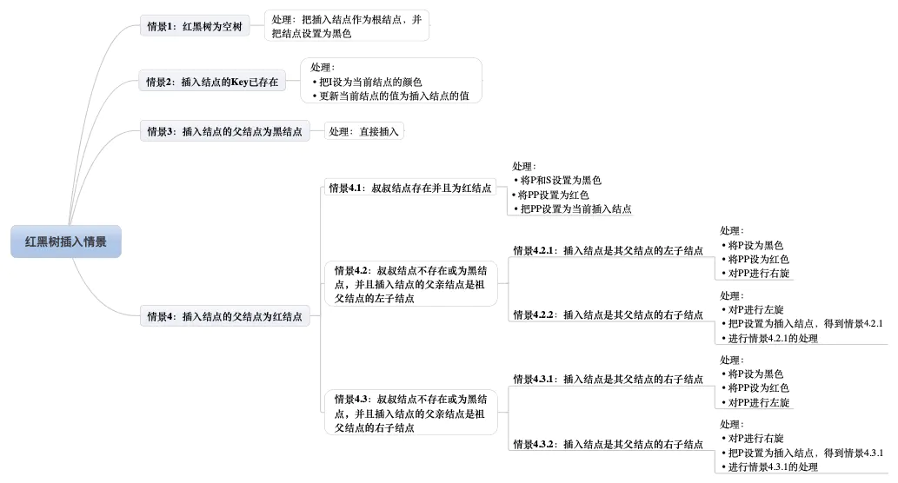
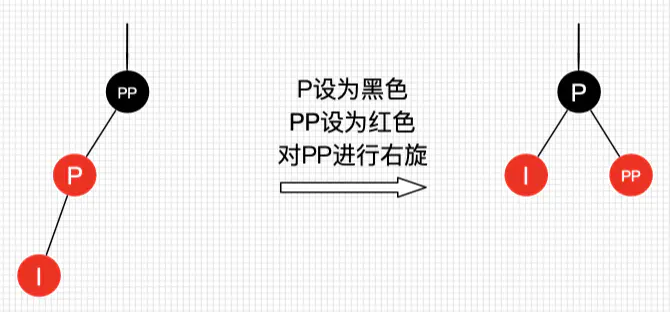

# 红黑树

## 红黑树定义与性质

红黑树和AVL树类似，本质上还是二叉查找树；是一种含有红黑结点并能够自平衡的二叉查找树。与AVL相比，红黑树并不追求所有递归子树高度差不超过1，而是保证从根节点到叶尾结点的最长路径不超过最短路径的2倍，最坏运行时间O(logN).红黑树通过重新着色和左右旋转，更加高效地完成插入和删除操作后的自平衡调整。   
性质：
* 节点只能是红色或黑色
* 根节点必须是黑色
* 所有NIL节点(Nothing In Leaf)均为黑色，叶子节点上不存在的两个虚拟节点。
* 一条路径上不能出现相邻的两个红色节点
* 在任何递归子树内，根节点到叶子节点的所有路径上包含相同数目的黑色节点。

### 红黑树与AVL树比较
>对于任意包含n个结点的红黑树而言，它的根节点高度h<= 2log2(n+1),保证树的高度始终保持在O(logn),所有操作的时间复杂度都能保持在O(logn)以内。而AVL有可能会退化成O(n),h=n;  
>红黑树只是个大致平衡，并不保证左右子树高度差超过1；相同结点的情况下，红黑树高度可能高于AVL，平均查找次数可能高于AVL；   
> 红黑树和AVL树在元素插入时，都能保证至多2次旋转恢复平衡。删除元素时，红黑树至多3次旋转恢复平衡，AVL则需要至多O(logn)次旋转。  
> AVL树在插入和删除时，回溯的时间成本最差可能为O(logn),红黑树向上回溯的不长为2.  
> 频繁的插入和删除，红黑树更合适；面对低频修改、大量查询，AVL树更为合适。  

## 红黑树的查找

因为红黑树是一颗近似二叉平衡树，并且不会破坏树的平衡。  

## 红黑树插入

插入操作：一是查找插入的位置，二是插入后自平衡。  

找到插入结点位置后，插入的结点颜色：<strong>红色</strong>;理由是：红色在父节点为黑色节点时，红黑树的平衡没被破坏，不需自平衡；若插入结点时黑色，插入位置所在的子树黑色结点总是多1，必须做自平衡。  
插入情景有四种情景：

首先约定每个情景。  

### 情景1:红黑树为空树
把插入结点作为根节点，同时设置为黑色。  

### 情景2：插入结点的Key已存在
插入结点的key存在，既然树已经是平衡，只需要替换旧值，  

### 情景3：插入结点的父节点为黑色结点
插入的结点是红色，并不会影响红黑树的平衡，直接插入即可。  

### 情景4：插入结点的父节点为红节点
如果插入的父节点为红结点，该父节点不可能为根节点，所以插入结点总是存在祖父节点。  

#### 情景4.1： 叔叔结点存在且为红结点
祖父节点肯定是黑结点，因为不可以同时存在两个相连的红色节点。此时插入子树的红黑层数情况是：黑红红。重新着色，改为红黑红；  
处理  
* 将P和S设置为黑色
* 将PP设置为红色
* 把PP设置为当前插入结点

把PP设置成红色后；如果pp的父节点是黑色，无需做处理。如果的pp的父节点是红色，则需要继续做插入自平衡。  
如果pp刚好为根节点，则直接把PP颜色设置为黑色。此时，黑色结点增加了。  

#### 4.2 叔叔结点不存在或为黑结点，并且插入结点的父节点是祖父节点的左子节点  
如果叔叔结点为黑色，而父节点为红色，那么叔叔结点所在的子树黑色结点比父节点所在的子树多了，不满足性质5，多了急需要旋转操作。   
##### 4.2.1 插入结点是父节点的左子节点

处理：  
* 将P设置为黑色
* PP设置为红色
* 对PP进行右旋

##### 4.2.2 插入结点是父节点的右子节点  
处理： 
* 对P进行左旋
* 把P设置成插入结点，得到情景4.2.1
* 进行情景4.2.1处理

#### 情景4.3 叔叔结点不存在或为黑色结点，且插入结点的父节点是祖父节点的右子节点

##### 情景4.3.1：插入结点是其父节点的右子节点
处理：
* 将P设置为黑色
* 将PP设置成红色
* 对PP进行左旋

##### 情景4.3.2： 插入结点是其父节点的左子节点
处理：
* 对P进行右旋
* 把P设置成插入结点，得到情景4.3.1
* 进行情景4.3.1的处理

## 红黑树的删除

删除操作也包括2部分：一是查找目标结点，二是删除后自平衡；删除结点后我们需要找结点来替代删除结点的位置。  
二叉树删除结点替代结点有3种情况:
* 情景1：若删除结点无子节点，直接删除
* 情景2：若删除结点只有一个子节点，用子节点替换删除结点
* 情景3：若删除结点有两个子节点，用后继结点替换删除的结点。

