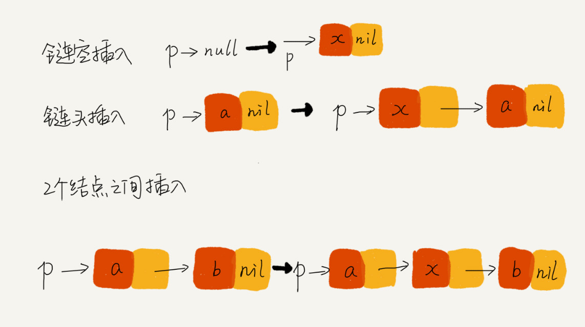

# 链表

## 拿下链表技巧
* 理解指针或引用的含义

>指针的理解：  
>将某个变量赋值给指针，实际上将这个变量的地址赋值给指针，或者反过来说，指针中存储了这个变量的内存地址，指向了这个变量，通过指针就能找到这个变量。

* 警惕指针丢失和内存泄露  
> 节点插入或删除时，注意指针丢失和内存泄露，

```Java
p->next = x;//将p的next指向x节点
x->next = p->next;//将x的节点next指针指向b节点
```
上面的语句会导致`x->next=x`,下一个指向本身。交换下步骤。  

* 利用哨兵简化实现难度  
>主要是带表头的链表。  

* 重点留意边界条件处理  
>如果链表为空时，代码能否正常工作？  
>如果链表只有一个结点时，代码能否正常工作?  
>如果链表只包含两个结点时，代码能否正常工作?  
>代码逻辑在处理头结点和尾结点的时候，是否能正常工作?

* 举例画图，辅助思考


* 多写多练LeetCode  
> 单链表反转 LC-206  
> 链表中的环检测 LC-141  
> 两个有序链表合并 LC-21  
> 删除链表倒数第n个结点 LC-19  
> 求链表的中间结点 LC-876  

## LeetCode题目

### LeetCode206 链表反转  

```Java
class Solution {
    public ListNode reverseList(ListNode head) {
        ListNode prev = null; //前指针节点
        ListNode curr = head; //当前指针节点
        //每次循环，都将当前节点指向它前面的节点，然后当前节点和前节点后移
        while (curr != null) {
            ListNode nextTemp = curr.next; //临时节点，暂存当前节点的下一节点，用于后移
            curr.next = prev; //将当前节点指向它前面的节点
            prev = curr; //前指针后移
            curr = nextTemp; //当前指针后移
        }
        return prev;
    }
}
```
### LeetCode141 142 环形链表  
[141](https://leetcode-cn.com/problems/linked-list-cycle/solution/huan-xing-lian-biao-by-leetcode/)
```java
public class Solution {
    public boolean hasCycle(ListNode head) {
        if(head == null || head.next == null){
            return false;
        }
        //快慢指针
        ListNode slow = head;
        ListNode fast = head.next;
        while( slow != fast){
            if(fast == null || fast.next == null){
                return false;
            }
            slow = slow.next;
            fast = fast.next.next;
        }
        return true;
    }
}
//需要考虑一个结点、两个结点、3个结点，因为有多层.需要判断空指针
```
遍历所有结点，存储在哈希表中每个结点的引用或内存地址，当结点为空时，检测到链表尾，如果不为空，且重复存在某个键，则为环形。 时间、空间复杂度 O(n)
```Java
public boolean hasCycle(ListNode head) {
    Set<ListNode> nodesSeen = new HashSet<>();
    while (head != null) {
        if (nodesSeen.contains(head)) {
            return true;
        } else {
            nodesSeen.add(head);
        }
        head = head.next;
    }
    return false;
}

```

### 链表合并LC-21
[21](https://leetcode-cn.com/problems/merge-two-sorted-lists/solution/he-bing-liang-ge-you-xu-lian-biao-by-leetcode/)  
方法1 递归  
  
方法2 迭代  
借助哨兵结点`prehead`，返回合并的链表,同时维护一个移动指针`pre`,我们只需要调整它的next指针.重复下面工作：直到l1或l2指向null,当`l1.val<=l2.val时，pre.next=l1`,l1同时移动，否则指向l2,l2移动；最后向后移动pre结点。当一个为空时，直接拼接不为空的剩余链表，`pre.next = l1||l2`.  
```Java
public ListNode mergeTwoLists(ListNode l1, ListNode L2){
    //维持一个头结点返回合并后的链表
    ListNode prehead = new ListNode(-1);
    //维护一个移动指针
    ListNode prev = prehead；
    while(l1 != null && l2 != null){
        if(l1.val <= l2.val){
            prev.next = l1;
            l1 = l1.next;
        }else{
            prev.next = l2;
            l2 = l2.next;
        }
        prev = prev.next;
    }

    //拼接剩余的链表
    prev.next = (l1 == null) ? l2 : l1;
    return prehead.next;
}
```

### 链表中间结点  
[876](https://leetcode-cn.com/problems/middle-of-the-linked-list/)  
方法一：单指针，遍历统计长度n,然后再遍历n/2  时间复杂度O(n),空间复杂度O(1)  
```Java
public ListNode middleNode(ListNode head){
    int n = 0;
    ListNode cur = head;
    while(cur != null){
        ++n;
        cur = cur.next;
    }
    int k = 0;
    cur = head;
    while(k < n/2){
        k++;
        cur = cur.next;
    }
    return cur;
}
```
方法二：快慢指针，一步，两步  
```Java
 public ListNode middleNode(ListNode head) {
        ListNode slow = head, fast = head;
        while (fast != null && fast.next != null) {
            slow = slow.next;
            fast = fast.next.next;
        }
        return slow;
    }

```

### 链表旋转LC-61
[61](https://leetcode-cn.com/problems/rotate-list/solution/xuan-zhuan-lian-biao-by-leetcode/)  
>1.求出链表的长度len  
2.k = k%len取余就是我们要右移的距离。  
3.找到倒数第k个位置。可以使用双指针法。  
4.记录慢指针的next节点，这就是最后要返回的节点。  
后边的过程看图解  
[参考](https://leetcode-cn.com/problems/rotate-list/solution/ji-bai-liao-91de-javayong-hu-qing-xi-yi-dong-by-2/)

```Java
public ListNode rotateRight(ListNode head, int k){
    if(head == null || k == 0){
        return head;
    }
    ListNode tmp = head;
    int len = 0;//链表长度
    while(tmp != null){
        tmp = tmp.next;
        len++;
    }
    k = k % len;
    if(k == 0){
        return head;
    }
    //快慢指针,tmp先走k步
    ListNode node = head;//慢指针从头开始
    tmp = head;
    while(k > 0){
        tmp = tmp.next;
        k--;
    }
    while(tmp.next != null){
        node = node.next;
        tmp = tmp.next;
    }
    //记录新头结点的位置
    ListNode newHead = node.next;
    //断开连接
    node.next = null;
    //后一段指向前一段的头
    tmp.next = head;
    return newHead;
}
```
### 删除链表倒数N个结点LC-19
[19](https://leetcode-cn.com/problems/remove-nth-node-from-end-of-list/solution/shan-chu-lian-biao-de-dao-shu-di-nge-jie-dian-by-l/)

```Java
public ListNode removeNthFromEnd(ListNode head, int n){
    ListNode dumy = new ListNode(0);//头结点
    dumy.next = head;
    //快慢指针
    ListNode slow = dumy, fast = dumy;
    //快指针多走n步
    while( n > 0){
        fast = fast.next;
        n--;
    }
    //移动快指针到尾结点，不是null
    while(fast.next != null){
        slow = slow.next;
        fast = fast.next;
    }
    //此时的slow的下一个结点就是要删除的结点，倒数第n个
    slow.next = slow.next.next;
    return dumy.next;
}
//这里借助dumy结点的理解，是因为如果删除的是head结点，这没法表示，下面的解法无法
//解决[1] 1
public ListNode removeNthFromEnd(ListNode head, int n) {
        if(n == 0){
            return head;
        }
        //快慢指针
        ListNode slow = head, fast =head;
        while(n > 0){
            fast = fast.next;
            n--;
        }
        while(fast.next != null){
            slow = slow.next;
            fast = fast.next;
        }
        //删除结点前的结点
        ListNode prev = slow;
        //删除结点后的结点
        ListNode nextNode = slow.next.next;
        //删除结点
        prev.next = nextNode;
        //就是
        slow.next = slow.next.next;
        return head;
    }
```
### 合并K个排序链表LC-23 hard
[23](https://leetcode-cn.com/problems/merge-k-sorted-lists/)
