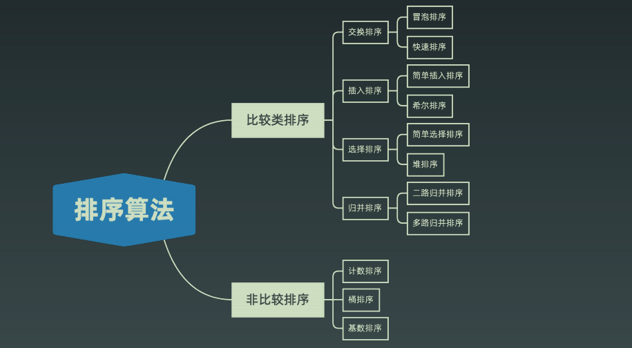
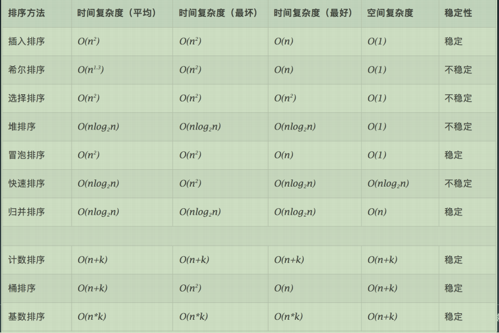

# 排序算法

## 比较类与非比较类



## 如何分析一个排序算法
### 排序算法的执行效率

* 最好情况、最坏情况、平均情况  
区分这些时间复杂度？第一有些排序算法会区分，为了好对比。第二，对于要排序的数据，有的接近有序，有的完全无序，有序度不同的数据对排序执行时间肯定有影响。
* 时间复杂度的系数、常数、低阶  
* 比较次数和交换次数(或移动次数)

### 排序算法的内存消耗
算法的内存消耗可以通过空间复杂度来衡量，原地排序算法就是指空间复杂度为O(1);

### 排序算法的稳定性
数组中有两个相同的元素，排序前后，相对位置是否改变，若改变则为不稳定排序


## 排序算法
### 冒泡排序算法
第一次排序

6次排序完

```java

// 冒泡排序，a表示数组，n表示数组大小
public void bubbleSort(int[] a, int n) {
  if (n <= 1) return;
 
 for (int i = 0; i < n; ++i) {
    // 提前退出冒泡循环的标志位
    boolean flag = false;
    for (int j = 0; j < n - i - 1; ++j) {
      if (a[j] > a[j+1]) { // 交换
        int tmp = a[j];
        a[j] = a[j+1];
        a[j+1] = tmp;
        flag = true;  // 表示有数据交换      
      }
    }
    if (!flag) break;  // 没有数据交换，提前退出
  }
}
```
* 冒泡排序是原地排序吗 只涉及相邻数据交换，常量级临时空间，原地排序
* 冒泡排序算法是稳定的排序算法吗？ 只有交换才改变两个元素的前后顺序，稳定排序
* 冒泡排序时间复杂度，最好的时候就是有序，只要进行一次冒泡，最坏的情况就是倒序排列，需要进行n次冒泡，时间复杂度O(n^2),平均时间复杂度O(n^2)

### 插入排序
数组分为已排序区间和未排序区间。初始排序区间只有一个元素，就是数组第一个元素。插入算法的核心是取未排序区间中的元素，在已排序中找到合适的插入位置将其插入，并一直保证排序区间数据有序。重复这个过程。

插入排序包括两种操作，一种是元素的比较，一种是元素的移动。


```java
//插入排序，a表示数组，n表示数组大小
public void insertionSort(int[] a, int n) {
    if(n <= 1) return;

    for(int i = 1; i < n; i++){
        int value = a[i];
        int j = i -1;
        //查找插入位置
        for(; j>= 0; j--) {
            if(a[j] > value){
                a[j+1] = a[j];//数据移动
            }else{
                break;
            }
        }
        a[j+1] = value;//插入数据
    }
}
```
原地排序，稳定排序，时间复杂度，最好已序，O(n)；倒序O(n^2);平均O(n^2).

### 选择排序

原地排序，不稳定排序，每次都要找剩余未排序元素中的最小值，并和前面的元素交换位置，破坏了稳定性。

比如 5，8，5，2，9 这样一组数据，使用选择排序算法来排序的话，第一次找到最小元素 2，与第一个 5 交换位置，那第一个 5 和中间的 5 顺序就变了，所以就不稳定了。正是因此，相对于冒泡排序和插入排序，选择排序就稍微逊色了

## 高级排序 O(nlogn)
### 快排(quick sort)

数组选取标杆pivot，将小元素放在pivot左边，大元素放在pivot右边，然后依次对右边和左边的子数组继续排序，以达到整个序列有序。<strong><font color="red">不稳定</font></strong>

```java
//递归
public void quickSort(int[] nums, int begin, int mid, int end){
  //1.结束递归
  if(begin >= end){
    return;
  }
  //2.计算当前的基准点
  int pivot = partition(nums, end, begin);
  //3.递归操作
  quickSort(nums, begin, pivot -1);
  quickSort(nums, pivot + 1, end);

}
//基准点位置i 保证nums[0~i-1] <nums[i]<nums[i+1~n]
public int partition (int[] nums, int begin, int end){
    int pivot = end;//选择最后一个元素为基准点
    int k = begin;//分界指针
    for(int i = begin; i < end; i++){
      //确保k前面的元素小于nums[pivot]
        if(nums[i] < nums[pivot]){
          swap(nums, i, k);
          k++;
        }
    }
    //找到基准值k的位置
    //基准值就位
    swap(nums, k, pivot);
    return k;
}
public void swap(int[] nums, int x, int y){
  int temp = nums[x];
  nums[x] = nums[y];
  nums[y] = temp;
}
```

### 归并排序-稳定
分治：  
1. 把长度为n的序列分成两个长度为n/2的子序列；
2. 对这两个子序列分别进行归并排序
3. 将两个排序好的子序列合并成一个最终的排序序序列

```java
//归并排序，递归
public void mergeSort(int[] nums, int left, int right){
  if(left >= right){
    return;
  }
  int mid = (left + right) >> 1;
  mergeSort(nums, left, mid);
  mergeSort(nums, mid + 1, end);
  //合并
  merge(nums, left, mid, right);
}
public void merge(int[] nums, int left, int mid, int right) {
  int[] temp = new int[right - left + 1];//暂存有序序列数组
  //2.合并两个有序数组
  int i = left, j = mid + 1, k = 0;//三个指针，
  while(i <= mid && j <= right){
      temp[k++] = (nums[i] < nums[j]) ? nums[i++]:nums[j++];
  }
  //  i有剩余
  while( i <= mid){
    temp[k++]=nums[i++];
  }
// j有剩余
  while( j <= right){
    temp[k++] = nums[j++];
  }

  //把有序序列还原到旧数组
  for(int p = left; p <= right; p++){
    nums[p] = temp[p - left];//temp从零开始
  }
}
```