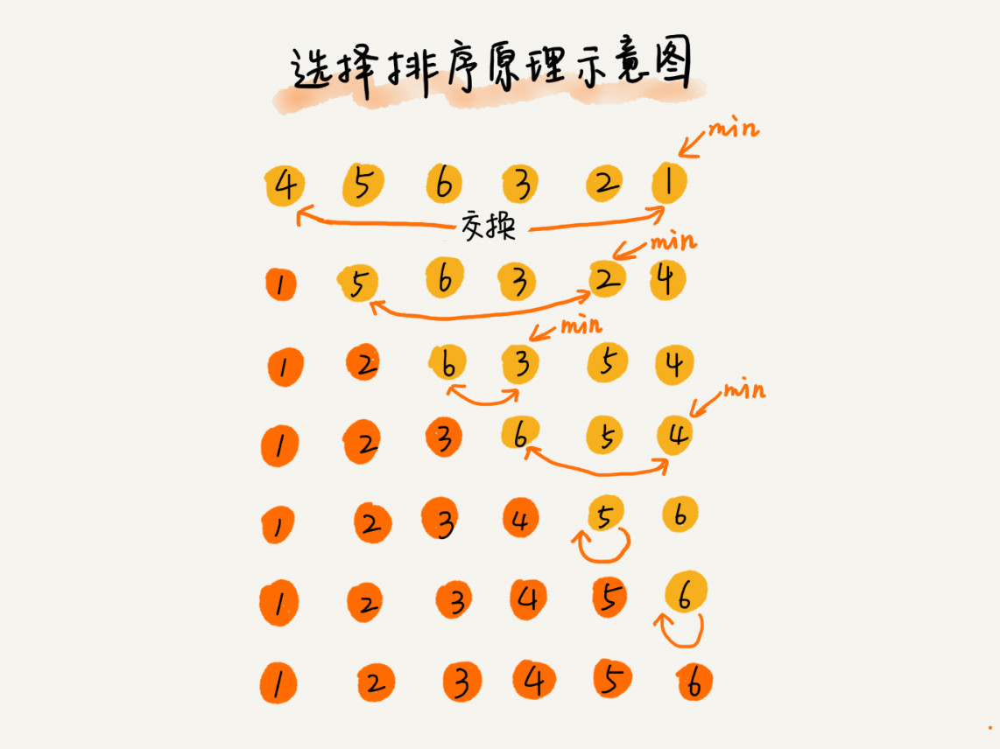

# 排序算法

## 比较类与非比较类


## 如何分析一个排序算法
### 排序算法的执行效率

* 最好情况、最坏情况、平均情况  
区分这些时间复杂度？第一有些排序算法会区分，为了好对比。第二，对于要排序的数据，有的接近有序，有的完全无序，有序度不同的数据对排序执行时间肯定有影响。
* 时间复杂度的系数、常数、低阶  
* 比较次数和交换次数(或移动次数)

### 排序算法的内存消耗
算法的内存消耗可以通过空间复杂度来衡量，原地排序算法就是指空间复杂度为O(1);

### 排序算法的稳定性
数组中有两个相同的元素，排序前后，相对位置是否改变，若改变则为不稳定排序


## 排序算法
### 冒泡排序算法
第一次排序

6次排序完

```java

// 冒泡排序，a表示数组，n表示数组大小
public void bubbleSort(int[] a, int n) {
  if (n <= 1) return;
 
 for (int i = 0; i < n; ++i) {
    // 提前退出冒泡循环的标志位
    boolean flag = false;
    for (int j = 0; j < n - i - 1; ++j) {
      if (a[j] > a[j+1]) { // 交换
        int tmp = a[j];
        a[j] = a[j+1];
        a[j+1] = tmp;
        flag = true;  // 表示有数据交换      
      }
    }
    if (!flag) break;  // 没有数据交换，提前退出
  }
}
```
* 冒泡排序是原地排序吗 只涉及相邻数据交换，常量级临时空间，原地排序
* 冒泡排序算法是稳定的排序算法吗？ 只有交换才改变两个元素的前后顺序，稳定排序
* 冒泡排序时间复杂度，最好的时候就是有序，只要进行一次冒泡，最坏的情况就是倒序排列，需要进行n次冒泡，时间复杂度O(n^2),平均时间复杂度O(n^2)

### 插入排序
数组分为已排序区间和未排序区间。初始排序区间只有一个元素，就是数组第一个元素。插入算法的核心是取未排序区间中的元素，在已排序中找到合适的插入位置将其插入，并一直保证排序区间数据有序。重复这个过程。

插入排序包括两种操作，一种是元素的比较，一种是元素的移动。


```java
//插入排序，a表示数组，n表示数组大小
public void insertionSort(int[] a, int n) {
    if(n <= 1) return;

    for(int i = 1; i < n; i++){
        int value = a[i];
        int j = i -1;
        //查找插入位置
        for(; j>= 0; j--) {
            if(a[j] > value){
                a[j+1] = a[j];//数据移动
            }else{
                break;
            }
        }
        a[j+1] = value;//插入数据
    }
}
```
原地排序，稳定排序，时间复杂度，最好已序，O(n)；倒序O(n^2);平均O(n^2).

### 选择排序

原地排序，不稳定排序，每次都要找剩余未排序元素中的最小值，并和前面的元素交换位置，破坏了稳定性。

比如 5，8，5，2，9 这样一组数据，使用选择排序算法来排序的话，第一次找到最小元素 2，与第一个 5 交换位置，那第一个 5 和中间的 5 顺序就变了，所以就不稳定了。正是因此，相对于冒泡排序和插入排序，选择排序就稍微逊色了
