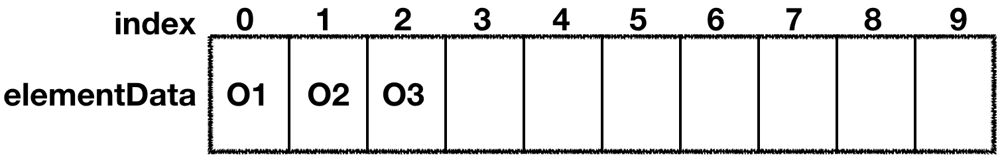

# ArrayList源码解析和设计思路

## 整体架构  
ArrayList就是一个数组结构，如图：

存储是基于elementData数组。  
* DEFAULT_CAPACITY 表示数组的初始大小，默认是10  
* size表示当前数组的大小，类型int，没有使用vilatile修饰，非线程安全  
* mdCount统计当前数组被修改的版本次数，数据结构变动，+1；

### 类注释
* permits all elements,including null;允许null值，会自动扩容。  
* size、isEmpty、get、set时间复杂度是常数，add是时间复杂度均摊常数
* 是非线程安全的，多线程情况下，推荐使用线程安全类：Collections#synchronizedList.
* 增强for循环或使用迭代器迭代，如果数组大小被改变，fail-fast；除使用Iterator'own{ListIterator#remove or add }方法

实现了RandomAccess，标记随机访问
## 源码解析
### 成员变量
```Java
/**
     * Default initial capacity.
     * 数组默认大小
     */
    private static final int DEFAULT_CAPACITY = 10;

    /**
     * Shared empty array instance used for empty instances.
     * 有参构造的空数组
     */
    private static final Object[] EMPTY_ELEMENTDATA = {};

    /**
     * Shared empty array instance used for default sized empty instances. We
     * distinguish this from EMPTY_ELEMENTDATA to know how much to inflate when
     * first element is added.
     * 用于无参构造函数的空数组
     */
    private static final Object[] DEFAULTCAPACITY_EMPTY_ELEMENTDATA = {};

    /**
     * The array buffer into which the elements of the ArrayList are stored.
     * The capacity of the ArrayList is the length of this array buffer. Any
     * empty ArrayList with elementData == DEFAULTCAPACITY_EMPTY_ELEMENTDATA
     * will be expanded to DEFAULT_CAPACITY when the first element is added.
     * 存储数组的元素
     */
    transient Object[] elementData; // non-private to simplify nested class access

    /**
     * The size of the ArrayList (the number of elements it contains).
     * 存储元素的实际数量
     * @serial
     */
    private int size;
```
### 初始化
初始化：无参初始化、指定大小初始化、指定数据初始化：  
```Java
//1、无参直接化，数组大小为空
public ArrayList() {
        this.elementData = DEFAULTCAPACITY_EMPTY_ELEMENTDATA;
    }
//2、指定大小初始化
public ArrayList(int initialCapacity) {
        if (initialCapacity > 0) {
            this.elementData = new Object[initialCapacity];
        } else if (initialCapacity == 0) {
            this.elementData = EMPTY_ELEMENTDATA;
        } else {
            throw new IllegalArgumentException("Illegal Capacity: "+
                                               initialCapacity);
        }
    }
//3、指定数据初始化，利用别的集合类来构建ArrayList的构造函数
 public ArrayList(Collection<? extends E> c) {
     ////直接利用Collection.toArray()方法得到一个对象数组，并赋值给elementData
        elementData = c.toArray();
        if ((size = elementData.length) != 0) {
            // c.toArray might (incorrectly) not return Object[] (see 6260652)
            if (elementData.getClass() != Object[].class)
                elementData = Arrays.copyOf(elementData, size, Object[].class);
        } else {
            // replace with empty array.
            this.elementData = EMPTY_ELEMENTDATA;
        }
    }
/**
 * 1、ArrayList无参初始化默认是空数组D_E_E，只有第一个元素添* 加的时候会扩容成默认大小10.
 * 
 * /
```
### 新增和扩容实现
新增是往数组中添加元素，分成两步：  
* 判断是否需要扩容，如果需要执行扩容  
* 直接赋值  
```Java
public boolean add(E e) {
    //保证数组容量够用
        ensureCapacityInternal(size + 1);  // Increments modCount!!
        elementData[size++] = e;//数组末尾追加元素
        return true;
    }

private void ensureCapacityInternal(int minCapacity) {
        ensureExplicitCapacity(calculateCapacity(elementData, minCapacity));
    }
//判断需不需要扩容
private void ensureExplicitCapacity(int minCapacity) {
    //用于存储修改次数
        modCount++;

        // overflow-conscious code
        //如果数组的长度小于需要的容量，就扩容
        if (minCapacity - elementData.length > 0)
            grow(minCapacity);
    }
//计算最小所需容量
private static int calculateCapacity(Object[] elementData, int minCapacity) {
    //无参构造第一次添加返回10，D_C
        if (elementData == DEFAULTCAPACITY_EMPTY_ELEMENTDATA) {
            return Math.max(DEFAULT_CAPACITY, minCapacity);
        }
        //添加一个元素后，再次添加size+1 = 2,minCapacity =2 
        return minCapacity;
    }
/**
 * 有参构造使用空数组与构造使用的空数组不是一个对象，一个EMPTY_ELEMENTDATA,无参D_E_E
 * 
 */
//能分配的最大大小 
 /**
     * The maximum size of array to allocate.
     * Some VMs reserve some header words in an array.
     * Attempts to allocate larger arrays may result in
     * OutOfMemoryError: Requested array size exceeds VM limit
     * 有些虚拟机在数组中保留一些头信息，防止内存溢出
     */
private static final int MAX_ARRAY_SIZE = Integer.MAX_VALUE - 8;

private void grow(int minCapacity) {
        // overflow-conscious code
        int oldCapacity = elementData.length;
        //扩容1.5倍
        int newCapacity = oldCapacity + (oldCapacity >> 1);
        //针对添加第一个元素时，minCapacity返回10，oldCapacity= newCapcity=0;
        //或者是增加多个元素时，小于期望值，则使用期望值扩容
        if (newCapacity - minCapacity < 0)
            newCapacity = minCapacity;
        //如果新的数组容量大于最大值，则进入hugeCapacity
        if (newCapacity - MAX_ARRAY_SIZE > 0)
            newCapacity = hugeCapacity(minCapacity);
        // minCapacity is usually close to size, so this is a win:
        //最后将原来的数组赋值到新数组
        elementData = Arrays.copyOf(elementData, newCapacity);
    }  

 private static int hugeCapacity(int minCapacity) {
        if (minCapacity < 0) // overflow
            throw new OutOfMemoryError();
        //对最小所需容量和max_array_size比较
        //minCapacity大则将Integer.MAX_VALUE作为大小。
        return (minCapacity > MAX_ARRAY_SIZE) ?
            Integer.MAX_VALUE :
            MAX_ARRAY_SIZE;
    }
```
几个数字:
> DEFAULT_CAPACITY = 10;  
> MAX_ARRAY_SIZE = Integer.MAX_VALUE - 8;  
> ArrayList数组最大能分配的大小是Integer.MAX_VALUE  
> 每次扩容1.5倍  

### 扩容的本质  
扩容是通过这行代码来实现的：`Arrays.copyOf(elementData, newCapacity);`，这行代码描述的本质是数组之间的拷贝，扩容是会先新建一个符合我们预期容量的新数组，然后把老数组的数据拷贝过去，我们通过 System.arraycopy 方法进行拷贝，此方法是 native 的方法，源码如下:
```Java
/**
 * @param src     被拷贝的数组
 * @param srcPos  从数组那里开始
 * @param dest    目标数组
 * @param destPos 从目标数组那个索引位置开始拷贝
 * @param length  拷贝的长度 
 * 此方法是没有返回值的，通过 dest 的引用进行传值
 */
public static native void arraycopy(Object src, int srcPos,
                                    Object dest, int destPos,
                                    int length);

System.arraycopy(elementData, 0, newElementData, 0,Math.min(elementData.length,newCapacity));
```
### 删除 

根据索引删除：  
```Java
public E remove(int index) {
    ///越界检查
        rangeCheck(index);
    //记录修改次数
        modCount++;
        //读取要删除的值
        E oldValue = elementData(index);
        //计算要移动的元素数量，-1是因为size从1算，index从0开始。
        int numMoved = size - index - 1;
        //直接用复制覆盖数组数据
        if (numMoved > 0)
         // 从 index +1 位置开始被拷贝，拷贝的起始位置是 index，长度是 numMoved
            System.arraycopy(elementData, index+1, elementData, index,
                             numMoved);
        //赋值null，帮助GC
        elementData[--size] = null; // clear to let GC do its work
        //返回删掉的值
        return oldValue;
    }
//删除就是将index后面的元素向前移动一个位置，最后元素尾部置空，
```
根据对象删除  
```Java
//ArrayList可以加null值，要找到索引需要遍历比较
public boolean remove(Object o) {
    //区分null，是因为o.equal会抛出空指针
        if (o == null) {
            for (int index = 0; index < size; index++)
                if (elementData[index] == null) {
                    fastRemove(index);
                    return true;
                }
        } else {
            for (int index = 0; index < size; index++)
                if (o.equals(elementData[index])) {
                    fastRemove(index);
                    return true;
                }
        }
        return false;
    }

    /*
     * Private remove method that skips bounds checking and does not
     * return the value removed.
     */
    private void fastRemove(int index) {
        //根据对象找到索引，不用判断越界
        //记录修改次数
        modCount++;
        int numMoved = size - index - 1;
        if (numMoved > 0)
            System.arraycopy(elementData, index+1, elementData, index,
                             numMoved);
        //数组尾部置空，可GC回收
        elementData[--size] = null; // clear to let GC do its work
    }
```

### 迭代
```Java
public Iterator<E> iterator() {
        return new Itr();
    }

    /**
     * An optimized version of AbstractList.Itr
     */
    private class Itr implements Iterator<E> {
        int cursor;       // index of next element to return默认是0
        int lastRet = -1; // index of last element returned; -1 if no such上一个元素返回的下标
        int expectedModCount = modCount;
        //迭代时，期望次数值等于初始修改的值，过程中次数修改会造成抛出ConcurrentModificationException
        Itr() {}

        public boolean hasNext() {
            return cursor != size;
        }

        @SuppressWarnings("unchecked")
        public E next() {
            checkForComodification();
            int i = cursor;
            if (i >= size)
                throw new NoSuchElementException();
            Object[] elementData = ArrayList.this.elementData;
            if (i >= elementData.length)
                throw new ConcurrentModificationException();
            cursor = i + 1;
            //返回元素 ，并设置上一次返回的元素的下标
            return (E) elementData[lastRet = i];
        }

        public void remove() {
            if (lastRet < 0)
                throw new IllegalStateException();
            checkForComodification();

            try {
                ArrayList.this.remove(lastRet);
                cursor = lastRet;//更新游标cursor，目的就是不要发生自增。
                lastRet = -1;//防止没有next()的情况下连续remove()，只有再次执行next()才会刷新lastRet
                expectedModCount = modCount;
            } catch (IndexOutOfBoundsException ex) {
                throw new ConcurrentModificationException();
            }
        }

        @Override
        @SuppressWarnings("unchecked")
        public void forEachRemaining(Consumer<? super E> consumer) {
            Objects.requireNonNull(consumer);
            final int size = ArrayList.this.size;
            int i = cursor;
            if (i >= size) {
                return;
            }
            final Object[] elementData = ArrayList.this.elementData;
            if (i >= elementData.length) {
                throw new ConcurrentModificationException();
            }
            while (i != size && modCount == expectedModCount) {
                consumer.accept((E) elementData[i++]);
            }
            // update once at end of iteration to reduce heap write traffic
            cursor = i;
            lastRet = i - 1;
            checkForComodification();
        }
        //检查版本号比较
        final void checkForComodification() {
            if (modCount != expectedModCount)
                throw new ConcurrentModificationException();
        }
    }

```
迭代器一般来说有三个方法：
* hasNext还有没有值可以迭代
* next如果有值，返回该值
* remove删除当前迭代的值

## 小结
### 增加元素
* ArrayList 增加元素时，<strong>先计算需求最小容量</strong>，一般是size+1,(特例：无参构造初始化，添加第一个元素时，返回DEFAULT_CAPACITY=10)；
* 然后<strong>判断需求最小容量与现有数组大小的关系，确定容积是否够</strong>，不够就进行扩容；
* <strong>1.5倍扩容</strong>，为数组原大小的1.5倍扩容，再比较扩容的容量与最小容量需求比较，扩容容量大于需求，则按扩容量扩容，小于最小需求（期望)则按期望扩容，若扩容量大于JVM分配的最大，则使用Integer的最大值扩容。
* 最后使用Arrays.copyOf()扩容  