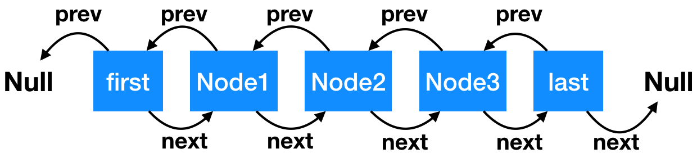

# LinkedList解析

## 整体架构  
LinkedList底层数据结构是一个双向链表，整体如图：
  
有几点注意：  
* 链表每个结点叫Node，Node有prev属性代表前一个结点的位置，next属性代表后一个结点的位置；
* first是双向链表头结点，它的prev是null；
* last是尾结点，它的next是null；
* 当链表中没有数据时，first和last是一个结点，前后都指向null。
* 双向链表，只要机器内存够大，是没有大小限制的。  
### 类注释：
* 和ArrayList一样，可以插入null
* 由于是双向链表，操作时会通过最从头或者尾开始遍历的最近方式找到index，

实现了List、Deque(双向队列)。

## 源码解析
### 属性
Node：
```Java
 private static class Node<E> {
        E item;//结点值
        Node<E> next;//后驱
        Node<E> prev;//前驱
// 初始化参数顺序分别是：前一个节点、本身节点值、后一个节点
        Node(Node<E> prev, E element, Node<E> next) {
            this.item = element;
            this.next = next;
            this.prev = prev;
        }
    }
```
其他成员属性：  
```Java
    transient int size = 0;

    /**
     * Pointer to first node.
     * Invariant: (first == null && last == null) ||
     *            (first.prev == null && first.item != null)
     */
    transient Node<E> first;

    /**
     * Pointer to last node.
     * Invariant: (first == null && last == null) ||
     *            (last.next == null && last.item != null)
     */
    transient Node<E> last;
```

### 初始化
两种方式： 无参初始化，根据集合数据初始化  
```Java
 /**
     * Constructs an empty list.
     */
    public LinkedList() {
    }

/**
     * Constructs a list containing the elements of the specified
     * collection, in the order they are returned by the collection's
     * iterator.
     *
     * @param  c the collection whose elements are to be placed into this list
     * @throws NullPointerException if the specified collection is null
     */
    public LinkedList(Collection<? extends E> c) {
        this();
        addAll(c);
    }
```
### 新增、追加
* 从尾部追加,add方法默认就是从尾部开始追加

```Java
/**
     * Appends the specified element to the end of this list.
     *
     * <p>This method is equivalent to {@link #add}.
     *
     * @param e the element to add
     */
    public void addLast(E e) {
        linkLast(e);
    }
 /**
     * Links e as last element.
     */
    void linkLast(E e) {
          // 把尾节点数据暂存
        final Node<E> l = last;
        //初始化节点，prev连接尾结点last，next后null
        final Node<E> newNode = new Node<>(l, e, null);
        last = newNode;//重新将last指向新节点
         //如果链表为空（l 是尾节点，尾节点为空，链表即空），头部和尾部是同一个节点，都是新建的节点
        if (l == null)
            first = newNode;
        else //把前尾结点的next指向newNode，连接起来，双链，
            l.next = newNode;
        size++;
        modCount++;//标记修改次数
    }

```
从头部增加 :  
```Java
 /**
     * Links e as first element.
     */
    private void linkFirst(E e) {
        //暂存头结点
        final Node<E> f = first;
         // 新建节点，前一个节点指向null，e 是新建节点，f 是新建节点的下一个节点，目前值是头节点的值
        final Node<E> newNode = new Node<>(null, e, f);
        first = newNode;//头结点指向新节点
        //如果头结点为空，就是链表为空，头尾一个结点，赋值尾结点
        if (f == null)
            last = newNode;
        else //不为空，则将prev指向新节点，双链
            f.prev = newNode;
        size++;
        modCount++;
    }
```
指定非空结点前增加
```Java
/**
     * Inserts element e before non-null Node succ.
     */
    void linkBefore(E e, Node<E> succ) {
        // assert succ != null;
        final Node<E> pred = succ.prev;
        final Node<E> newNode = new Node<>(pred, e, succ);
        succ.prev = newNode;
        //判断前驱为不为空，为空则新结点变成头节点，既然要进行.next肯定要判断空，防止空指针
        if (pred == null)
            first = newNode;
        else
            pred.next = newNode;
        size++;
        modCount++;
    }
```
头尾部添加元素，操作类似，初始化Node的时候，连上了prev,next链，由于是双链，后续操作就是要把另一条链补上，后插选择补前一节点的next链，前插选择补后一节点的prev链。

### 结点删除  
也分头尾删除，同时把删除的结点值、前后指向都置位null，帮助GC。
```Java

 /**
     * Unlinks non-null first node f. 从头删除结点，返回头结点值
     */
    private E unlinkFirst(Node<E> f) {
        // assert f == first && f != null;
        final E element = f.item;//暂存头结点值，返回
        final Node<E> next = f.next;//获取头结点的下一个节点，待会为新的头结点
        f.item = null;
        f.next = null; // help GC，置为空，帮助GC
        first = next;//更新头结点
        if (next == null)//如果next为空，则链表为空，头尾同结点空
            last = null;
        else //否则将新头结点前驱置为空
            next.prev = null;
        size--;
        modCount++;//标记修改次数
        return element;
    }
/**
     * Unlinks non-null last node l.尾删除，逻辑类似，处理好新旧头尾结点，注意
     * 空链表情况
     */
    private E unlinkLast(Node<E> l) {
        // assert l == last && l != null;
        final E element = l.item;
        final Node<E> prev = l.prev;
        l.item = null;
        l.prev = null; // help GC
        last = prev;
        if (prev == null)
            first = null;
        else
            prev.next = null;
        size--;
        modCount++;
        return element;
    }
// 删除任意结点
 /**
     * Unlinks non-null node x.
     */
    E unlink(Node<E> x) {
        // assert x != null;
        final E element = x.item;
        final Node<E> next = x.next;//获取前一个结点
        final Node<E> prev = x.prev;//获取后一个结点
        //前节点为null,则删除的是头结点
        if (prev == null) {
            first = next;
        } else {//否则前节点的后驱指向后一个结点，
            prev.next = next;
            x.prev = null;//断掉x的前驱
        }
        //后结点为null，则x为尾结点，
        if (next == null) {
            last = prev;
        } else {//否则后结点的前驱指向前结点
            next.prev = prev;
            x.next = null;//断掉x的后驱
        }

        x.item = null;//x的值置为空，前后驱已经都为空，帮助GC
        size--;
        modCount++;
        return element;
    }
```
### 结点查询 
链表不支持随机查询，需要挨个遍历，但是LinkedList双向链表中作了小优化，根据index位置，确定离头近还是尾近，进行后驱或前驱遍历。
```java
 /**
     * Returns the (non-null) Node at the specified element index.
     */
    Node<E> node(int index) {
        // assert isElementIndex(index);断言index不越界
        //如果index小于 size/2,则在前半部分，用next从头结点开始遍历
        if (index < (size >> 1)) {
            Node<E> x = first;
            //直接循环到index的前一个结点停止，此时x=x.next取到该结点
            for (int i = 0; i < index; i++)
                x = x.next;
            return x;
        } else {//后半部分，从尾结点prev遍历
            Node<E> x = last;
              // 直到 for 循环到 index 的后一个 node 停止
            for (int i = size - 1; i > index; i--)
                x = x.prev;
            return x;
        }
    }
```
LinkedList采用了简单二分法进行查找，减少了遍历次数，提高了查找性能。

### 方法对比
LinkedList实现了Deque接口，在增加、删除增加了新方法，整理如下：  
|方法含义|返回异常|返回特殊值|底层实现|
|---|---|---|---|
|新增|add(e)|offer(e)|底层实现相同|
|删除|remove()|poll(e)|链表为空时，remove抛出异常，poll返回null|
|查找|element()|peek()|链表为空时，element抛出异常，peek返回null|

### 迭代器

新增了一个迭代接口：ListIterator,提供了向前和向后的迭代方法
|迭代顺序|方法|
|--|--|
|从头到尾|hasNext,next,nextIndex|
|尾到头|hasPervious,previous,previousIndex|

```java
private class ListItr implements ListIterator<E> {
        private Node<E> lastReturned;//上一次执行next、previous方法时的结点位置
        private Node<E> next;//下一个节点
        private int nextIndex;//下一个节点位置
        //期待版本号
        private int expectedModCount = modCount;

        ListItr(int index) {
            // assert isPositionIndex(index);
            next = (index == size) ? null : node(index);
            nextIndex = index;
        }
        //判断有不有下一个元素
        public boolean hasNext() {
            return nextIndex < size;
        }

        public E next() {
            //检查期望版本号是否变化
            checkForComodification();
            if (!hasNext())
                throw new NoSuchElementException();
        //next是当前结点，上一次执行next方法时被赋值的，
         // 第一次执行时，是在初始化迭代器的时候，next 被赋值的
            lastReturned = next;
              // next 是下一个节点了，为下次迭代做准备
            next = next.next;
            nextIndex++;
            return lastReturned.item;
        }
        //判断索引位置大于0，是否可以迭代
        public boolean hasPrevious() {
            return nextIndex > 0;
        }
        //从尾到头
        public E previous() {
            checkForComodification();
            if (!hasPrevious())
                throw new NoSuchElementException();
             // next 为空场景：1:说明是第一次迭代，取尾节点(last);2:上一次操作把尾节点删除掉了
         // next 不为空场景：说明已经发生过迭代了，直接取前一个节点即可(next.prev)
            lastReturned = next = (next == null) ? last : next.prev;
            nextIndex--;
            return lastReturned.item;
        }

        public int nextIndex() {
            return nextIndex;
        }

        public int previousIndex() {
            return nextIndex - 1;
        }

        public void remove() {
            checkForComodification();
      // lastReturned 是本次迭代需要删除的值，分以下空和非空两种情况：
    // lastReturned 为空，说明调用者没有主动执行过 next() 或者 previos()，直接报错
    // lastReturned 不为空，是在上次执行 next() 或者 previos()方法时赋的值
            if (lastReturned == null)
                throw new IllegalStateException();

            Node<E> lastNext = lastReturned.next;
            unlink(lastReturned);
     // next == lastReturned 的场景分析：从尾到头递归顺序，并且是第一次迭代，并且要删除最后一个元素的情况下
    // 这种情况下，previous() 方法里面设置了 lastReturned = next = last,所以 next 和 lastReturned会相等
            if (next == lastReturned)
     // 这时候 lastReturned 是尾节点，lastNext 是 null，所以 next 也是 null，
     //这样在 previous() 执行时，发现 next 是 null，就会把尾节点赋值给 next
                next = lastNext;
            else
                nextIndex--;
            lastReturned = null;
            expectedModCount++;
        }

        public void set(E e) {
            if (lastReturned == null)
                throw new IllegalStateException();
            checkForComodification();
            lastReturned.item = e;
        }

        public void add(E e) {
            checkForComodification();
            lastReturned = null;
            if (next == null)
                linkLast(e);
            else
                linkBefore(e, next);
            nextIndex++;
            expectedModCount++;
        }

        public void forEachRemaining(Consumer<? super E> action) {
            Objects.requireNonNull(action);
            while (modCount == expectedModCount && nextIndex < size) {
                action.accept(next.item);
                lastReturned = next;
                next = next.next;
                nextIndex++;
            }
            checkForComodification();
        }

        final void checkForComodification() {
            if (modCount != expectedModCount)
                throw new ConcurrentModificationException();
        }
    }
```