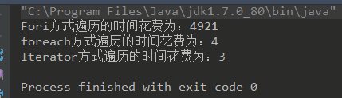

# List 综合问题

## ArrayList和LinkedList三种遍历
for循环、forearch(增强型for循环)、Iterator迭代器  

foreach与Iterator遍历性能好，foreach底层也是使用了Iterator，

## ArrayList删除问题
```Java
for( int i = 0; i < list.size(); i++){
    list.remove(i);
    System.out.println("remove");
}
System.out.println("size="+list.size());
//输出3次remove，输出3
```
不能全部删除，原list={a,b,c,d,e,f},则剩下bdf,原因是删除的时候底层：
```Java
  //计算要移动的元素数量，-1是因为size从1算，index从0开始。
        int numMoved = size - index - 1;
        //直接用复制覆盖数组数据
        if (numMoved > 0)
         // 从 index +1 位置开始被拷贝，拷贝的起始位置是 index，长度是 numMoved
            System.arraycopy(elementData, index+1, elementData, index,
                             numMoved);
```
底层是采用arrayCopy复制数组到新数组，复制就是把后面的数组都前移，然而index在增加1，原来是1-b,复制后，变成0-b,1-c,2-d,3-e,4-f,所以index=1时删除c,依次类推，数组留下b,d,f。

## ArrayList(int initalCapacity)会不会初始化数组大小?
会初始化数组大小，但是list的大小size没有变，
```Java
ArrayList<Integger> a = new ArrayList<>(10);
System.out.println(a.size());//0
a.set(5, 4);//报错，越界异常，会调用 rangeCheckForAdd(index);
  /**
     * A version of rangeCheck used by add and addAll.
     */
    private void rangeCheckForAdd(int index) {
        if (index > size || index < 0)
            throw new IndexOutOfBoundsException(outOfBoundsMsg(index));
    }
```