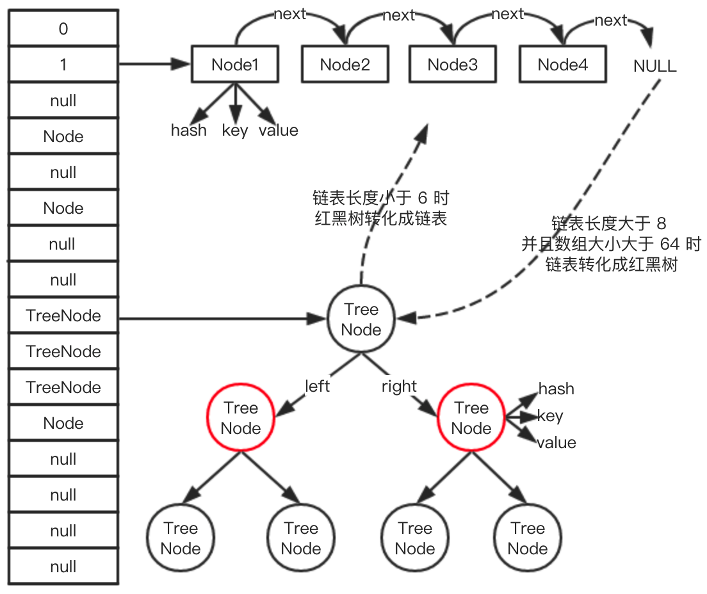
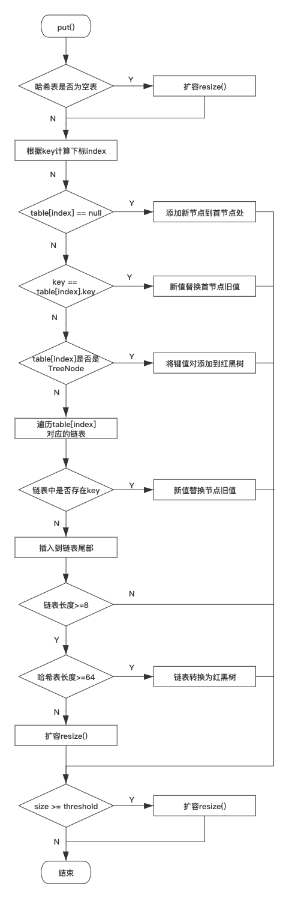

# HashMap源码解析

## 整体架构 
HashMap底层的数据结构主要是：数组+链表+红黑树。其链表长度大于等于8时，链表转换成红黑树，当红黑树的大小小于等于6时，红黑树转换成链表，整体结构如图;

图左边竖着的事HashMap的数组结构，数组的元素可能是单个Node，有可能是链表，也可能是红黑树，

### 类注释
* 允许null，key和value均允许；不同于hashTable，是线程不安全的
* loadfactor (影响因子)默认值是0.75，
> ```Java
> The <i>load factor</i> is a measure of how full the hash table is allowed to get before its capacity is automatically increased. 
> ```
> 装载因子是来度量table的装载程度，以便扩容。认值是 0.75， 是均衡了时间和空间损耗算出来的值，较高的值会减少空间开销（扩容减少，数组大小增长速度变慢），但增加了查找成本（hash 冲突增加，链表长度变长），不扩容的条件：数组容量 > 需要的数组大小 /load factor；
* 如果有很多数据需要储存到 HashMap 中，建议 HashMap 的容量一开始就设置成足够的大小，这样可以防止在其过程中不断的扩容，影响性能；
* HashMap 是非线程安全的，我们可以自己在外部加锁，或者通过 Collections#synchronizedMap 来实现线程安全，Collections#synchronizedMap 的实现是在每个方法上加上了 synchronized 锁；
* 在迭代过程中，如果 HashMap 的结构被修改，会快速失败。fail-fast
  
### 常见属性
```Java
/**
     * The default initial capacity - MUST be a power of two.
     */
    static final int DEFAULT_INITIAL_CAPACITY = 1 << 4; // aka 16

    /**
     * The maximum capacity, used if a higher value is implicitly specified
     * by either of the constructors with arguments.
     * MUST be a power of two <= 1<<30.
     */
    static final int MAXIMUM_CAPACITY = 1 << 30;

    /**
     * The load factor used when none specified in constructor.
     */
    static final float DEFAULT_LOAD_FACTOR = 0.75f;

    /**
     * The bin count threshold for using a tree rather than list for a
     * bin.  Bins are converted to trees when adding an element to a
     * bin with at least this many nodes. The value must be greater
     * than 2 and should be at least 8 to mesh with assumptions in
     * tree removal about conversion back to plain bins upon
     * shrinkage. 桶上的链表长度大于等于8时，链表转化成红黑树
     */
    static final int TREEIFY_THRESHOLD = 8;

    /**
     * The bin count threshold for untreeifying a (split) bin during a
     * resize operation. Should be less than TREEIFY_THRESHOLD, and at
     * most 6 to mesh with shrinkage detection under removal.
     * 桶上的红黑树大小小于等于6时，红黑树转化成链表
     */
    static final int UNTREEIFY_THRESHOLD = 6;

    /**
     * The smallest table capacity for which bins may be treeified.
     * (Otherwise the table is resized if too many nodes in a bin.)
     * Should be at least 4 * TREEIFY_THRESHOLD to avoid conflicts
     * between resizing and treeification thresholds.
     * 当数组容量大于 64 时，链表才会转化成红黑树
     */
    static final int MIN_TREEIFY_CAPACITY = 64;
    //记录迭代过程中 HashMap 结构是否发生变化，如果有变化，迭代时会 fail-fast
    transient int modCount;

    //HashMap 的实际大小，可能不准(因为当你拿到这个值的时候，可能又发生了变化)
    transient int size;

     //存放数据的数组
     transient Node<K,V>[] table;

    // 扩容的门槛，有两种情况
    // 如果初始化时，给定数组大小的话，通过 tableSizeFor 方法计算，数组大小永远接近于 2 的幂次方，比如你给定初始化大小 19，实际上初始化大小为 32，为 2 的 5 次方。
    // 如果是通过 resize 方法进行扩容，大小 = 数组容量 * 0.75
    int threshold;

    //链表的节点
    static class Node<K,V> implements Map.Entry<K,V> {}

    //红黑树的节点
    static final class TreeNode<K,V> extends LinkedHashMap.Entry<K,V> {}
```
## 初始化
```java
 /**
     * Constructs an empty <tt>HashMap</tt> with the specified initial
     * capacity and load factor.
     *
     * @param  initialCapacity the initial capacity
     * @param  loadFactor      the load factor
     * @throws IllegalArgumentException if the initial capacity is negative
     *         or the load factor is nonpositive
     */
    public HashMap(int initialCapacity, float loadFactor) {
        if (initialCapacity < 0)
            throw new IllegalArgumentException("Illegal initial capacity: " +
                                               initialCapacity);
        if (initialCapacity > MAXIMUM_CAPACITY)
            initialCapacity = MAXIMUM_CAPACITY;
        if (loadFactor <= 0 || Float.isNaN(loadFactor))
            throw new IllegalArgumentException("Illegal load factor: " +
                                               loadFactor);
        this.loadFactor = loadFactor;
        this.threshold = tableSizeFor(initialCapacity);
    }
    /**
     * Returns a power of two size for the given target capacity.
     */
    static final int tableSizeFor(int cap) {
        int n = cap - 1;
        n |= n >>> 1;
        n |= n >>> 2;
        n |= n >>> 4;
        n |= n >>> 8;
        n |= n >>> 16;
        return (n < 0) ? 1 : (n >= MAXIMUM_CAPACITY) ? MAXIMUM_CAPACITY : n + 1;
    }
    /**
     * Constructs an empty <tt>HashMap</tt> with the specified initial
     * capacity and the default load factor (0.75).
     *
     * @param  initialCapacity the initial capacity.
     * @throws IllegalArgumentException if the initial capacity is negative.
     */
    public HashMap(int initialCapacity) {
        this(initialCapacity, DEFAULT_LOAD_FACTOR);
    }

    /**
     * Constructs an empty <tt>HashMap</tt> with the default initial capacity
     * (16) and the default load factor (0.75).
     */
    public HashMap() {
        this.loadFactor = DEFAULT_LOAD_FACTOR; // all other fields defaulted
    }

    /**
     * Constructs a new <tt>HashMap</tt> with the same mappings as the
     * specified <tt>Map</tt>.  The <tt>HashMap</tt> is created with
     * default load factor (0.75) and an initial capacity sufficient to
     * hold the mappings in the specified <tt>Map</tt>.
     *
     * @param   m the map whose mappings are to be placed in this map
     * @throws  NullPointerException if the specified map is null
     */
    public HashMap(Map<? extends K, ? extends V> m) {
        this.loadFactor = DEFAULT_LOAD_FACTOR;
        putMapEntries(m, false);
    }
```

## 新增

步骤如下：
* 1空数组有无初始化，没有的初始化;
* 2如果通过key的hash能够直接找到值，则跳转到6，否则至3
* 3如果hash冲突，两种解决方案：链表or红黑树
* 4如果链表，递归循环，把新元素追加到队尾
* 5如果是红黑树，调用红黑树新增的方法
* 6通过2、4、5将新元素追加成功，再根据onlyIfAbsent判断是否需要覆盖
* 7判断是否需要扩容，需要扩容进行扩容，结束
示意图如下：

代码：
```Java
/**
     * Associates the specified value with the specified key in this map.
     * If the map previously contained a mapping for the key, the old
     * value is replaced.
     *
     * @param key key with which the specified value is to be associated
     * @param value value to be associated with the specified key
     * @return the previous value associated with <tt>key</tt>, or
     *         <tt>null</tt> if there was no mapping for <tt>key</tt>.
     *         (A <tt>null</tt> return can also indicate that the map
     *         previously associated <tt>null</tt> with <tt>key</tt>.)
     */
    public V put(K key, V value) {
        return putVal(hash(key), key, value, false, true);
    }

    /**
     * Implements Map.put and related methods.
     *
     * @param hash hash for key
     * @param key the key
     * @param value the value to put
     * @param onlyIfAbsent if true, don't change existing value
     * @param evict if false, the table is in creation mode.
     * @return previous value, or null if none
     */
    // 入参 hash：通过 hash 算法计算出来的值。
    // 入参 onlyIfAbsent：false 表示即使 key 已经存在了，仍然会用新值覆盖原来的值，默认为 false
    final V putVal(int hash, K key, V value, boolean onlyIfAbsent,
                   boolean evict) {
        //n表示数组的长度，i为数组索引下标，p为i下标位置的Node值
        Node<K,V>[] tab; Node<K,V> p; int n, i;
        //如果数组为空，使用resize方法初始化
        if ((tab = table) == null || (n = tab.length) == 0)
            n = (tab = resize()).length;
        //如果当前索引位置是空的，直接生成新的结点在当前索引位置上
        if ((p = tab[i = (n - 1) & hash]) == null)
            tab[i] = newNode(hash, key, value, null);
        //如果当前索引值有值，则处理冲突
        else {
            //e 为当前结点临时变量
            Node<K,V> e; K k;
              // 如果 key 的 hash 和值都相等，直接把当前下标位置的 Node 值赋值给临时变量
            if (p.hash == hash &&
                ((k = p.key) == key || (key != null && key.equals(k))))
                e = p;
            //如果是红黑树，使用红黑树的方式新增
            else if (p instanceof TreeNode)
                e = ((TreeNode<K,V>)p).putTreeVal(this, tab, hash, key, value);
            else {//如果是链表，则在链表的尾端添加
                for (int binCount = 0; ; ++binCount) {
                    if ((e = p.next) == null) {
                        //把新节点放在末尾
                        p.next = newNode(hash, key, value, null);
                        //当链表的长度大于8时，链表转红黑树
                        if (binCount >= TREEIFY_THRESHOLD - 1) // -1 for 1st
                            treeifyBin(tab, hash);
                        break;
                    }
                    //链表遍历过程中，发现元素和新增的元素相等，结束循环
                    if (e.hash == hash &&
                        ((k = e.key) == key || (key != null && key.equals(k))))
                        break;
                    p = e;//更改循环的当前元素，使p在遍历过程中，一直后移
                }
            }
            //说明新节点已经的新增位置已经找到，
            if (e != null) { // existing mapping for key
                V oldValue = e.value;
                //当onlyIfAbsent为false，才会覆盖
                if (!onlyIfAbsent || oldValue == null)
                    e.value = value;
                afterNodeAccess(e);
                return oldValue;
            }
        }
        ++modCount;//记录发生变化
        if (++size > threshold)//HashMap实际大小大于扩容门槛，开始扩容
            resize();
        afterNodeInsertion(evict);
        return null;
    }
```
### 扩容
[参考](https://itlemon.blog.csdn.net/article/details/104271481)
JDK8扩容条件：  
* 哈希表为null或长度为0；
* 哈希表中存储的k-v对数超过了threshold。
* 链表长度超过了8，并且哈希表长度到达64，此时也会扩容。
```Java
final Node<K,V>[] resize() {
        Node<K,V>[] oldTab = table;
        //计算老哈希表的容量，
        int oldCap = (oldTab == null) ? 0 : oldTab.length;
        //threshold的值，初始化时，它是哈希表需要扩容到的长度
        //否则就是capacity*loadfactor
        int oldThr = threshold;
        int newCap, newThr = 0;
        if (oldCap > 0) {
            //进入这里说明不是初始化，当容量达到最大的时候1<<30,不再扩容
            if (oldCap >= MAXIMUM_CAPACITY) {
                threshold = Integer.MAX_VALUE;
                return oldTab;
            }
            else if ((newCap = oldCap << 1) < MAXIMUM_CAPACITY &&
                     oldCap >= DEFAULT_INITIAL_CAPACITY)
            //新哈希表长度扩容两倍
                newThr = oldThr << 1; // double threshold
        }
        else if (oldThr > 0) // initial capacity was placed in threshold
        //进入到这里，说明oldCap =0,就是初始化扩容，此时扩容的大小就应该是oldThr的值
        //且这个值必然是2的N次幂，前面通过tableSizeFor进行计算
            newCap = oldThr;
        else {               // zero initial threshold signifies using defaults
        // 如果上述条件不满足，则使用16作为容量，12作为阈值
            newCap = DEFAULT_INITIAL_CAPACITY;
            newThr = (int)(DEFAULT_LOAD_FACTOR * DEFAULT_INITIAL_CAPACITY);
        }
        //下面if是计算扩容阈值，第一、二都没有计算newThr
        if (newThr == 0) {
            float ft = (float)newCap * loadFactor;
            newThr = (newCap < MAXIMUM_CAPACITY && ft < (float)MAXIMUM_CAPACITY ?
                      (int)ft : Integer.MAX_VALUE);
        }
        //到这里完成了扩容后的容量和扩容阈值计算
        threshold = newThr;
        //创建新的哈希表，容量为newCap，扩容阈值为newThr
        @SuppressWarnings({"rawtypes","unchecked"})
        Node<K,V>[] newTab = (Node<K,V>[])new Node[newCap];
        //扩容后的哈希赋值给table
        table = newTab;
        if (oldTab != null) {
            //能进入这里不是初始化扩容
            for (int j = 0; j < oldCap; ++j) {
                Node<K,V> e;//取桶内结点给临时变量e
                if ((e = oldTab[j]) != null) {
                    //旧桶内该结点设置null,帮助GC
                    oldTab[j] = null;
                    if (e.next == null)//桶内如果只有一个结点，取模计算新索引赋值，
                        newTab[e.hash & (newCap - 1)] = e;
                    // 如果该节点是红黑树，执行split方法来处理红黑树节点，包括升级、降级、回退到链表等操作
                    else if (e instanceof TreeNode)
                        ((TreeNode<K,V>)e).split(this, newTab, j, oldCap);
                    else { // preserve order
                    // 说明是链表操作，接下来部分是重点
                    // "lo"前缀代表的是存储原bucket的节点，"hi"前缀代表的是存储在新bucket的节点
                    // loHead是头节点，loTail是尾节点
                        Node<K,V> loHead = null, loTail = null;
                        Node<K,V> hiHead = null, hiTail = null;
                        Node<K,V> next;
                        //遍历链表
                        do {
                            next = e.next;
                            //从if-else判断对一条链进行遍历，通过e.hash & oldcap ==0
                            //分成两段链，采用尾插法，要点1
                            if ((e.hash & oldCap) == 0) {
                                if (loTail == null)
                                    loHead = e;
                                else
                                    loTail.next = e;
                                loTail = e;
                            }
                            else {
                                if (hiTail == null)
                                    hiHead = e;
                                else
                                    hiTail.next = e;
                                hiTail = e;
                            }
                        } while ((e = next) != null);
                         // 将loHead链放在数组的原位置
                        if (loTail != null) {
                            loTail.next = null;
                            newTab[j] = loHead;
                        }
                         // 将hiHead链放在数组的（j + oldCap）位置
                         //要点2
                        if (hiTail != null) {
                            hiTail.next = null;
                            newTab[j + oldCap] = hiHead;
                        }
                    }
                }
            }
        }
        return newTab;
    }
```
这里先说新哈希表后的2个要点：
通过`e.hash & oldCap) == 0`拆分成新旧链表，我们知道扩容是以2倍方式扩容，起点是16， 
计算索引的方式 `e.hash & (newCap - 1)` 其实就是等效于 `e.hash % newCap`前提是newCap必须是2的N次幂。假设这里有4组键值对如表,`oldCap = 16,hash%16 ,hash&(16-1)`：  
`0000 0000 0000 0000 0000 0000 0000 1111` 15
|键值对|键哈希值(二进制)|&运算下标二进制|下标|
|--|--|--|--|
|`{5:A}`|`0000 0000 0000 0000 0000 0000 0000 0101`|` 0101`|5|
|`{21:B}`|`0000 0000 0000 0000 0000 0000 0001 0101`|` 0101`|5|
|`{37:C}`|`0000 0000 0000 0000 0000 0000 0010 0101`|` 0101`|5|
|`{53:D}`|`0000 0000 0000 0000 0000 0000 0011 0101`|` 0101`|5|

扩容后newCap=32,`hash%32,hash&(32-1),既然是两倍扩容就是相差一个oldCap;
|键值对|键哈希值(二进制)|&运算下标二进制|下标|
|--|--|--|--|
|`{5:A}`|`0000 0000 0000 0000 0000 0000 0000 0101`|` 0 0101`|5|
|`{21:B}`|`0000 0000 0000 0000 0000 0000 0001 0101`|` 1 0101`|21|
|`{37:C}`|`0000 0000 0000 0000 0000 0000 0010 0101`|` 0 0101`|5|
|`{53:D}`|`0000 0000 0000 0000 0000 0000 0011 0101`|` 1 0101`|21|
`0000 0000 0000 0000 0000 0000 0001 1111` 31  
`0000 0000 0000 0000 0000 0000 0001 0000` 16  
看到高位增加1或0，与16进行&操作，`hash&oldCap == 0`,得到1或0；`1 0101 = 1 0000 + 0101 = 5+16= j+oldCap`;
### HashMap 的get方法
```Java
public V get(Object key) {
        Node<K,V> e;
        return (e = getNode(hash(key), key)) == null ? null : e.value;
    }

    /**
     * Implements Map.get and related methods.
     *
     * @param hash hash for key
     * @param key the key
     * @return the node, or null if none
     */
    final Node<K,V> getNode(int hash, Object key) {
        Node<K,V>[] tab; Node<K,V> first, e; int n; K k;
        if ((tab = table) != null && (n = tab.length) > 0 &&
            (first = tab[(n - 1) & hash]) != null) {
            if (first.hash == hash && // always check first node
                ((k = first.key) == key || (key != null && key.equals(k))))
                return first;
            if ((e = first.next) != null) {
                if (first instanceof TreeNode)
                    return ((TreeNode<K,V>)first).getTreeNode(hash, key);
                do {
                    if (e.hash == hash &&
                        ((k = e.key) == key || (key != null && key.equals(k))))
                        return e;
                } while ((e = e.next) != null);
            }
        }
        return null;
    }
```
总结步骤就是：  
> 1.检查哈希表数组是否为null和索引结点的首结点(bucket的第一个结点)是否为null  
> 2.如果索引结点的首结点first.hash == key.hash且first.key == key或者(first.key)与key进行equal相同返回首结点first。  
> 3.如果不满足相同，则判断是不是红黑树，是红黑树根据红黑树查找相同key的结点
> 4.如果是链表则开始遍历链表，找到key相同键的结点  
> 5.如果都没找到返回null  

