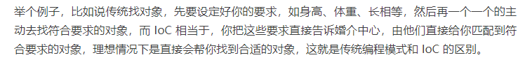

# Spring  IoC

## 谈谈IOC和DI

* IoC(Inversion of control，控制反转)，一种设计思想，与传统控制流相比，IoC 会颠倒控制流，在传统的编程中，需要开发者自行创建并销毁对象，而在IoC中，这些操作交给框架来处理，这样开发者就不用关注具体的实现细节，拿来直接用。<font color="red">体现面向对象的设计法则之一——好莱坞法则：“别找我们，我们找你",即由IoC容器帮助对象找到相应的依赖对象并注入，而不是由对象主动找。</font>



* DI(Dependency Injection,"依赖注入"),表示组件的依赖关系交由容器在运行期间自动生成，也就是说，由容器将某个依赖关系注入到组件之中，这样就能提升组件的重用频率。通过依赖注入机制，我们只需要通过简单的配置，就可指定目标需要的资源，完成自身的业务逻辑，而不需要关心资源来自哪里、由谁实现等问题。

* <strong>被注入对象依赖 IoC 容器配置依赖对象</strong>

### 知识扩展
#### 1.Spring IOC优点
* 使用方便，拿来即用，无需显示创建和销毁的过程，
* 可以很容易提供众多服务，比如事务管理、消息服务
* 提供了单例模式支持
* 提供了AOP抽象，利用它很容易实现权限拦截，运行期间监控等功能。
* 更符合面向对象的设计法则
* 低侵入式设计，代码的污染极低，降低了业务对象替换的复杂性。

#### 2.SpringIOC注入方式汇总
* 构造方法注入

构造方法主要依赖于构造方法实现，构造方法可以无参，我们平时new对象就是同过类的构造方法来创建对象，每个类都有一个无参构造方法。
```java
public class Person{
    private int id;
    private String name;

    public Person(){

    }
    public Person(int id, String name){
        this.id = id;
        this.name = name;
    }
}
```
applicationContext.xml配置如下：
```xml
<bean id = "person" class="org.xx.beans.Person">
    <construct-arg value="1" type="int"></construct-arg>
    <construct-arg value="java" type="java.lang.String"></construct-arg>
</bean>
```

* Setter注入

Setter方法注入目前是Spring主流的注入方式，它可以利用Java Bean规范定义的Getter/Setter方法来完成注入，可读性和灵活性都很高，它不需要使用声明式构造方法，而是用Setter直接设置相关的值。
```xml
<bean id="person" class="org.xx.beans.Person">
    <property name="id" value="1"></property>
    <property name="name" value="java"></property>
</bean>
```
* 接口注入

#### 循环依赖注入问题
<strong>什么是循环依赖</strong>
