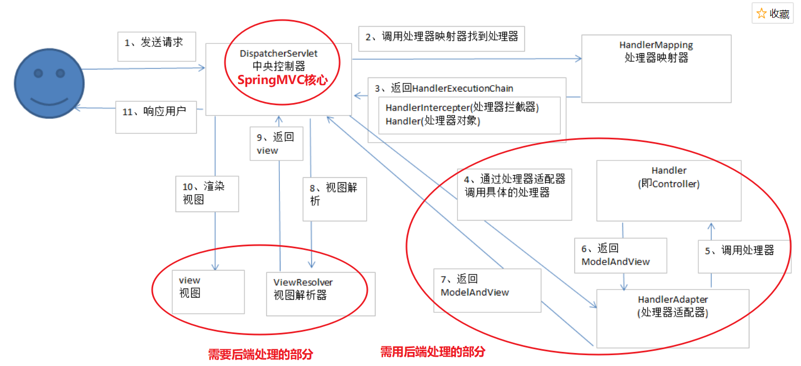

# SpringMVC

## SpringMVC的处理流程

web容器启动时会通知SPring初始化容器，加载bean的定义信息并初始化所有单例bean，然后遍历容器中的bean，获取每一个Controller中所有方法访问的URL，将URL和对应的Controller保存到一个Map中，
* 所有的请求会转发给DispatchServlet前端处理器，DispatchServlet会请求HandlerMapping找出容器中`@Controller`注解修饰的bean以及被`@RequestMapping`修饰的方法和类，生成Handler和HandlerInterceptor并以一个HandlerExcutionChain处理器执行链的形式返回
* 之后DispatchServlet使用Handler找到对应的HandlerAdapter，通过HandlerAdapter调用Handler方法，将请求参数绑定到方法的形参上，执行方法处理请求并得到ModelAndView.
* 最后DispatchServlet根据使用ViewResoulver视图解析器对得到的ModelAndView逻辑视图进行解析得到View物理视图，然后对视图渲染，将数据填充到视图并返回给客户端。

## SpringMVC有哪些组件
* `DispatchServlet`:SpringMVC中的前端控制器，整个流程控制的核心，负责请求并转发给对应的处理组件
* `Handler`：处理器，完成具体业务逻辑，相当于Servlet或Action
* `HandlerMapping`:完成URL到Controller映射，DispatchServlet通过HandlerMapping将不同的请求映射到不同Handler
* `HandlerInterceptor`：处理器拦截器，是一个接口，如果需要完成一些拦截处理，可以实现该接口。
* `HandlerExecutionChain`:处理器执行链，包括两部分：Handler和HandlerInterceptor`
* `HandlerAdapter`:处理器适配器，Handler执行业务方法钱需要进行一系列操作，包括表单数据验证、数据类型转换、将表单数据封装到javaBean等，这些操作都由HandlerAdapter完成，DispatchServlet通过HandlerAdapter来执行不同的Handler。
* `ModelAndView`：装载模型数据和视图信息，作为Handler处理结果返回给DispatchServlet
* `ViewResolver`:视图解析器，DispatchServlet通过它将逻辑视图解析为物理视图，最终渲染返回给客户端。

