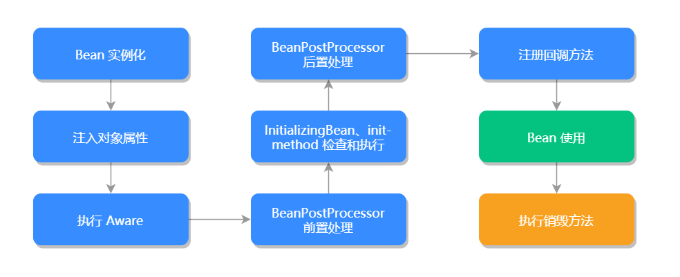

# bean

## bean的注册方式
* XML配置文件的注册方式
```xml
<bean id="person" class="org.springframework.beans.Person">
   <property name="id" value="1"/>
   <property name="name" value="Java"/>
</bean>

```
* Java注解方式
使用@component
```java
@Component
public class Person {
   private Integer id;
   private String name
   // 忽略其他方法
}
```
也可使用@bean注解方式来注册Bean
```java
@Configuration
public class Person {
   @Bean
   public Person  person(){
      return new Person();
   }
   // 忽略其他方法
}
```
其中@configuration可以理解为XML配置里的`<beans>`,而@Bean可以理解为XML配置里`<bean>`

* java API注册方式
```java
public class CustomBeanDefinitionRegistry implements BeanDefinitionRegistryPostProcessor {
	@Override
	public void postProcessBeanFactory(ConfigurableListableBeanFactory beanFactory) throws BeansException {
	}
	@Override
	public void postProcessBeanDefinitionRegistry(BeanDefinitionRegistry registry) throws BeansException {
		RootBeanDefinition personBean = new RootBeanDefinition(Person.class);
		// 新增 Bean
		registry.registerBeanDefinition("person", personBean);
	}
}
```
## bean作用域
* singleton：表示在Spring容器中只有一个Bean实例，以单例的形式存在，默认的作用域,缺省配置
* prototype：原型作用域，每次调用Bean时都会创建一个新实例，每次调用getBean()方法时，相当于执行了new bean().
```xml
<bean class="..." scope="prototype"></bean>

```
* request：每次http请求都会创建一个新的Bean，该作用域仅适用于WebApplicationContext环境
```xml
<bean class="..." scope="request"></bean>

```
java注解
```java
@Scope(WebApplicationContext.SCOPE_REQUEST)

```
* session作用域：同一个Http Session共享一个Bean对象，不同的Session拥有不同Bean对象，仅适用于WebApplicationContext环境


## 同名Bean问题
每个 Bean 拥有一个或多个标识符，在基于 XML 的配置中，我们可以使用 id 或者 name 来作为 Bean 的标识符。通常 Bean 的标识符由字母组成，允许使用特殊字符。

同一个 Spring 配置文件中 Bean 的 id 和 name 是不能够重复的，否则 Spring 容器启动时会报错。但如果 Spring 加载了多个配置文件的话，可能会出现同名 Bean 的问题。同名 Bean 指的是多个 Bean 有相同的 name 或者 id。

Spring 对待同名 Bean 的处理规则是使用最后面的 Bean 覆盖前面的 Bean，所以我们在定义 Bean 时，尽量使用长命名非重复的方式来定义，避免产生同名 Bean 的问题。

Bean 的 id 或 name 属性并非必须指定，如果留空的话，容器会为 Bean 自动生成一个唯一的

名称，这样也不会出现同名 Bean 的问题。

## Bean生命周期
* BeanFactory来说，启动阶段并不会触发Bean的实例化，只有通过显示或隐式调用getBean()方法，才会触发该类的实例化，但是作用域为单例时，只会在第一次实例化Bean对象，后面直接返回该对象。
* ApplicationContext来说，容器启动的时候，并立即调用注册到该容器所有Bean的实例化方法。

<strong>getBean()是Bean对象的入口，getBean()方法是属于BeanFactory接口的，它的真正实现是AbstractAutowireCapableBeanFactory的createBean()方法，而createBean()是通过doCreateBean()来实现的</strong>
```java
@Override
protected Object createBean(String beanName, RootBeanDefinition mbd, @Nullable Object[] args)
        throws BeanCreationException {
    if (logger.isTraceEnabled()) {
        logger.trace("Creating instance of bean '" + beanName + "'");
    }
    RootBeanDefinition mbdToUse = mbd;
    // 确定并加载 Bean 的 class
    Class<?> resolvedClass = resolveBeanClass(mbd, beanName);
    if (resolvedClass != null && !mbd.hasBeanClass() && mbd.getBeanClassName() != null) {
        mbdToUse = new RootBeanDefinition(mbd);
        mbdToUse.setBeanClass(resolvedClass);
    }
    // 验证以及准备需要覆盖的方法
    try {
        mbdToUse.prepareMethodOverrides();
    }
    catch (BeanDefinitionValidationException ex) {
        throw new BeanDefinitionStoreException(mbdToUse.getResourceDescription(),
                beanName, "Validation of method overrides failed", ex);
    }
    try {
        // 给BeanPostProcessors 一个机会来返回代理对象来代替真正的 Bean 实例，在这里实现创建代理对象功能
        Object bean = resolveBeforeInstantiation(beanName, mbdToUse);
        if (bean != null) {
            return bean;
        }
    }
    catch (Throwable ex) {
        throw new BeanCreationException(mbdToUse.getResourceDescription(), beanName,
                "BeanPostProcessor before instantiation of bean failed", ex);
    }
    try {
        // 创建 Bean
        Object beanInstance = doCreateBean(beanName, mbdToUse, args);
        if (logger.isTraceEnabled()) {
            logger.trace("Finished creating instance of bean '" + beanName + "'");
        }
        return beanInstance;
    }
    catch (BeanCreationException | ImplicitlyAppearedSingletonException ex) {
        throw ex;
    }
    catch (Throwable ex) {
        throw new BeanCreationException(
                mbdToUse.getResourceDescription(), beanName, "Unexpected exception during bean creation", ex);
    }
}
```
doCreateBean()源码：
```java
protected Object doCreateBean(final String beanName, final RootBeanDefinition mbd, final @Nullable Object[] args)
        throws BeanCreationException {
    // 实例化 bean，BeanWrapper 对象提供了设置和获取属性值的功能
    BeanWrapper instanceWrapper = null;
    // 如果 RootBeanDefinition 是单例，则移除未完成的 FactoryBean 实例的缓存
    if (mbd.isSingleton()) {
        instanceWrapper = this.factoryBeanInstanceCache.remove(beanName);
    }
    if (instanceWrapper == null) {
        // 创建 bean 实例
        instanceWrapper = createBeanInstance(beanName, mbd, args);
    }
    // 获取 BeanWrapper 中封装的 Object 对象，其实就是 bean 对象的实例
    final Object bean = instanceWrapper.getWrappedInstance();
    // 获取 BeanWrapper 中封装 bean 的 Class
    Class<?> beanType = instanceWrapper.getWrappedClass();
    if (beanType != NullBean.class) {
        mbd.resolvedTargetType = beanType;
    }
    // 应用 MergedBeanDefinitionPostProcessor 后处理器，合并 bean 的定义信息
    // Autowire 等注解信息就是在这一步完成预解析，并且将注解需要的信息放入缓存
    synchronized (mbd.postProcessingLock) {
        if (!mbd.postProcessed) {
            try {
                applyMergedBeanDefinitionPostProcessors(mbd, beanType, beanName);
            } catch (Throwable ex) {
                throw new BeanCreationException(mbd.getResourceDescription(), beanName,
                        "Post-processing of merged bean definition failed", ex);
            }
            mbd.postProcessed = true;
        }
    }
    boolean earlySingletonExposure = (mbd.isSingleton() && this.allowCircularReferences &&
            isSingletonCurrentlyInCreation(beanName));
    if (earlySingletonExposure) {
        if (logger.isTraceEnabled()) {
            logger.trace("Eagerly caching bean '" + beanName +
                    "' to allow for resolving potential circular references");
        }
        // 为了避免循环依赖，在 bean 初始化完成前，就将创建 bean 实例的 ObjectFactory 放入工厂缓存（singletonFactories）
        addSingletonFactory(beanName, () -> getEarlyBeanReference(beanName, mbd, bean));
    }
    // 对 bean 属性进行填充
    Object exposedObject = bean;
    try {
        populateBean(beanName, mbd, instanceWrapper);
        // 调用初始化方法，如 init-method 注入 Aware 对象
        exposedObject = initializeBean(beanName, exposedObject, mbd);
    } catch (Throwable ex) {
        if (ex instanceof BeanCreationException && beanName.equals(((BeanCreationException) ex).getBeanName())) {
            throw (BeanCreationException) ex;
        } else {
            throw new BeanCreationException(
                    mbd.getResourceDescription(), beanName, "Initialization of bean failed", ex);
        }
    }
    if (earlySingletonExposure) {
        // 如果存在循环依赖，也就是说该 bean 已经被其他 bean 递归加载过，放入了提早公布的 bean 缓存中
        Object earlySingletonReference = getSingleton(beanName, false);
        if (earlySingletonReference != null) {
            // 如果 exposedObject 没有在 initializeBean 初始化方法中被增强
            if (exposedObject == bean) {
                exposedObject = earlySingletonReference;
            } else if (!this.allowRawInjectionDespiteWrapping && hasDependentBean(beanName)) {
                // 依赖检测
                String[] dependentBeans = getDependentBeans(beanName);
                Set<String> actualDependentBeans = new LinkedHashSet<>(dependentBeans.length);
                for (String dependentBean : dependentBeans) {
                    if (!removeSingletonIfCreatedForTypeCheckOnly(dependentBean)) {
                        actualDependentBeans.add(dependentBean);
                    }
                }
                // 如果 actualDependentBeans 不为空，则表示依赖的 bean 并没有被创建完，即存在循环依赖
                if (!actualDependentBeans.isEmpty()) {
                    throw new BeanCurrentlyInCreationException(beanName,
                            "Bean with name '" + beanName + "' has been injected into other beans [" +
                                    StringUtils.collectionToCommaDelimitedString(actualDependentBeans) +
                                    "] in its raw version as part of a circular reference, but has eventually been " +
                                    "wrapped. This means that said other beans do not use the final version of the " +
                                    "bean. This is often the result of over-eager type matching - consider using " +
                                    "'getBeanNamesOfType' with the 'allowEagerInit' flag turned off, for example.");
                }
            }
        }
    }
    try {
        // 注册 DisposableBean 以便在销毁时调用
        registerDisposableBeanIfNecessary(beanName, bean, mbd);
    } catch (BeanDefinitionValidationException ex) {
        throw new BeanCreationException(
                mbd.getResourceDescription(), beanName, "Invalid destruction signature", ex);
    }
    return exposedObject;
}
```
* doCreateBean()方法中，首先对Bean进行了实例化工作，它是通过调用createBeanInstance()方法来实现的，该方法返回一个BeanWrapper对象。BeanWrapper对象是Spring中一个基础的Bean结构接口，基础接口连基本属性都没有。
* BeanWrapper接口有一个默认实现类BeanWrapperImpl,其主要作用是对Bean进行填充，比如填充和注入Bean的属性等
* 当Spring完成Bean对象的实例化并且设置完成相关属性和依赖后，则会调用Bean的初始化方法initializeBean()方法，
  * 初始化第一阶段：检查当前Bean对象是否实现了BeanNameAware、BeanCLassLoaderAware、BeanFactoryAware等接口
```java
  private void invokeAwareMethods(final String beanName, final Object bean) {
    if (bean instanceof Aware) {
        if (bean instanceof BeanNameAware) {
            ((BeanNameAware) bean).setBeanName(beanName);
        }
        if (bean instanceof BeanClassLoaderAware) {
            ClassLoader bcl = getBeanClassLoader();
            if (bcl != null) {
                ((BeanClassLoaderAware) bean).setBeanClassLoader(bcl);
            }
        }
        if (bean instanceof BeanFactoryAware) {
            ((BeanFactoryAware) bean).setBeanFactory(AbstractAutowireCapableBeanFactory.this);
        }
    }
}
```
  * 初始化第二阶段，BeanPostProcessor增强器，主要是对Spring容器提供的Bean实例对象进行有效扩展，允许Spring在初始化Bean阶段对其进行定制化修改，比如处理标记接口或者为其提供代理实现。
  * 在初始化处理完成之后就会检查和执行initializingBean和init-method方法
  * initializingBean是一个接口，它有一个afterPropertiesSet()方法，在Bean初始化会判断当前Bean是否实现了initializingBean，实现了则调用afterPropertiesSet方法，进行初始化工作，再检查是否制定了init-method,如果指定了则通过反射机制来调用指定的init-method方法
```java
protected void invokeInitMethods(String beanName, final Object bean, @Nullable RootBeanDefinition mbd)
        throws Throwable {
    // 判断当前 Bean 是否实现了 InitializingBean，如果是的话需要调用 afterPropertiesSet()
    boolean isInitializingBean = (bean instanceof InitializingBean);
    if (isInitializingBean && (mbd == null || !mbd.isExternallyManagedInitMethod("afterPropertiesSet"))) {
        if (logger.isTraceEnabled()) {
            logger.trace("Invoking afterPropertiesSet() on bean with name '" + beanName + "'");
        }
        if (System.getSecurityManager() != null) { // 安全模式
            try {
                AccessController.doPrivileged((PrivilegedExceptionAction<Object>) () -> {
                    ((InitializingBean) bean).afterPropertiesSet(); // 属性初始化
                    return null;
                }, getAccessControlContext());
            } catch (PrivilegedActionException pae) {
                throw pae.getException();
            }
        } else {
            ((InitializingBean) bean).afterPropertiesSet(); // 属性初始化
        }
    }
    // 判断是否指定了 init-method()
    if (mbd != null && bean.getClass() != NullBean.class) {
        String initMethodName = mbd.getInitMethodName();
        if (StringUtils.hasLength(initMethodName) &&
                !(isInitializingBean && "afterPropertiesSet".equals(initMethodName)) &&
                !mbd.isExternallyManagedInitMethod(initMethodName)) {
            // 利用反射机制执行指定方法
            invokeCustomInitMethod(beanName, bean, mbd);
        }
    }
}
```
* 初始化完成后，就阔以正常使用Bean对象，Spring容器关闭时执行销毁方法，但是不会自动去调用销毁方法，需要我们主动调用
* 如果是 BeanFactory 容器，那么我们需要主动调用 destroySingletons() 方法，通知 BeanFactory 容器去执行相应的销毁方法；如果是 ApplicationContext 容器，那么我们需要主动调用 registerShutdownHook() 方法，告知 ApplicationContext 容器执行相应的销毁方法。




