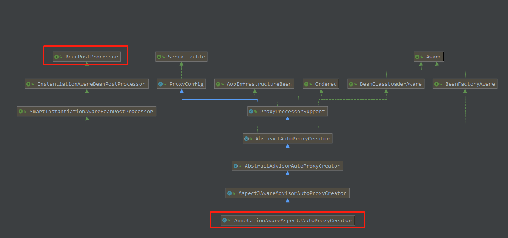

# Spring AOP

## AOP术语
AOP-Aspect Orient Programming，面向切面编程
## 作用
在不修改源代码的的情况下，可以实现增强功能


<strong>AOP 思想： 基于代理思想，对原来目标对象，创建代理对象，在不修改原对象代码情况下，通过代理对象，调用增强功能的代码，从而对原有业务方法进行增强 ！</strong>
## 应用场景
* 记录日志
* 监控方法运行时间
* 权限控制
* 缓存优化(第一次调用查询数据库，将查询结果放入内存对象， 第二次调用， 直接从内存对象返回，不需要查询数据库)
* 事务管理(调用方法前开启事务， 调用方法后提交关闭事务)

## AOP实现
主要有spring AOP和AspectJ.  
* AspectJ的底层技术是静态代理，即用一种AspectJ支持的特定语言编写切面，通过一个命令来编译，生成一个新的代理类，该代理类增强了业务类，在编译时增强，相对于运行时增强，编译性能更好
* Spring AOP，采用的是动态代理，在运行期间对业务方法进行增强。
>Spring AOP的动态代理主要有两种方式实现，JDK动态代理和cglib动态代理。JDK动态代理通过反射来接收被代理的类，但是被代理的类必须实现接口，核心是InvocationHandler和Proxy类。cglib动态代理的类一般是没有实现接口的类，cglib是一个代码生成的类库，可以在运行时动态生成某个类的子类，所以，CGLIB是通过继承的方式做的动态代理，因此如果某个类被标记为final，那么它是无法使用CGLIB做动态代理的。[参考](https://blog.csdn.net/yanweihpu/article/details/80169790)  
SpringAOP使用哪种实现方式具体逻辑在`org.springframework.aop.framework.DefaultAopProxyFactory`中实现。
> 
#### JDK代理
[java jdk代理](https://blog.csdn.net/jiankunking/article/details/52143504)、[jdk代理](https://www.cnblogs.com/akaneblog/p/6720513.html)
```Java
void proxyJDK(){
        //目标接口，被代理的
        IndexService proxy = (IndexService) Proxy.newProxyInstance(indexService.getClass().getClassLoader(),
                indexService.getClass().getInterfaces(),
                new InvocationHandler() {
                    // 参数proxy:被代理的对象
                    // 参数method:执行的方法，代理对象执行哪个方法，method就是哪个方法
                    // 参数args:执行方法的参数
                    @Override
                    public Object invoke(Object proxy, Method method, Object[] args) throws Throwable {
                        log.info("JDK 代理增强");
                        Object result = method.invoke(indexService, args);
                        return result;
                    }
                });
        proxy.testPrint();
        //核心 InvocationHandler接口中的invoke()方法
    }
```
#### CGlib代理
```Java
void proxyCGLib(){
    //目标对象，没有实现接口的类
        CGlibService cGlibService = new CGlibService();
        //创建CGlib核心对象
        Enhancer enhancer = new Enhancer();
        //设置父类
        //enhancer.setSuperclass(cGlibService.getClass());
        enhancer.setSuperclass(CGlibService.class);
        //设置回调
        enhancer.setCallback(new MethodInterceptor() {
            @Override
            public Object intercept(Object o, Method method, Object[] objects, MethodProxy methodProxy) throws Throwable {
                log.info("测试CGl代理");
                Object result = method.invoke(cGlibService, objects);
                return result;
            }
        });
        CGlibService proxy = (CGlibService)enhancer.create();
        proxy.testPrint();

    }
```
1、创建CGlib核心对象，Enhancer对象
2、设置enhancer的父类就是要代理的类
3、设置回调，intercept函数，加入增强的功能，

### 通知(Advice) *
切面的工作称为通知，通知定义了切面是要完成什么工作以及什么时候执行这个工作。
5种通知类型
|类型|执行|
|--|--|
|前置通知(before)|在目标方法被调用前调用通知功能|
|后置通知(after)|在目标方法被调用后调用通知，不关心方法的输出,都会执行该通知|
|返回通知(After-returning)|在目标方法成功执行之后调用通知|
|异常通知(After-throwing)|在目标方法抛出异常后调用通知|
|环绕通知(Around)|通知包裹了被通知的方法，在被通知的方法调用之前和之后执行自定义的行为|
### 通知(Advice)
想要的功能，安全，日志，事务等功能，先定义好
### 连接点(Join point)
连接点是在应用执行过程中能够插入切面的一个点。

### 切点(Pointcut) *
一个切面并不需要通知所有连接点，切点有助于缩小通知的连接点范围，如果说通知定义了切面的"什么"和"何时"(before,after,around等)的话，那么切点就定义了"何处"。因此，切点其实就是定义了需要执行在哪些连接点上执行通知

### 切面(Advisor) *
切面是通知和切点的结合，<strong>通知和切点</strong>共同定义了切面的全部内容--它是什么，在何时和何处完成其功能。

### 引入(Introduction)
引入允许我们向现有的类添加新方法或属性

### 织入(weaving)
织入是把切面应用到目标对象并创建新的代理对象的过程。切面在指定的连接点被织入到目标对象中。
>编译期：切面在目标类编译时被织入。这种方式需要特殊的编译器。AspectJ的织入编译器就是以这种方式织入切面的。  
类加载期：切面在目标类加载到JVM时被织入。这种方式需要特殊的类加载器，它可以在目标类被引入应用之前增强该目标类的字节码。AspectJ 5的加载时织入就支持这种方式织入切面。  
运行期：切面在应用运行的某个时刻被织入。一般情况下，在织入切面时，AOP容器会为目标对象动态的创建一个代理对象。Spring AOP就是以这种方式织入切面的。

## 操作日志举例
记录操作了什么方法，运行时间等
自定义日志注解
```Java
@Target(ElementType.METHOD)
@Retention(RetentionPolicy.RUNTIME)
@Documented
public @interface SysLog {
    String value() default "";
}
```
自定义切面
```Java
@Aspect
@Component
public class SysLogAspect {

    @Autowired
    private SysLogService logService;

    /**
     * 这里通过注解的形式，
     * 我们也可以通过切点表达式
     * execution 拦截包、类、方法
     */
    @Pointcut("@annotation(com.hs.demo.anno.SysLog)")
    public void pointcut(){}

    /**
     *
     * @param point
     * @return
     * @throws Throwable
     */
    @Around("pointcut()")
    public Object around(ProceedingJoinPoint point)throws Throwable{
        long beginTime = System.currentTimeMillis();
        Object result = point.proceed();
        long time = System.currentTimeMillis() - beginTime;
        try{
            saveLog(point, time);
        }catch (Exception e){

        }
        return result;
    }

    /**
     *
     * @param joinPoint
     * @param time
     */
    private void saveLog(ProceedingJoinPoint joinPoint, long time) {
        MethodSignature signature = (MethodSignature) joinPoint.getSignature();
        Method method = signature.getMethod();
        SysLogBO sysLogBO = new SysLogBO();
        sysLogBO.setExeuTime(time);
        SimpleDateFormat dateFormat = new SimpleDateFormat("yyyy-MM-dd hh:mm:ss");
        sysLogBO.setCreateDate(dateFormat.format(new Date()));
        SysLog sysLog = method.getAnnotation(SysLog.class);
        if(sysLog != null){
            //注解上的描述
            sysLogBO.setRemark(sysLog.value());
        }
        //请求的 类名、方法名
        String className = joinPoint.getTarget().getClass().getName();
        String methodName = signature.getName();
        sysLogBO.setClassName(className);
        sysLogBO.setMethodName(methodName);
        //请求的参数
        Object[] args = joinPoint.getArgs();
        try{
            List<String> list = new ArrayList<String>();
            for (Object o : args) {
                list.add(new Gson().toJson(o));
            }
            sysLogBO.setParams(list.toString());
        }catch (Exception e){ }
        logService.save(sysLogBO);
    }

}

```
定义控制器
```Java
 /**
     * 
     * @param name
     * @return
     * "测试值"对应 String value（） default ""；
     */
    @SysLog("测试")
    @GetMapping("/test2")
    public String testAnoLog(String name){
        return name;
    }
```

## SpringAOP流程简介

### 注册AnnotationAwareAspectJAutoProxyCreator
在Spring源码中，全局搜索启动Aop的自定义标签`aspectj-autoproxy`，可以定位到注册该自定义标签解析类的AopNamespaceHandler
```java
public BeanDefinition parse(Element element, ParserContext parserContext) {
        BeanDefinitionRegistry registry = parserContext.getRegistry();
        AopNamespaceUtils.registerAtAspectJAutoProxyCreatorIfNecessary(parserContext, element);
        extendBeanDefinition(registry, element);
        return null;
    }
```
在注册解析类`AspectJAutoProxyBeanDefinitionParser`的parse方法中，关键是调用了AopNamespaceUtils.registerAtAspectJAutoProxyCreatorIfNecessary方法。
* 注册或升级`AnnotationAwareAspectJAutoProxyCreator`，对于AOP的实现，基本上都是靠`AnnotationAwareAspectJAutoProxyCreator`去完成，
* 处理proxy-target-class（如果为true则使用cglib代理）跟expose-proxy（暴露当前的aop代理类，可用AopContext.currentProxy()获取）属性（此处对这两个属性的处理，是指以key-value的形式放入BeanDefinition的propertyValues属性中）
* 注册组件并通知

### 创建AOP代理
#### 1.查看继承关系

可知类继承了BeanPostProcessor，可以顺着查看其实现方法`postProcessorAfterInitialization`
<strong>AbstractAutoProxyCreator</strong>
```java
/**
	 * Create a proxy with the configured interceptors if the bean is
	 * identified as one to proxy by the subclass.
	 * @see #getAdvicesAndAdvisorsForBean
	 */
	@Override
	public Object postProcessAfterInitialization(@Nullable Object bean, String beanName) {
		if (bean != null) {
			Object cacheKey = getCacheKey(bean.getClass(), beanName);
			if (!this.earlyProxyReferences.contains(cacheKey)) {
				return wrapIfNecessary(bean, beanName, cacheKey);
			}
		}
		return bean;
    }

/**
	 * Wrap the given bean if necessary, i.e. if it is eligible for being proxied.
	 * @param bean the raw bean instance
	 * @param beanName the name of the bean
	 * @param cacheKey the cache key for metadata access
	 * @return a proxy wrapping the bean, or the raw bean instance as-is
	 */
	protected Object wrapIfNecessary(Object bean, String beanName, Object cacheKey) {
		if (StringUtils.hasLength(beanName) && this.targetSourcedBeans.contains(beanName)) {
			return bean;
		}
		if (Boolean.FALSE.equals(this.advisedBeans.get(cacheKey))) {
			return bean;
		}
		if (isInfrastructureClass(bean.getClass()) || shouldSkip(bean.getClass(), beanName)) {
			this.advisedBeans.put(cacheKey, Boolean.FALSE);
			return bean;
		}

		// Create proxy if we have advice.
		Object[] specificInterceptors = getAdvicesAndAdvisorsForBean(bean.getClass(), beanName, null);
		if (specificInterceptors != DO_NOT_PROXY) {
			this.advisedBeans.put(cacheKey, Boolean.TRUE);
			Object proxy = createProxy(
					bean.getClass(), beanName, specificInterceptors, new SingletonTargetSource(bean));
			this.proxyTypes.put(cacheKey, proxy.getClass());
			return proxy;
		}

		this.advisedBeans.put(cacheKey, Boolean.FALSE);
		return bean;
    }
 
```
* getAdvicesAndAdvisorsForBean方法获取到所有增强，以Object[]的形式存放
* createProxy方法针对增强创建代理，最终以postProcessorAfterInitialization方法返回的对象就是这个创建的代理的对象，而此对象最后就成了getBean方法获取到的对象。
* <strong><font color="red">1、获取增强方法或者增强；2、根据获取的增强进行代理</font></strong>
#### 增强获取
在AnnotationAwareAspectJAutoProxyCreator类间接继承了AbstractAdvisorAutoProxyCreator类，获取bean的注解增强的功能，实际由
this.aspectJAdvisorsBuilder.buildAspectJAdvisors()实现。
```java
// AnnotationAwareAspectJAutoProxyCreator

	@Override
	protected List<Advisor> findCandidateAdvisors() {
		// Add all the Spring advisors found according to superclass rules.
		List<Advisor> advisors = super.findCandidateAdvisors();
		// Build Advisors for all AspectJ aspects in the bean factory.
		if (this.aspectJAdvisorsBuilder != null) {
			advisors.addAll(this.aspectJAdvisorsBuilder.buildAspectJAdvisors());
		}
		return advisors;
    }
```
* 获取bean所有的Beanname，在BeanFactory中注册的bean都会被提取出来
* 遍历所有beanname，并找出声明了Aspectj注解的类
* 对标记为Aspectj注解的类进行增强器的提取
* 提取结果存入缓存

```java
/**
	 * Look for AspectJ-annotated aspect beans in the current bean factory,
	 * and return to a list of Spring AOP Advisors representing them.
	 * <p>Creates a Spring Advisor for each AspectJ advice method.
	 * @return the list of {@link org.springframework.aop.Advisor} beans
	 * @see #isEligibleBean
	 */
	public List<Advisor> buildAspectJAdvisors() {
		List<String> aspectNames = this.aspectBeanNames;

		if (aspectNames == null) {
			synchronized (this) {
				aspectNames = this.aspectBeanNames;
				if (aspectNames == null) {
					List<Advisor> advisors = new ArrayList<>();
                    aspectNames = new ArrayList<>();
                    //获取所有beanName
					String[] beanNames = BeanFactoryUtils.beanNamesForTypeIncludingAncestors(
                            this.beanFactory, Object.class, true, false);
                            //找出对应的增强方法
					for (String beanName : beanNames) {
						if (!isEligibleBean(beanName)) {
							continue;
						}
						// We must be careful not to instantiate beans eagerly as in this case they
						// would be cached by the Spring container but would not have been weaved.
						Class<?> beanType = this.beanFactory.getType(beanName);
						if (beanType == null) {
							continue;
                        }
                        //如果存在注解
						if (this.advisorFactory.isAspect(beanType)) {
							aspectNames.add(beanName);
							AspectMetadata amd = new AspectMetadata(beanType, beanName);
							if (amd.getAjType().getPerClause().getKind() == PerClauseKind.SINGLETON) {
								MetadataAwareAspectInstanceFactory factory =
                                        new BeanFactoryAspectInstanceFactory(this.beanFactory, beanName);
                                //解析标记Aspectj注解中的增强方法
								List<Advisor> classAdvisors = this.advisorFactory.getAdvisors(factory);
								if (this.beanFactory.isSingleton(beanName)) {
									this.advisorsCache.put(beanName, classAdvisors);
								}
								else {
									this.aspectFactoryCache.put(beanName, factory);
								}
								advisors.addAll(classAdvisors);
							}
							else {
								// Per target or per this.
								if (this.beanFactory.isSingleton(beanName)) {
									throw new IllegalArgumentException("Bean with name '" + beanName +
											"' is a singleton, but aspect instantiation model is not singleton");
								}
								MetadataAwareAspectInstanceFactory factory =
										new PrototypeAspectInstanceFactory(this.beanFactory, beanName);
								this.aspectFactoryCache.put(beanName, factory);
								advisors.addAll(this.advisorFactory.getAdvisors(factory));
							}
						}
					}
					this.aspectBeanNames = aspectNames;
					return advisors;
				}
			}
		}

		if (aspectNames.isEmpty()) {
			return Collections.emptyList();
        }
        //记录在缓存中
		List<Advisor> advisors = new ArrayList<>();
		for (String aspectName : aspectNames) {
			List<Advisor> cachedAdvisors = this.advisorsCache.get(aspectName);
			if (cachedAdvisors != null) {
				advisors.addAll(cachedAdvisors);
			}
			else {
				MetadataAwareAspectInstanceFactory factory = this.aspectFactoryCache.get(aspectName);
				advisors.addAll(this.advisorFactory.getAdvisors(factory));
			}
		}
		return advisors;
    }
//增强筛选 过滤
/**
	 * Search the given candidate Advisors to find all Advisors that
	 * can apply to the specified bean.
	 * @param candidateAdvisors the candidate Advisors
	 * @param beanClass the target's bean class
	 * @param beanName the target's bean name
	 * @return the List of applicable Advisors
	 * @see ProxyCreationContext#getCurrentProxiedBeanName()
	 */
	protected List<Advisor> findAdvisorsThatCanApply(
			List<Advisor> candidateAdvisors, Class<?> beanClass, String beanName) {

		ProxyCreationContext.setCurrentProxiedBeanName(beanName);
		try {
			return AopUtils.findAdvisorsThatCanApply(candidateAdvisors, beanClass);
		}
		finally {
			ProxyCreationContext.setCurrentProxiedBeanName(null);
		}
    }

//          AOPUtils
/**
	 * Determine the sublist of the {@code candidateAdvisors} list
	 * that is applicable to the given class.
	 * @param candidateAdvisors the Advisors to evaluate
	 * @param clazz the target class
	 * @return sublist of Advisors that can apply to an object of the given class
	 * (may be the incoming List as-is)
	 */
	public static List<Advisor> findAdvisorsThatCanApply(List<Advisor> candidateAdvisors, Class<?> clazz) {
		if (candidateAdvisors.isEmpty()) {
			return candidateAdvisors;
		}
        List<Advisor> eligibleAdvisors = new ArrayList<>();
        //首先处理引介增强
		for (Advisor candidate : candidateAdvisors) {
			if (candidate instanceof IntroductionAdvisor && canApply(candidate, clazz)) {
				eligibleAdvisors.add(candidate);
			}
		}
		boolean hasIntroductions = !eligibleAdvisors.isEmpty();
		for (Advisor candidate : candidateAdvisors) {
            //引介增强已处理
			if (candidate instanceof IntroductionAdvisor) {
				// already processed
				continue;
            }
            //普通bean处理
			if (canApply(candidate, clazz, hasIntroductions)) {
				eligibleAdvisors.add(candidate);
			}
		}
		return eligibleAdvisors;
	}
```
补充解释：
* 1.在AbstractAdvisorAutoProxyCreator类的aspectJAdvisorsBuilder.buildAspectJAdvisors()方法中，先获取所有的beanName，然后遍历beanNames，校验每一个beanName对应的type，
* 2.如果有AspectJ的注解，则通过advisorFactory.getAdvisor(factory)方法获取此切面类下的所有增强方法（先找到有Advice类注解(如@Before、@Around等)的方法，然后给每一个切点生成对应PointCut对象，用InstantiationModelAwarePointcutAdvisorImpl统一封装，并对不同的PoinCut使用对应的增强器初始化（如@Before对应AspectJMethodBeforeAdvice）增强器），以`List<Advisor>`形式存放。其中，切面中每个增强+对应的PointCut对应一个Advisor。
* 3.然后筛选获取到的所有增强器，只取到与当前bean相关的Advisor。相关方法为findAdvisorThatCanApply，其中过滤增强分了两种，一种是引介增强IntroductionAdvisor（类级别的拦截），一种是普通的增强。

#### 创建代理
<strong>AbstractAutoProxyCreator</strong>

```java
   
    /**
	 * Create an AOP proxy for the given bean.
	 * @param beanClass the class of the bean
	 * @param beanName the name of the bean
	 * @param specificInterceptors the set of interceptors that is
	 * specific to this bean (may be empty, but not null)
	 * @param targetSource the TargetSource for the proxy,
	 * already pre-configured to access the bean
	 * @return the AOP proxy for the bean
	 * @see #buildAdvisors
	 */
	protected Object createProxy(Class<?> beanClass, @Nullable String beanName,
			@Nullable Object[] specificInterceptors, TargetSource targetSource) {

		if (this.beanFactory instanceof ConfigurableListableBeanFactory) {
			AutoProxyUtils.exposeTargetClass((ConfigurableListableBeanFactory) this.beanFactory, beanName, beanClass);
		}
        //创建一个ProxyFactory，初始化
        ProxyFactory proxyFactory = new ProxyFactory();
        //获取类中的属性
		proxyFactory.copyFrom(this);
        //决定对于给定的
		if (!proxyFactory.isProxyTargetClass()) {
			if (shouldProxyTargetClass(beanClass, beanName)) {
                //添加代理接口
				proxyFactory.setProxyTargetClass(true);
			}
			else {
				evaluateProxyInterfaces(beanClass, proxyFactory);
			}
		}

        Advisor[] advisors = buildAdvisors(beanName, specificInterceptors);
        //加入增强器
        proxyFactory.addAdvisors(advisors);
        //设置要代理的类
        proxyFactory.setTargetSource(targetSource);
        //定制代理
		customizeProxyFactory(proxyFactory);

		proxyFactory.setFrozen(this.freezeProxy);
		if (advisorsPreFiltered()) {
			proxyFactory.setPreFiltered(true);
		}

		return proxyFactory.getProxy(getProxyClassLoader());
    }
//                                  调用getProxy
/**
	 * Create a new proxy according to the settings in this factory.
	 * <p>Can be called repeatedly. Effect will vary if we've added
	 * or removed interfaces. Can add and remove interceptors.
	 * <p>Uses the given class loader (if necessary for proxy creation).
	 * @param classLoader the class loader to create the proxy with
	 * (or {@code null} for the low-level proxy facility's default)
	 * @return the proxy object
	 */
	public Object getProxy(@Nullable ClassLoader classLoader) {
		return createAopProxy().getProxy(classLoader);
    }

/**
	 * Subclasses should call this to get a new AOP proxy. They should <b>not</b>
	 * create an AOP proxy with {@code this} as an argument.
	 */
	protected final synchronized AopProxy createAopProxy() {
		if (!this.active) {
			activate();
		}
		return getAopProxyFactory().createAopProxy(this);
    }

//                                判断是否JDK或CGLib代理
@Override
	public AopProxy createAopProxy(AdvisedSupport config) throws AopConfigException {
		if (config.isOptimize() || config.isProxyTargetClass() || hasNoUserSuppliedProxyInterfaces(config)) {
			Class<?> targetClass = config.getTargetClass();
			if (targetClass == null) {
				throw new AopConfigException("TargetSource cannot determine target class: " +
						"Either an interface or a target is required for proxy creation.");
			}
			if (targetClass.isInterface() || Proxy.isProxyClass(targetClass)) {
				return new JdkDynamicAopProxy(config);
			}
			return new ObjenesisCglibAopProxy(config);
		}
		else {
			return new JdkDynamicAopProxy(config);
		}
	}
```
Spring委托ProxyFactory去处理，主要是对ProxyFactory的初始化，
* 获取当前类中的属性
* 添加代理接口
* 封装Advisor加入到ProxyFactory中
* 设置要代理的类
* 为子类提供了customizeProxyFactory，子类可以在此函数中对ProxyFactory进行进一步封装
* 进行获取代理操作

### 调用目标方法
 当调用第二步中获取到代理对象后，根据代理模式，我们知道程序会走invoke方法，就是在此方法中完成了对增强的调用。下面以JdkDynamicAopProxy为例，查看其invoke方法。

有两个重要的点：

1、对于exposeProxy的处理

当代理走到invoke方法时，如果之前解析到的exposeProxy为true，则通过AopContext.setCurrentProxy(proxy)将当前代理放入这个属性中，这样，我们在代码中使用AopContext.getCurrentProxy才能获取到当前的代理对象。

2、拦截器链（即增强）的调用

在invoke方法中，将当前方法的所有拦截器都封装进ReflectiveMethodInvocation中，调用其proceed()方法，使所有拦截器生效。不同的增强器，如@Before、@After，他们的执行顺序由他们自身功能来控制。

### 总结
AOP的实现原理如上所述。对于一个切面中多个不同Advice的执行顺序，是由对应增强器的invoke方法本身实现的，具体顺序如下所示：

     目标方法正常执行：@Around前 ->@Before ->执行方法 ->  @Around后 -> @After -> @AfterReturning

     目标方法抛异常：    @Around前 ->@Before ->方法报错 -> @After -> @AfterThrowing

参考[AOP流程](https://www.cnblogs.com/minikobe/p/12700841.html)