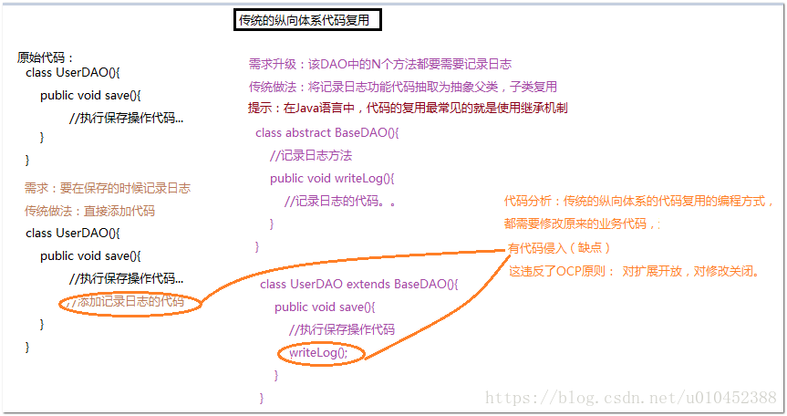
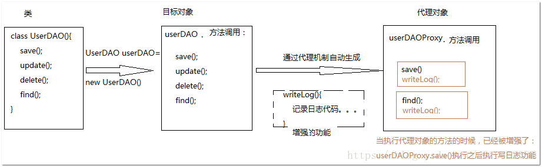

# Spring AOP

## AOP术语
AOP-Aspect Orient Programming，面向切面编程
## 作用
在不修改源代码的的情况下，可以实现增强功能


<strong>AOP 思想： 基于代理思想，对原来目标对象，创建代理对象，在不修改原对象代码情况下，通过代理对象，调用增强功能的代码，从而对原有业务方法进行增强 ！</strong>
## 应用场景
* 记录日志
* 监控方法运行时间
* 权限控制
* 缓存优化(第一次调用查询数据库，将查询结果放入内存对象， 第二次调用， 直接从内存对象返回，不需要查询数据库)
* 事务管理(调用方法前开启事务， 调用方法后提交关闭事务)

## AOP实现
主要有spring AOP和AspectJ.  
* AspectJ的底层技术是静态代理，即用一种AspectJ支持的特定语言编写切面，通过一个命令来编译，生成一个新的代理类，该代理类增强了业务类，在编译时增强，相对于运行时增强，编译性能更好
* Spring AOP，采用的是动态代理，在运行期间对业务方法进行增强。
>Spring AOP的动态代理主要有两种方式实现，JDK动态代理和cglib动态代理。JDK动态代理通过反射来接收被代理的类，但是被代理的类必须实现接口，核心是InvocationHandler和Proxy类。cglib动态代理的类一般是没有实现接口的类，cglib是一个代码生成的类库，可以在运行时动态生成某个类的子类，所以，CGLIB是通过继承的方式做的动态代理，因此如果某个类被标记为final，那么它是无法使用CGLIB做动态代理的。[参考](https://blog.csdn.net/yanweihpu/article/details/80169790)  
SpringAOP使用哪种实现方式具体逻辑在`org.springframework.aop.framework.DefaultAopProxyFactory`中实现。
> 
#### JDK代理
[java jdk代理](https://blog.csdn.net/jiankunking/article/details/52143504)、[jdk代理](https://www.cnblogs.com/akaneblog/p/6720513.html)
```Java
void proxyJDK(){
        //目标接口，被代理的
        IndexService proxy = (IndexService) Proxy.newProxyInstance(indexService.getClass().getClassLoader(),
                indexService.getClass().getInterfaces(),
                new InvocationHandler() {
                    // 参数proxy:被代理的对象
                    // 参数method:执行的方法，代理对象执行哪个方法，method就是哪个方法
                    // 参数args:执行方法的参数
                    @Override
                    public Object invoke(Object proxy, Method method, Object[] args) throws Throwable {
                        log.info("JDK 代理增强");
                        Object result = method.invoke(indexService, args);
                        return result;
                    }
                });
        proxy.testPrint();
        //核心 InvocationHandler接口中的invoke()方法
    }
```
#### CGlib代理
```Java
void proxyCGLib(){
    //目标对象，没有实现接口的类
        CGlibService cGlibService = new CGlibService();
        //创建CGlib核心对象
        Enhancer enhancer = new Enhancer();
        //设置父类
        //enhancer.setSuperclass(cGlibService.getClass());
        enhancer.setSuperclass(CGlibService.class);
        //设置回调
        enhancer.setCallback(new MethodInterceptor() {
            @Override
            public Object intercept(Object o, Method method, Object[] objects, MethodProxy methodProxy) throws Throwable {
                log.info("测试CGl代理");
                Object result = method.invoke(cGlibService, objects);
                return result;
            }
        });
        CGlibService proxy = (CGlibService)enhancer.create();
        proxy.testPrint();

    }
```
1、创建CGlib核心对象，Enhancer对象
2、设置enhancer的父类就是要代理的类
3、设置回调，intercept函数，加入增强的功能，

### 通知(Advice) *
切面的工作称为通知，通知定义了切面是要完成什么工作以及什么时候执行这个工作。
5种通知类型
|类型|执行|
|--|--|
|前置通知(before)|在目标方法被调用前调用通知功能|
|后置通知(after)|在目标方法被调用后调用通知，不关心方法的输出,都会执行该通知|
|返回通知(After-returning)|在目标方法成功执行之后调用通知|
|异常通知(After-throwing)|在目标方法抛出异常后调用通知|
|环绕通知(Around)|通知包裹了被通知的方法，在被通知的方法调用之前和之后执行自定义的行为|
### 通知(Advice)
想要的功能，安全，日志，事务等功能，先定义好
### 连接点(Join point)
连接点是在应用执行过程中能够插入切面的一个点。

### 切点(Pointcut) *
一个切面并不需要通知所有连接点，切点有助于缩小通知的连接点范围，如果说通知定义了切面的"什么"和"何时"(before,after,around等)的话，那么切点就定义了"何处"。因此，切点其实就是定义了需要执行在哪些连接点上执行通知

### 切面(Advisor) *
切面是通知和切点的结合，<strong>通知和切点</strong>共同定义了切面的全部内容--它是什么，在何时和何处完成其功能。

### 引入(Introduction)
引入允许我们向现有的类添加新方法或属性

### 织入(weaving)
织入是把切面应用到目标对象并创建新的代理对象的过程。切面在指定的连接点被织入到目标对象中。
>编译期：切面在目标类编译时被织入。这种方式需要特殊的编译器。AspectJ的织入编译器就是以这种方式织入切面的。  
类加载期：切面在目标类加载到JVM时被织入。这种方式需要特殊的类加载器，它可以在目标类被引入应用之前增强该目标类的字节码。AspectJ 5的加载时织入就支持这种方式织入切面。  
运行期：切面在应用运行的某个时刻被织入。一般情况下，在织入切面时，AOP容器会为目标对象动态的创建一个代理对象。Spring AOP就是以这种方式织入切面的。

## 操作日志举例
记录操作了什么方法，运行时间等
自定义日志注解
```Java
@Target(ElementType.METHOD)
@Retention(RetentionPolicy.RUNTIME)
@Documented
public @interface SysLog {
    String value() default "";
}
```
自定义切面
```Java
@Aspect
@Component
public class SysLogAspect {

    @Autowired
    private SysLogService logService;

    /**
     * 这里通过注解的形式，
     * 我们也可以通过切点表达式
     * execution 拦截包、类、方法
     */
    @Pointcut("@annotation(com.hs.demo.anno.SysLog)")
    public void pointcut(){}

    /**
     *
     * @param point
     * @return
     * @throws Throwable
     */
    @Around("pointcut()")
    public Object around(ProceedingJoinPoint point)throws Throwable{
        long beginTime = System.currentTimeMillis();
        Object result = point.proceed();
        long time = System.currentTimeMillis() - beginTime;
        try{
            saveLog(point, time);
        }catch (Exception e){

        }
        return result;
    }

    /**
     *
     * @param joinPoint
     * @param time
     */
    private void saveLog(ProceedingJoinPoint joinPoint, long time) {
        MethodSignature signature = (MethodSignature) joinPoint.getSignature();
        Method method = signature.getMethod();
        SysLogBO sysLogBO = new SysLogBO();
        sysLogBO.setExeuTime(time);
        SimpleDateFormat dateFormat = new SimpleDateFormat("yyyy-MM-dd hh:mm:ss");
        sysLogBO.setCreateDate(dateFormat.format(new Date()));
        SysLog sysLog = method.getAnnotation(SysLog.class);
        if(sysLog != null){
            //注解上的描述
            sysLogBO.setRemark(sysLog.value());
        }
        //请求的 类名、方法名
        String className = joinPoint.getTarget().getClass().getName();
        String methodName = signature.getName();
        sysLogBO.setClassName(className);
        sysLogBO.setMethodName(methodName);
        //请求的参数
        Object[] args = joinPoint.getArgs();
        try{
            List<String> list = new ArrayList<String>();
            for (Object o : args) {
                list.add(new Gson().toJson(o));
            }
            sysLogBO.setParams(list.toString());
        }catch (Exception e){ }
        logService.save(sysLogBO);
    }

}

```
定义控制器
```Java
 /**
     * 
     * @param name
     * @return
     * "测试值"对应 String value（） default ""；
     */
    @SysLog("测试")
    @GetMapping("/test2")
    public String testAnoLog(String name){
        return name;
    }
```