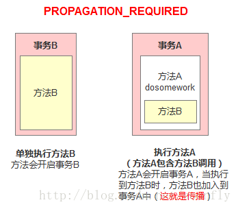
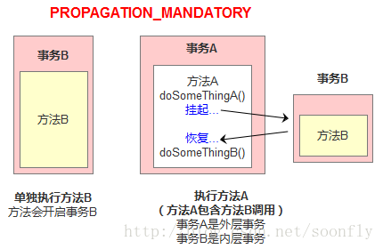
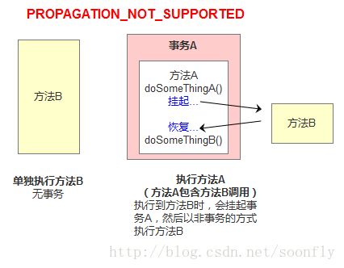
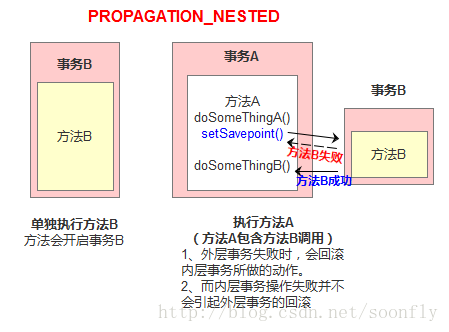

# 事务传播行为

## 事务传播
事务传播行为(propagation behavior)指的就是当一个事务方法被另一个事务方法调用时，这个事务方法该如何进行；   
例如：methodA事务方法调用methodB事务方法时，methodB是继续在调用者methodA中的事务进行还是为自己开启一个新事务运行，这个又methodB的事务传播行为决定。  
spring定义了7中事务传播行为：
|传播行为|含义|
|---|---|
|PROPAGATION_REQUIRED|表示当前方法必须运行在事务中，如果当前事务存在，方法将会在该事务中运行，否则，会启动另一个新的事务；<strong>默认传播</strong>|
|PROPAGATION_SUPPORTS|表示当前方法不需要事务上下文，但是如果存在当前事务的话，那么该方法在这个事务中运行|
|PROPAGATION_MANDATORY|表示该方法必须在事务中运行，如果当前事务不存在，则抛出一个异常|
|PROPAGATION_REQUIRED_NEW|表示当前方法必须运行在它自己的事务中，一个新的事务将被启动，如果存在当前事务，在该方法执行期间，当前事务会被挂起，如果使用JIATransactionManager的话，则需要访问TransactionManager|
|PROPAGATION_NOT_SUPPORTED|表示方法不应该运行在事务中，如果存在当前事务，在该方法运行期间，当前事务被挂起，如果使用JTATransactionManager的话，则需要访问TransactionManager|
|PROPAGATION_NEVER|表示当前方法不应该运行在事务上下文中。如果当前正在有一个事务在运行，则会抛出异常|
|PROPAGATION_NESTED|表示如果当前已经存在一个事务，那么该方法将会在嵌套事务中运行。嵌套的事务可以独立于当前事务单独地提交或回滚。如果当前事务不存在，那么其行为与PROPAGATION_REQUIRED一样|

### PROPAGATION_REQUIRED
如果存在一个事务，则支持当前事务，如果没有事务则开启一个新事务，如图


```java
@Transactional(propagation = Propagation.REQUIRED)
public void methodA(){
    methodB();
    //doSomething
}
@Transactional(propagation = Propagation.REQUIRED)
public void methodB(){
    // doSomething
}
```
单独调用methodB，因为当前上下文不存在事务，所以会开启一个新事务。   
调用methodA方法时，因为当前上下文存在事务，所以会开启一个新的事务。当执行到methodB时，methodB发现上下文有事务，因此加入到当前事务来。

### PROPAGATION_SUPPORTS
如果存在一个事务，支持当前事务。如果没有事务，则非事务执行，但是对于同步的事务管理器，PROPAGATION_SUPPORTS与不使用事务有少许不同。 
```java

@Transactional(propagation = Propagation.REQUIRED)
public void methodA() {
 methodB();
// do something
}
 
// 事务属性为SUPPORTS
@Transactional(propagation = Propagation.SUPPORTS)
public void methodB() {
    // do something
}
```
单纯的调用methodB时，methodB方法是非事务的执行的。当调用methodA时，methodB则加入methodA的事务中，事务地执行。

### PROPAGATION_MANDATORY
如果已经存在一个事务，支持当前事务，如果没有一个活动的事务，则抛出异常。
```java

@Transactional(propagation = Propagation.REQUIRED)
public void methodA() {
 methodB();
// do something
}
 
// 事务属性为MANDATORY
@Transactional(propagation = Propagation.MANDATORY)
public void methodB() {
    // do something
}
```
当单独调用methodB时，因为当前没有一个活动的事务，则会抛出异常throw new IllegalTransactionStateException("Transaction propagation 'mandatory' but not existing transaction found")，当调用methodA时，methodB则加入到methodA的事务中，事务地执行。

### PROPAGATION_REQUIRED_NEW

使用PROPAGATION_REQUIRED_NEW，需要JtaTransactionManager作为事务管理器，它会开启一个新的事务。如果一个事务已经存在，则先将这个事务挂起。
```java
@Transactional(propagation = Propagation.REQUIRED)
public void methodA() {
doSomeThingA();
methodB();
doSomeThingB();
// do something else
}
 
 
// 事务属性为REQUIRES_NEW
@Transactional(propagation = Propagation.REQUIRES_NEW)
public void methodB() {
    // do something
}
```
当调用
```java
main{
    methodA();
}
```
相当于调用
```java
main(){
    TransactionManager tm = null;
    try{
        //获得一个JTA事务管理器
        tm = getTransactionManager();
        tm.begin();//开启一个新的事务
        Transaction ts1 = tm.getTransaction();
        doSomeThing();
        tm.suspend();//挂起当前事务
        try{
            tm.begin();//重新开启第二个事务
            Transaction ts2 = tm.getTransaction();
            methodB();
            ts2.commit();//提交第二个事务
        } Catch(RunTimeException ex) {
            ts2.rollback();//回滚第二个事务
        } finally {
            //释放资源
        }
        //methodB执行完后，恢复第一个事务
        tm.resume(ts1);
        doSomeThingB();
        ts1.commit();//提交第一个事务
    } catch(RunTimeException ex) {
        ts1.rollback();//回滚第一个事务
    } finally {
        //释放资源
    }
}
```
这里，把ts1称为外层事务，ts2称为内层事务。从上面看，t1与t2是两个独立的事务，互不相干。ts2是否成功并不依赖于ts1.如果methodA方法在调用methodB方法后的doSomethingB失败后，而methodB方法所做的结果依然被提交。而除了methodB之外的其它代码导致的却被回滚了。

### PROPAGATION_NOT_SUPPORTED
PROPAGATION_NOT_SUPPORTED 总是非事务地执行，并挂起任何存在的事务。使用PROPAGATION_NOT_SUPPORTED,也需要使用JtaTransactionManager作为事务管理器。 


### PROPAGATION_NEVER
总是非事务地执行，如果存在第一个活动事务，则抛出异常。

### PROPAGATION_NESTED



##
[参考扩展](https://blog.csdn.net/qq_34552004/article/details/79599275?utm_medium=distribute.pc_relevant.none-task-blog-BlogCommendFromMachineLearnPai2-4.channel_param&depth_1-utm_source=distribute.pc_relevant.none-task-blog-BlogCommendFromMachineLearnPai2-4.channel_param)