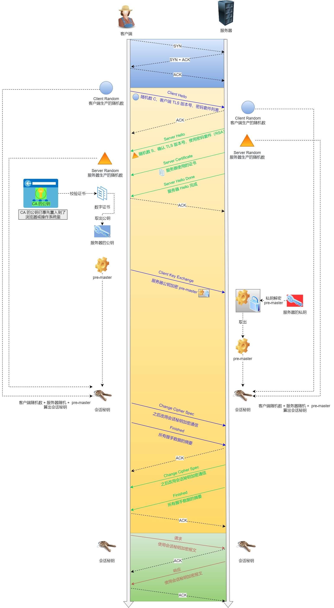

# HTTP

## 常见字段有哪些
* Host：客户端发送请求时，用来指定服务器的域名。`Host: www.A.com`
* Content-Length：本次回应的数据长度`Content-Length: 1000`
* Connection：常用于客户端要求服务器使用TCP持久连接，HTTP1.1默认是持久连接，兼容HTTP1.0，Connection：Keep-Alive;`Connection: keep-alive`
* Content-Type:用于服务器回应时，本次数据的格式`Content-Type: text/html; charset=utf-8`;客户端请求的时候Accept字段声明自己可以接受哪些，`Accept: */*`
* Content-Encoding:数据压缩方法，服务器返回的数据用了什么压缩格式，`Content-Encoding: gzip`,客户端接收：`Accept-Encoding: gzip, deflate`

## 无状态理解 
[https://www.zhihu.com/tardis/sogou/qus/23202402](https://www.zhihu.com/tardis/sogou/qus/23202402)
* 协议的状态是指下次传输可以保留这次传输信息的能力。  
HTTP协议自身不具备保存之前发送过的请求或响应的功能。每次新的请求，有对应新的响应。  
* 保留状态的方法
>1、Cookie是客户端的解决方案：Cookie是服务端发送给客户端的一些消息(响应报文中，Set-Cookie字段，通知客户端保留cookie)，下次访问服务器时带上cookie，服务端接收到带cookie的请求，分析哪个客户端发送过来的。  
>2、session是服务端保持状态的方法：既指客户端与服务端一系列交互的动作，又指服务端为客户端开辟的存储空间；session的持续时间以浏览器关闭结束；通过键值的形式获取匹配内容。session持久化采用高性能的存储方式，如redis，集群部署的方式，防止单点故障，从而提升高可用，同时涉及session过期问题。
>3.sessionid是服务端生成的，服务端通过set-cookie放在HTTP的响应头中，然后浏览器写到cookie里，下次请求时cookie带上sessionid.

## URI、URL

### URI(Unifrom Resource Identifier)
统一资源标识符，用来标识某一互联网资源，

### URL与URI
URL 统一资源位置(互联网上所处的位置)，URL是URI的子集。

## 状态码

### 状态码类别
| |类别|原因短语|
|--|--|--|
|1XX|Infromational(信息性状态码)|接收的请求正在处理|
|2XX|Success(成功状态码)|请求正在处理|
|3XX|Redirection(重定向)|需要进行附加操作完成请求|
|4XX|Client Error(客户端错误)|服务器无法处理请求|
|5XX|Server Error(服务器错误状态码)|服务器无法处理请求|

### 常见的状态码
* 2XX  

|状态码|意义|
|--|--|
|200|OK，返回成功|
|201|创建成功|
|204|No Content，请求成功，无资源返回,响应报文实体不含body部分|
|206|Partial Content，部分资源返回，响应报文Content—Range指定内容|

* 3XX  

|状态码|意义|
|--|--|
|301|Moved Permanently，永久性重定向，资源URI已更新|
|302|Found,资源的URI临时定位到其他位置|

* 4XX  

|状态码|意义|
|--|--|
|400|Bad Request,请求报文中存在语法错误|
|401|Unauthorized,未授权，需要认证|
|403|Forbidden，拒绝访问请求资源|
|404|Not Found,服务器上没有请求的资源|
|405|请求方法不对|

* 5XX  

|状态码|意义|
|--|--|
|500|Internal Server Error服务器内部错误|
|501|Not Implemented表示客户端请求的功能暂不支持|
|502|Bad Gateway,服务器作为网关或代理时返回的错误|
|503|Service Unavailable，服务不可用|

## DNS
DNS核心系统是一个三层树状、分布式服务：  
* 根域名服务器(Root DNS Server)：管理顶级域名服务器,返回"com"\"net"\"cn"等顶级域名的服务器ip地址
* 顶级域名服务器(Top-level DNS server)：管理各自域名下的权威域名服务器，比如com顶级域名服务器返回apple.com域名服务器的IP地址
* 权威域名服务器(Authoritative DNS Server)：管理自己域名下的主机的IP地址，比如apple.com权威域名服务器可以返回www.apple.com的IP地址。

> 要访问www.apple.com，三次查询：
>> 1.访问根域名服务器，它会告诉你"com"顶级域名服务器的地址；  
>>2.访问"com"顶级域名服务器，它再会告诉你"apple.com"域名服务器的地址；  
>>3.最后访问"apple.com"域名服务器，就得到了"www.apple.com"的地址。

核心DNS系统外，会建立自己的DNS服务器，作为用DNS查询的代理，称为非权威域名服务器，可以缓存之前的查询结果，有了记录无需向根域名服务器查询，直接返回IP地址。

## HTTP与HTTPS
### HTTP与HTTPS有哪些区别
* HTTP是超文本传输协议，明文传输，存在安全风险问题；HTTPS解决安全缺陷，在TCP与HTTP之间加入了SSL/TLS协议，使得报文能够加密传输。
* HTTP连接建立相对简单，TCP3次握手便可进行HTTP报文传输。而 HTTPS 在 TCP 三次握手之后，还需进行 SSL/TLS 的握手过程，才可进入加密报文传输。
* HTTP端口号80，HTTPS端口号443
* HTTPS需要向CA(证书权威机构)申请数字证书，来保证服务器身份可信。

### HTTPS解决了哪些问题，如何解决的
风险：
* 窃听风险：获取通信内容
* 篡改风险：强制植入垃圾广告
* 冒充风险：冒充假淘宝网站

解决：
* 信息加密：交互信息无法被窃取；采用混合加密，实现信息的机密性
* 校验机制：无法篡改内容，篡改不正常显示；采用摘要算法实现完整性，它为数据生成独一无二的指纹
* 身份证书：证明网站是真的；将服务器的公钥放到数字证书中，解决冒充风险。

> 混合加密：  
>> HTTPS采用对称加密与非对称加密结合；通信建立前采用非对称加密(公钥和私钥，公钥任意分发，私钥保密，但是速度慢)；通信建立后采用对称加密(只有一个密钥，必须保密，，运算速度快)  

>摘要算法   
>>摘要算法用于实现数据的完整性，客户端发送明文之前通过摘要算法计算明文的[指纹]，发送时把指纹和明文一同加密，发给服务端，服务端解密后，相同的摘要算法计算指纹与携带的指纹比较，来说明数据是否完整、被修改。

>数字证书
>>客户端先向服务端索要公钥，然后用公钥加密信息，服务器收到密文后，用自己的私钥解密。  
为了防止公钥不被篡改和可信，这里借助第三方结构CA，将服务器的公钥放在数字证书中，只要证书可信，公钥就可信。

### HTTPS如何建立的？交互了什么
SSL/TLS协议基本流程：
* 客户端向服务器索要并验证公钥
* 双方协商产生[会话密钥]
* 双方采用会话密钥对称加密通信。

前两步是SSL\TLS握手阶段。

SSL/TLS涉及四次通信:

SSL/TLS详细建立流程：
> 1.ClientHello
>>由客户端发起加密通信请求，向服务器发送以下信息：  
(1)客户端支持的SSL/TLS版本，例如TLS1.2  
(2)客户端产生的随机数1(Client Random)，后面用于生产[会话密钥]  
(3)客户端支持的密码套件列表，<strong>对称加密、非对称加密、摘要算法-密码套件</strong>；

> 2.ServerHello
>> 服务器收到请求后，发出响应ServerHello。服务器回应以下内容：  
(1)确认SSL/TLS协议版本。如浏览器不支持，关闭通信  
(2)服务器产生随机数2(Server Random),后面产生[会话密钥]。  
(3)确认密码套件列表-加密算法，RSA算法  
(4)服务器的数字证书  

>3.客户端回应  
>> 客户端收到服务器的回应之后，首先通过浏览器或操作系统中的CA公钥确认服务器数字证书的真实性；如果证书没有问题，取出公钥，用来加密报文；发送如下信息：  
(1)一个随机数3(pre-master key)[椭圆曲线算法用客户端和服务器参数计算生成]，该随机数会被服务器公钥加密。  
(2)加密通信算法改变，表示随后用[会话密钥-master key]加密通信  
(3)客户端握手结束通知，表示客户端的握手阶段已经结束。这一项同时把之前所有内容的发生的数据做个摘要，再用户会话密钥对称加密一下，用来供服务端校验。  
握手产生的3个随机数，服务器和客户端根据这3个随机数和协商的加密算法，产生各自本次通信会话密钥。  

>4.服务器回应：
>> 服务器收到客户端的第三个随机数（pre-master key）之后，通过协商的加密算法，计算出本次通信的「会话秘钥」。然后，向客户端发生最后的信息：  
(1)加密通信算法改变通知，表示随后的信息都将用「会话秘钥」加密通信。
(2)服务器握手结束通知，表示服务器的握手阶段已经结束。这一项同时把之前所有内容的发生的数据做个摘要，用来供客户端校验。

><strong>为什么要三个随机数？</strong>  
>这就必须说 TLS 的设计者考虑得非常周到了，他们不信任客户端或服务器伪随机数的可靠性，为了保证真正的"完全随机""不可预测"，把三个不可靠的随机数混合起来，那么"随机"的程度就非常高了，足够让黑客难以猜测。
### ssl、tls(1.1、1.2、1.3)
SSL：Secure Sockets Layer，安全套接字层；TLS：Transport Layer Security Protocol，传输层安全协议。  
SSL发展到3.0时改名TLS  
TLS协议组成：  
* 记录协议：规定了TLS收发数据的基本单位：记录(record).  
* 警报协议-向对方发出警报声，有点像HTTP协议里的状态码。  
* 握手协议-TLS里最复杂的子协议，握手过程中协商TLS版本号、随机数、密码套件，然后交换证书和密钥参数，协商最终得到会话密钥，用于混合加密。
* 变更密码规范协议，通知对方后续的数据将使用加密保护，

TLS1.2握手过程：

* 对finshed报文影响，TLS1.0-1.1用的是MD5+SHA1组合方式，1.2变成了单词SHA256.

TLS1.3相比1.2变化：利用扩展
* 强化了安全：伪随机函数由PRF升级为HKDF，废除RC4、DES对称加密；废除MD5、SHA1、SHA-224摘要算法；废除了RSA、DH密钥交换算法和许多命名曲线。瘦身。多了对"Certicate Verify"用私钥对前面的曲线、套件、参数等数据加了签名，作用和Finshed差不多。
* 提升性能：在Client Hello消息直接用"suported-groups"带上支持的曲线，用"key-share"带上曲线对应的客户端参数，"signature-algorithm"带上签名算法。

## HTTP1.0、HTTP1.1、HTTP2.0、HTTP3.0
HTTP/1.1相比HTTP/1.0的改进：
* 使用TCP长连接，改善HTTP1.0短连接造成的性能开销。
* 支持管道(pipeline)网络传输，只要发出一个请求不用等其回来，可以发送第二个请求。
<strong>长连接只是共享了TCP连接，和java中的池化技术一样，避免重复的开销，节省效率，降低响应时间</strong>
HTTP/1.1性能瓶颈： 
* 请求头/响应头部未经压缩，首部信息越多延迟越大
* 发送冗长的首部，每次互发相同的首部造成浪费。
* 服务器是按请求的顺序响应的，如果服务器响应慢，客户端会一直请求不到数据，也就是队头阻塞。
* 没有请求优先级控制
* 请求只能从客户端开始，服务器被动响应

HTTP2做了哪些优化  
* HTTP2是基于HTTPS，安全有保障
* 头部压缩，同时发出多个请求，头部一样或相似，协议会帮你消重，  
HPACK算法：客户端和服务器同时维护一张头部信息表，所有字段存入这个表，生成一个索引号，以后就发送索引号，提高速度
* 二进制格式：HTTP2全面采用二进制格式的报文，头信息和数据体都是二进制，统称为帧。

虽然对人不太友好，但是对于计算机友好，直接传送二进制报文，提高了数据传输效率。

* 数据流：HTTP2的数据包不是按顺序发送的，同一个连接里面连续的数据包可能属于不同的回应，需要数据包做标记对应具体回应。客户端可以指定数据流的优先级。

* 多路复用：HTTP2可以在一个连接中并发多个请求或回应，不用按照顺序一一对应；移除了HTTP1.1中的串行请求，不需要排队，降低了延迟，提高了连接利用率。
* 服务器推送：改善了传统[请求-应答]工作模式，服务器可以主动向客户端发送消息，

HTTP2有哪些缺陷？HTTP3做了哪些优化  
* HTTP2多请求复用一个TCP连接，一旦发生丢包，会阻塞所有的HTTP请求。

HTTP3特性:考虑TCP建立耗时、协议僵化，才有了基于UDP的QUIC协议  
* 实现了类似TCP的流量控制、传输可靠性的功能。
* 集成了TLS加密功能，TLS1.3减少了握手花费的RTT个数。
* 实现了HTTP2中的多路复用功能；QUIC实现了同一物理连接上有多个独立的逻辑数据流，单独的数据流传输解决了队头阻塞的问题。
* 实现了快速握手，基于UDP，
HTTP挑战：  
* 服务器和浏览器没有完整的支持HTTP3
* 部署HTTP3存在非常大的问题，系统内核对UDP的优化没有达到TCP的优化程度。
* 中间设备僵化，对UDP的优化程度远低于TCP，使用QUIC，大约3%-7%的丢包率。

## 网络安全补充
### 两类密码体制
* 对称密钥体制：加密与解密密钥使用相同，安全性取决于密钥的保密性。
* 非对称密钥体制：产生公私密钥对公钥Pk-公开，私钥SK-保密；用于解决密钥分配问题和数字签名。

### 数字签名
数字签名实现以下三个功能：  
* 接收者能够核实发送者对报文的签名，确信报文是发送者发的，-报文鉴别
* 接收者确信报文没有被修篡改过，报文的完整性
* 发送者事后不能抵赖对报文的签名，这叫做不可否认。

> 签名可以采用A的私钥对报文X加密。B为了核实签名，用A的公钥解密，还原X  
>> <strong>申请数字证书过程 </strong>   
>> 1.申请方X准备一套公私钥，私钥自己保留，不可泄露。  
>> 2.X向CA机构提交公钥、公司、站点信息等待确认。  
>> 3.CA通过线上线下对A提供的信息进行验证，确定合法与真实性。  
>> 4.如果信息审核通过，CA向X签发认证的<strong>数字证书</strong>,包含X的公钥、组织信息、CA信息、有效时间、证书序列号，这些都是明文，同时包含一个CA生成的签名。  
>>>CA首先使用Hash函数计算极客时间提交的明文信息，得到<strong>信息摘要</strong>,然后CA使用自己的私钥对信息摘要加密，<strong>加密后的密文就是CA颁发给X的数字签名</strong>.
>>
>><strong>浏览器如何验证数字证书</strong>  
>>1.浏览器向X服务器发出请求是，服务器会返回数字证书。  
>>2.浏览器接收数字证书后，对数字证书进行验证；首先获取证书中明文信息，采用CA签名时相同的Hash函数计算并得到明文的信息摘要A，再利用CA的公钥解密签名数据，得到信息摘要B；对比A与B，一致则确认证书是合法的，证明X服务器是正确的。同时浏览器还会验证证书相关的域名信息、有效时间等信息。

### 报文鉴别
* 散列函数MD5和SHA-1

> MD5报文摘要算法：  
>>1、任意长度的报文按模2^64计算其余位，追加在报文后  
2、在报文和余数之间追加填充1-512位，使得总长度是512的倍数。填充首位1，后面都是0  
3、把追加和填充后的报文分割成一个个512位的数据块，每个512位的数据再分成4个128位的数据块依次送到不同的散列函数进行4轮计算。每一轮又都按32位的小数据块进行复杂的运算。一直得到最后的报文摘要代码(128位)。

## CDN
CDN(Content Delivery Network或 Content Distribution Network)内容分发网络。  
CDN的核心原则就是"就近访问"，缓存代理，缓存了源站的静态资源，<strong>我们不生产内容，只是内容的搬运工</strong>

### 全局负载均衡
全局负载均衡（Global Sever Load Balance）一般简称为 GSLB，它是 CDN 的"大脑"，主要的职责是当用户接入网络的时候在 CDN 专网中挑选出一个"最佳"节点提供服务，解决的是用户如何找到"最近的"边缘节点，对整个 CDN 网络进行"负载均衡"；  
最常见的实现方式"DNS负载均衡",加入CDN后，权威DNS域名服务器返回的不是IP地址，而是一个别名记录，指向CDN的GSLB，本地DNS再向GSLB发起请求，进入CDN的全局负载均衡系统，智能调度挑选一个边缘节点，返回这个节点的IP地址给用户。

### CDN的缓存代理
"命中"就是指用户访问的资源恰好在缓存系统里，可以直接返回给用户；"回源"则正相反，缓存里没有，必须用代理的方式回源站取。