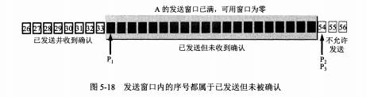

# TCP可靠传输原理
## 停止等待协议
就是每发送一个分组就停止发送，等待对方确认，收到确认后再发送下一个分组。
* 无差错
* 出现差错，A发完一个分组暂时保存已发送的分组副本；超时计时器设置重传时间大于平均往返时间，
* 确认丢失和确认迟到；B对于迟到的重复的分组，直接丢弃，发送重传确认。A对于迟到的确认，啥也不做。

## 连续ARQ协议
ARQ-自动重传请求；在停止等待的时候，信道利用率低；采用流水线传输，连续发送多个分组，需要滑动窗口协议和连续ARQ协议。  
>连续ARQ协议规定：发送方每收到一个确认，发送窗口就向前滑动一个分组的位置。  
接收方一般采用累积确认，不必对分组逐个发送确认，而是收到几个分组后，对按序到达的最后一个分组发送确认。优点：实现简单；缺点：不能向发送方反映接收方已正确收到的分组信息。  

# TCP可靠传输的实现

## 字节为单位的滑动窗口

> TCP首部中窗口字段占2字节，窗口值[0, 2^16-1]之间的整数。指出了接收方允许对方发送的数据量，动态变化  

* 发送窗口的数据状态种类：
a.已发送已确认，b.已发送但未确认，c.允许发送但尚未发送，d.不允许发送
* 接收窗口数据种类：
a.已发送确认交付，b.允许接受未发送确认，c.不允许接收

> P3-P1=A的发送窗口  
> P2-P1=已发送尚未确认  
> P3-P2=允许发送尚未发送(可用窗口或有效窗口)  
虽然5-16中，32、33未按序收到，但是B只能按序收到的数据中的最高序号给出确认，即发送确认号31。  

B现在收到了序号为31的数据，，把31-33都交付，删除这些数据，接收窗口向前移动3个序号如图5-17所示,同时给A发送确认号34，窗口大小20。  
  
A收到B的确认号后，窗口向前移动三个序号，指针P2不动，A的可用窗口变大。A继续发送数据42-53后，指针P2与P3重合，P1未移动，即未新增确认号；如图5-18；  
  
此时A窗口序号已用完，停止发送。A等待B确认，假若B发送了确认，如果没有收到确认，会超时重传这部分数据。  
实际上，字节流是写入TCP的缓存中，<strong>缓存大于窗口</strong>，进行发送和接收。如图5-19  
  
>发送缓存暂时存放的是：  
(1)已发送暂未确认  
(2)TCP准备发送的数据  
接收缓存：  
(1)按序到达、但尚未被应用程序接收的数据；  
(2)未按序到达的数据。  
>

### 小结：

* A发送窗口是由B发送窗口确定，并不总是一样大的；根据网络拥塞调控。
* 不按序到达的数据处理，先临时缓存在接收窗口中,等缺少的字节收到后，按序交付上层应用。
* TCP接收方有累积确认的功能，减小传输开销，在合适的时候发送确认，也可以在自己发送数据时捎带确认信息。
* TCP是全双工通信，每一方都有自己的发送和接收窗口。

## 超时重传

RTT 报文发出到收到确认的时间差。  
RTTs 是一个加权平均往返时间。每次重采样RTT样本时间，计算新的RTTs:  
新的RTTs = (1-$\alpha$)*(旧的RTTs)+$\alpha$*(新的RTT样本)  
超时重传时间RTO略大于RTTs;  

## 选择确认SACK

报文段无差错，只是未按序号，中间缺少一些序号，能否让发送方只传缺少的数据，而不重传已到达接收方的数据。选择SACK可以解决，但是得在TCP头部加上SACK，指明边界，双方事先商量好。目前暂未支持。

# TCP 流量控制
## 利用滑动窗口实现流量控制
如果发送方发送数据过快，接收方可能来不及接收，这就造成数据的丢失。  
流量控制：就是让发送方的发送速率不要太快，要让接收方来得及接收。
> A向B发送数据，建立连接时B会告诉A，B的rwnd值，发送方的窗口不能大于接收方的窗口值。<strong>窗口单位字节</strong>  
> 假如B向A发送了零窗口后，B的接收缓存空出了一些空间，此时B向A发送新的rwnd,但是这个报文段传送时丢失，A会一直等待B的非零窗口通知，而B会等待A发送的数据。会造成相互等待的死锁局面。  
> TCP为每个连接设置一个持续计时器，只要一方收到零窗口，则启动计时器；若持续计时器设置的时间到，就发送零窗口探测报文(仅带一个字节)，对方收到探测报文段后，反馈最新窗口值，若是0，则重新设置计时器等待，若不为0，则死锁局面打破。  

## TCP的传输效率

TCP报文段的发送时机：
* TCP维持一个变量，它的最大报文段长度MSS，只要缓存存放的数据达到MSS字节时，组装TCP报文段发出。
* 由发送方的应用进程指明要求发送报文段，即TCP支持的推送操作。
* 发送方一个计时器期限到了，把当前的已有的缓存数据装入报文段(不超过MSS)发出去。
* <strong>Nagle算法</strong>：若发送应用进程把要发送的数据逐个字节地送到TCP的发送缓存，则发送方就把第一个数据字节发送出去，把后面到达的数据字节都缓存起来。当发送方收到对第一个数据字节的确认后，再把发送缓存中的所有数据组装成一个报文段发送出去，同时继续对随后到达的数据进行缓存。只有在收到前一个报文段的确认后才继续发送下一个报文段。当数据到达较快而网络速率较慢时，用这样的方法可以明显地减少网络带宽。同时还规定，当到达的数据已达到发送窗口大小的一半或已到达报文段的最大长度时，立即发送一个报文段。
[流量控制](https://www.cnblogs.com/kubidemanong/p/9987810.html)
## 总结

* 滑动窗口是以字节为单位，基于缓存区(大小大于滑动窗口)，发送方和接收方商量窗口大小，发送方不能大于接收方窗口大小。
* 发送方数据状态类型有四种：发送已确认、发送未确认、准备发送、不允许发送，中间两种构成滑动窗口大小，也是缓存中的数据；接收方数据状态类型有三种：接收已确认、允许接收未确认、未接收，允许接收构成窗口大小，缓存中存放已接收已确认但未交付应用程序，未按序到达的数据。
* 超时重传时间RTO，涉及对RTT采样加权计算。
* 选择确认SACK机制只传送缺少的序号数据，不用重传未按序已正确到达的数据，目前暂未支持。
* 流量控制就是根据接收端处理数据的能力来决定发送方的窗口值。

* 如何处理乱序包
1 TCP具有乱序重组的功能。
（1）TCP具有du缓冲区
（2）TCP报文具有序列号
所以，对于你说的问题zhi，一种常见的处理dao方式是：TCP会先将报文段3缓存下来，当报文段2到达时，再根据序列号进行拼接。
2 当然缓冲区也有满的时候，这时接收端会直接丢弃报文，不做任何其他处理；发送方的定时器发现迟迟收不到接收方丢弃报文的确认号（ack number），就会重传该报文。这就是TCP的超时重传功能。
