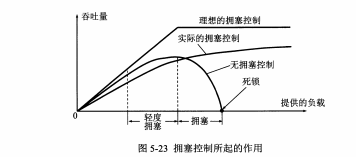
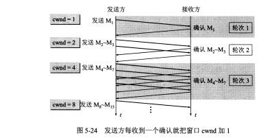
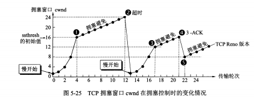
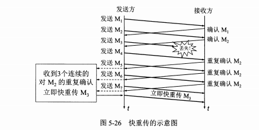

# TCP 拥塞控制实现

## 拥塞控制原理

> 一般就是 对资源的需求 > 可用资源  ,网络性能变坏，这种情况称为拥塞  
> <strong>拥塞控制</strong>就是防止过多的数据注入到网络当中，网络中的路由或链路不致过载。是一个全局过程，涉及所有的主机、路由器、以及降低网络传输性能有关的因素。  
> <strong>流量控制</strong>是指点对点，端到端的问题，抑制发送端的发送数据速率，以便接收端来得及接收。  

## TCP拥塞控制方法

TCP拥塞控制算法有四种算法：慢开始(slow-start)、拥塞避免、快重传和快恢复。
* 慢开始和拥塞避免
> 拥塞控制也是基于窗口，发送方维持一个拥塞窗口cwnd,拥塞窗口大小取决于网络拥塞情况，动态变化，<strong>发送方让自己发送窗口等于拥塞窗口</strong>。  
> 控制拥塞窗口的原则：只要不出现拥塞，cwnd就可以再增大些，出现拥塞，就减小cwnd。  
> 判断拥塞的依据：出现了超时。  
>><strong>慢开始算法</strong>：探测，由小到大逐渐增大发送窗口(cwnd)  
>>cwnd初始设置为1，发送第一个报文段M1，接收后发回确认，cwnd变为2  
>>接着发送M2-M3两个报文，<strong>每次收到一个对新报文段的确认，cwnd+1</strong>,收到确认后，此时cnwd为4.  
>>接着发送M4-M7，<strong>每经过一个轮次，cwnd加倍</strong>  
如图5-24  
  
>>同时设置一个慢开始门限ssthresh，防止cwnd增长过快，引起拥塞  
>>cwnd < ssthresh 慢开始算法  
>>cwnd > ssthresh 拥塞避免算法  
>>cwnd = ssthresh 都可以  
>> <strong>拥塞避免算法</strong>:初始化cwnd是1，没经过一个往返时间RTT，发送方的cwnd就增加1，拥塞窗口cwnd线性增长，比慢开始算法增长速率缓慢。  
>> 当出再次现拥塞时此时cwnd=x,调整门限值ssthresh = cwnd/2 = x/2;同时置cwnd=1，开始执行慢开始算法，后面按这个规则进行cwnd变化。  
如图5-25理解  
  
* 快重传算法：要接收方不要等待自己发送数据时进行捎带确认，而是要立即发送确认，即使收到了失序报文段也要立即发已收到的报文段的重复确认。快重传算法规定只要一连收到<strong>3个重复确认</strong>，知道接收方没有收到某个报文，立即进行重传。这样不会出现超时，也不会出现拥塞，网络吞吐量提高20%。  
  
* 快速恢复算法：将慢启动门限值设为原来的一半，将拥塞窗口cwnd设置为现在的门限值，直接进入拥塞避免阶段。
  
## 总结

拥塞避免：  
让拥塞窗口cwind缓慢地增大，每经过一个往返时间RTT就把发送方的拥塞窗口cwind加1，而不是加倍。这样拥塞窗口cwind线性缓慢增长，比慢开始算法的拥塞窗口增长速率缓慢得多。  
无论慢启动开始阶段还是在拥塞避免阶段，只要发送方判断网络出现拥塞（其根据就是没有收到确认），就要把慢启动门限ssthresh设置为出现拥塞时的发送方窗口值的一半（但不能小于2）。然后把拥塞窗口cwind重新设置为1，执行慢启动算法。目的是迅速减少主机发送到网络中的分组数，使得发生拥塞的路由器有足够时间把队列中积压的分组处理完毕。

控制过程：  
  -[1]. TCP连接初始化，将拥塞窗口cwind设置为1个报文段，即cwind=1；  
  -[2]. 执行慢开始算法，cwind按指数规律增长，直到cwind == ssthresh时，开始执行拥塞避免算法，cwind按线性规律增长；  
  -[3]. 当网络发生拥塞，把ssthresh值更新为拥塞前ssthresh值的一半，cwind重新设置为1，再按照 [2] 执行。

