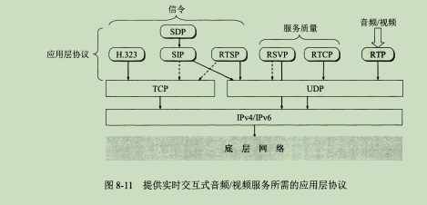
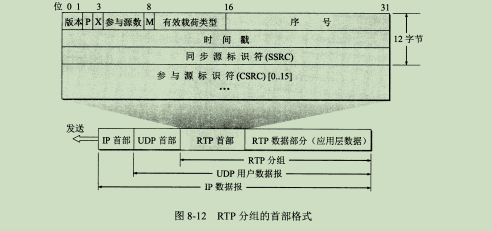

# UDP与TCP
## UDP 主要特点：
* UDP是无连接的，减少了开销和发送数据之前的时延
* UDP使用尽最大努力交付，不保证可靠
* UDP是面向报文的，发送方的UDP对应用程序交下来的报文，添加首部后就向下交付给IP层。也就是说：UDP对应用层的报文既不拆分也不合并，UDP一次交付一个完整的报文。
* UDP没有拥塞控制；这对某些实时应用很重要。允许源主机以恒定的速率发送数据，网络拥塞时丢失一些数据，却不允许数据有太大的时延。
* UDP支持一对一、一对多、多对一、多对多交互通信。
* UDP首部开销小，只有8个字节，比TCP首部20个字节要短。
  

## TCP 主要特点
* 面向连接的传输层协议，建立连接和释放
* 每个TCP连接只有两个端点，只能是点对点一对一;TCP通信的两个端点(套接字：IP+端口)
* TCP提供可靠交付任务；无差错、不丢失、不重复、按序到达。
* TCP提供全双工通信；允许通信双方的应用进程再任何时候都能发送数据，TCP两端都有发送缓存和接收缓存，用来存放临时通信的数据。
* 面向字节流：流是指流入到进程或从进程流出的字节序列；面向字节流-应用程序与TCP交互的一次一个数据块(大小不等),

## IP电话所需要的几种应用协议扩展

### 实时运输协议RTP
RTP为实时应用提供端到端的运输，但不提供任何服务质量的保证
* 要发送的多媒体数据块经过压缩编码处理后，先由RTP封装成RTP分组，RTP分组再装入UDP用户数据报。
* RTP是应用层的一部分，应用程序开发者需要编写用RTP封装分组的程序代码；然后再将分组交给UDP。
* RTP分组只包含RTP数据，控制是配套使用的RTCP协议来提供的。

> 序号：对每一个发送出去的RTP分组，其序号加1。初始序号是随机的。序号使接收端能够发现丢失的分组，也能将丢失的分组重排序。  
> 时间戳：反映了RTP分组中的第一个字节的采样时刻

### 实时运输控制协议RTCP
主要功能：  
* 服务质量的监控与反馈
* 媒体间的同步
* 多播组中成员的标志

### 面试问题
* 如何提高UDP的传输可靠性?

[参考](https://www.cnblogs.com/home123/p/7499608.html)
> TCP通过确认机制和超时重传机制实现可靠传输；  
> UDP不属于连接协议，因而耗资源小；传输层无法保证可靠性，我们可以通过应用层来实现；考虑两点：提供超时重传，避免数据丢失；提供确认序列号，可以对数据报进行确认和排序。  
>> 本端：在UDP数据报定义一个首部，包含确认序列号和时间戳，时间戳用来计算RTT，从而计算出合适的RTO(重传的超时时间)。然后以等停的方式发送数据报。当时间超时，本端重传数据报，同时RTO扩大原来的两倍，重新开始计算。  
>>对端：接收到一个数据报之后，取下该数据报的首部时间戳和确认序列号，并添加本端的确认数据报首部之后发送给对端。根据此序列号对已收到的数据报进行排序并丢弃重复的数据报。

* 常见哪些应用层协议基于TCP和UDP

|应用|应用层协议|下面的传输层协议|
|--|--|--|
|电子邮件|SMTP|TCP
|远程终端访问|Telnet|TCP|
|web|HTTP|TCP|
|文件传输|FTP|TCP|
|离线邮件处理|POP3|TCP|
|远程文件服务器|NFS|通常UDP|
|流式多媒体|通常专用|UDP或TCP|
|因特网电话|通常专用|UDP或TCP|
|网络管理|SNMP|通常UDP|
|路由协议|RIP|UDP|
|名字转换|DNS|通常UDP|

